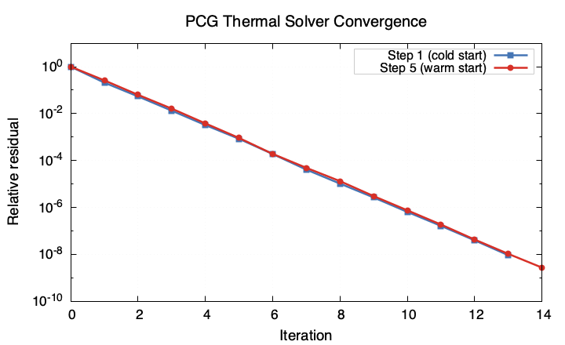

# MDOODZ 7.0 — Optimizations

Performance optimizations for MDOODZ 7.0. These changes reduce wall-clock time by up to **59%** on large grids (≥200×200) with multi-threading, while producing **bit-identical** or **machine-precision-equivalent** results.

## Overview

Two main optimizations are available:

| Optimization | Parameter | Default | Effect |
|---|---|---|---|
| **PCG thermal solver** | `thermal_solver = 1` | 0 (CHOLMOD) | Replaces the CHOLMOD direct solve with a Jacobi-preconditioned Conjugate Gradient solver. Warm-starts from the previous time step. |
| **Fused P2Mastah interpolation** | `interp_mode = 3` | 0 (standard) | Single-pass particle-to-grid interpolation with shared stencil weights and atomic scatter. Eliminates redundant weight computation. |

Additional optimizations that are always active:
- **Cached thermal factorization** (Experiment 3): CHOLMOD reuses the symbolic analysis from step 1 on subsequent steps.
- **AccumulatedStrainII OpenMP parallelisation** (Experiment 6): post-solve strain accumulation loop is parallelised.

## Performance Results

Benchmarked on AWS c5ad.4xlarge (16 vCPU AMD EPYC 7R32, 32 GB RAM), 1000×800 grid, 10 time steps, `RiftingChenin` scenario.

### Cumulative Wall-Time Reduction

| Metric | Baseline | Optimized | Reduction |
|---|---|---|---|
| **Total wall** | 20.5 s | 8.42 s | **59%** |
| Thermal solve | 6.2 s | 0.1 s | **98%** |
| Interpolation | 6.5 s | 2.2 s | **66%** |
| Post-solve | 3.2 s | 2.65 s | **17%** |

### Per-Experiment Breakdown

| # | Change | Wall Impact |
|---|---|---|
| 1 | CHOLMOD multi-threading | 0% (no effect for 5-point stencil) |
| 2 | Internal persistent OMP regions | Reverted (+7% regression) |
| 3 | Cache thermal factorisation | −3–6% thermal |
| 4 | PCG thermal solver | **−98% thermal, −17–32% wall** |
| 5 | Persistent interp buffers (`interp_mode=2`) | **−37% wall at 16t, −62% interp** |
| 6 | AccumulatedStrainII OMP | **−5.6% wall at 16t** |
| 7 | Fused P2Mastah (`interp_mode=3`) | **−3–8% wall** |
| 8 | Small-grid validation (41×41) | ±0% (expected) |

## Validation Evidence

All optimizations are validated against analytic solutions and the original CHOLMOD solver.

### Thermal Solver Accuracy (PCG vs CHOLMOD)

Both solvers produce identical L2 errors against analytic solutions:

| Test | CHOLMOD L2 | PCG L2 | \|diff\| |
|---|---|---|---|
| Gaussian diffusion (51×51) | 1.074e-02 | 1.074e-02 | **0** |
| Steady-state geotherm (31×31) | 2.423e-06 | 2.423e-06 | **0** |

The L2 error is entirely from finite-difference discretisation — the two solvers agree to machine precision.

CI test: `ThermalTests.GaussianDiffusionL2PCG` asserts `|L2_PCG − L2_CHOLMOD| < 1e-6`.

### PCG Convergence Behaviour

The PCG solver uses **warm-starting**: the temperature solution from the previous time step is used as the initial guess for the current step. Because temperatures evolve slowly between steps, this initial guess is already close to the solution and the solver converges in fewer iterations.

- **Cold start** (step 1): no prior solution exists, so the solver starts from the initial condition. This requires the most iterations (~13–15) as the initial guess may be far from the converged field.
- **Warm start** (step N > 1): reuses the previous step's temperature as the initial guess. Convergence is typically comparable in iteration count but starts from a much lower initial residual, reflecting proximity to the solution.



Residual export is available for diagnostics: set `export_pcg_residuals = 1` in the `.txt` file. This writes `pcg_residuals_step<NNNNN>.csv` to the output directory.

### Interpolation Equivalence (Mode 0 vs Mode 3)

Field-level comparison of temperature, pressure, and viscosity between standard (`interp_mode=0`) and fused (`interp_mode=3`) interpolation on a 51×51 Gaussian diffusion setup (5 time steps):

| Field | max\|diff\| |
|---|---|
| T (temperature) | **0** |
| P (pressure) | **0** |
| η_n (viscosity) | **0** |

The two modes produce bit-identical results.

CI test: `InterpEquivalenceTests.Mode0vsMode3` asserts all field differences < 1e-6.

### Visual Tests

Figures are generated by `make run-vis` (requires `-DVIS=ON`):
- `VISUAL_TESTS/img/pcg_convergence.png` — Log-scale convergence: cold start vs warm start

## Usage

### PCG Thermal Solver

Add to your `.txt` parameter file:

```
thermal_solver       = 1
max_its_thermal      = 5000
rel_tol_thermal      = 1e-12
```

- `thermal_solver = 1` enables PCG (default: 0 = CHOLMOD)
- `max_its_thermal` — maximum CG iterations (default: 5000)
- `rel_tol_thermal` — relative residual tolerance (default: 1e-12)
- `export_pcg_residuals = 1` — optional, writes per-step CSV residual logs

### Fused Interpolation

```
interp_mode = 3
```

- `interp_mode = 0` — standard (separate weight computation per field)
- `interp_mode = 1` — variant using distance-weighted averaging
- `interp_mode = 2` — persistent buffers with atomic scatter
- `interp_mode = 3` — fused single-pass (recommended for performance)

## When NOT to Use

### Small Grids (< 100×100)

On small grids, the overhead of solver setup and thread synchronisation exceeds the computation time. Experiment 8 showed **zero speedup** on a 41×41 grid. The optimizations target problems where interpolation and thermal solve dominate wall time — typically grids ≥ 200×200.

### Single-Thread Runs

The interpolation optimizations (`interp_mode = 2, 3`) gain most of their advantage from reduced thread contention and better cache behaviour at higher thread counts. On a single thread, the benefit is marginal (~1–3%).

### Already-Fast CHOLMOD with Factorisation Cache

If your simulation has very few thermal degrees of freedom (small grid, infrequent thermal solves), CHOLMOD with cached factorisation (always active) is already fast. PCG's advantage comes from avoiding the O(N^{1.5}) direct-solve cost at large N.

### Non-Thermal Simulations

If `thermal = 0`, the PCG solver is irrelevant. The interpolation optimization still applies.

### Debugging Convergence Issues

If you suspect thermal solver convergence problems, use `thermal_solver = 0` (CHOLMOD) as a reference. Enable `export_pcg_residuals = 1` to inspect PCG convergence curves.

## Logging and Phase Timing

MDOODZ has a built-in structured logger and automatic per-timestep performance CSV. Use these to measure the effect of optimizations on your setup.

### .txt Configuration

Add to the `OUTPUT FILES` section of your `.txt` file:

```
log_dest      = 2   / 0=console, 1=file, 2=both (default: 2)
log_level     = 2   / 0=error, 1=warn, 2=info, 3=debug (default: 2)
log_timestamp = 1   / 0=off, 1=on (default: 1)
log_ts_mode   = 0   / 0=relative, 1=absolute, 2=both (default: 0)
log_metadata  = 0   / 0=off, 1=on (default: 0)
```

- `log_dest = 2` writes to both console and `mdoodz.log` (ANSI codes are stripped in the file).
- `log_level = 3` (debug) additionally emits per-timestep memory and CPU usage.
- `log_timestamp = 1` + `log_ts_mode = 0` prefixes each line with seconds since simulation start, e.g. `[    5.620]`.
- `log_metadata = 1` adds step/iteration context: `[    6.565|S0001|N00] INFO | ...`

### Phase Timing in Logs

Key phases are instrumented with `LOG_TIME`. At the end of each timestep the breakdown is printed:

```
[   36.192] TIME  | Total timestep calculation time = 36.192000 sec
[   36.192] TIME  |   Breakdown: rheology=2.073 assembly=1.709 solve=0.000 sec
```

### Performance CSV (`perf.csv`)

Every run automatically writes `perf.csv` in the execution directory (no config needed). One row per timestep with columns:

| Column | Description |
|--------|-------------|
| `wall_s` | Wall-clock time for the timestep |
| `thermal_s` | Thermal solver time |
| `interp_s` | Interpolation + timestep setup |
| `rheology_s` | Rheology update |
| `assembly_s` | Stokes assembly |
| `solve_s` | Direct solve (CHOLMOD) |
| `advection_s` | Particle advection |
| `post_solve_s` | Post-solve particle updates |
| `peak_rss_mb` | Peak resident memory (MB) |

The full CSV also includes `free_surface_s`, `reseeding_s`, `melting_s`, `anisotropy_s`, `gse_s`, `output_s`, `user_cpu_s`, `sys_cpu_s`, and equation/particle counts.

Use `perf.csv` to compare baseline vs optimized runs:

```bash
# Compare thermal solver time across steps
awk -F, 'NR>1 {print $1, $7}' perf.csv   # step, thermal_s
```
