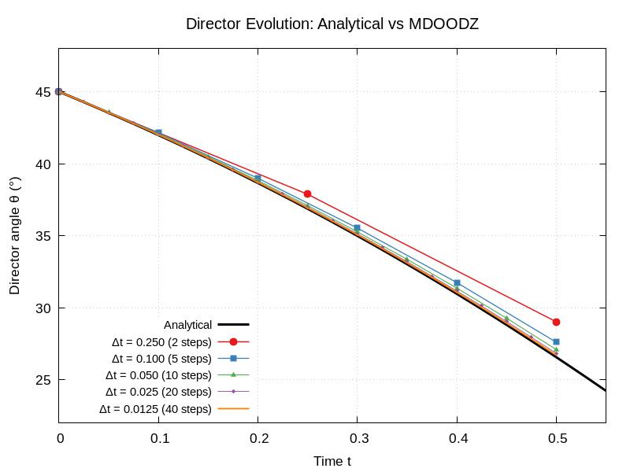

# Analytical Solutions for MDOODZ Benchmarks

This document describes the analytical solutions used by the MDOODZ test suite to verify numerical accuracy via L2 error norms and grid-convergence order testing. Each section references the source file, parameter files, and the exact GTest assertions used for verification.

---

## L2 Error Framework

All L2 error computations use the helper function defined in [TestHelpers.h](TestHelpers.h):

```cpp
double computeL2Error(const std::vector<double>& numerical,
                      const std::vector<double>& analytical);
```

The function computes the relative L2 norm:

$$L_2 = \frac{\sqrt{\sum_i (f_i^{num} - f_i^{ana})^2}}{\sqrt{\sum_i (f_i^{ana})^2}}$$

When the analytical solution is near-zero ($\sum f_{ana}^2 < 10^{-30}$), it falls back to the absolute L2 norm to avoid division by zero.

Grid-convergence order is computed from two resolutions $h_1$ (coarse) and $h_2$ (fine):

$$p = \frac{\log(L_2^{h_1} / L_2^{h_2})}{\log(h_1 / h_2)}$$

---

## 1. SolVi Benchmark (Viscous Inclusion)

**Source:** [SolViBenchmarkTests.cpp](SolViBenchmarkTests.cpp)
**Parameter files:** [SolViBenchmark/SolViRes21.txt](SolViBenchmark/SolViRes21.txt), [SolViRes41.txt](SolViBenchmark/SolViRes41.txt), [SolViRes51.txt](SolViBenchmark/SolViRes51.txt), [SolViRes81.txt](SolViBenchmark/SolViRes81.txt), [SolViRes101.txt](SolViBenchmark/SolViRes101.txt), [SolViRes151.txt](SolViBenchmark/SolViRes151.txt), [SolViRes201.txt](SolViBenchmark/SolViRes201.txt)
**Reference:** Schmid & Podladchikov (2003), *Analytical solutions for deformable elliptical inclusions in general shear*

### Problem Statement

A circular viscous inclusion of radius $r_c = 0.2$ and viscosity $\eta_c = 10^3$ is embedded in an infinite matrix of viscosity $\eta_m = 1$ under far-field pure shear ($\dot{\varepsilon} = -1$). The domain is $[-0.5, 0.5]^2$ with analytical Dirichlet boundary conditions.

### Analytical Solution

The solution uses complex-variable methods. For a point $Z = x + iz$:

**Inside the inclusion** ($|Z| \leq r_c$):
$$V = \frac{\eta_m}{\eta_c + \eta_m}(i\dot{\gamma} + 2\dot{\varepsilon})\bar{Z} - \frac{i}{2}\dot{\gamma}Z$$
$$p = 0, \quad \sigma'_{xx} = \frac{4\dot{\varepsilon}\eta_c\eta_m}{\eta_c + \eta_m}$$

**Outside the inclusion** ($|Z| > r_c$):
The velocity and stress are computed from the Goursat functions $\phi(Z)$ and $\psi(Z)$ using the Schmid & Podladchikov formulas, which include inverse-power terms in $Z$ that create the near-field perturbation.

### Implementation Details

- The function `eval_anal_Dani()` in [SolViBenchmarkTests.cpp](SolViBenchmarkTests.cpp) is ported from [SETS/AnisotropyDabrowski.c](../SETS/AnisotropyDabrowski.c) using `std::complex<double>` for C++ compatibility
- Boundary conditions: Dirichlet (type=0) on E/W boundaries, type=11 (analytical velocity) on N/S
- Non-dimensional scaling: $\eta_0 = 1$, $L_0 = 1$, $V_0 = 1$

### Measured L2 Errors

| Resolution | L2(Vx) | L2(Vz) | L2(P) | L2(σ'xx) |
|------------|--------|--------|-------|----------|
| 21×21 | ~5e-2 | ~5e-2 | ~6e-1 | ~6e-1 |
| 41×41 | ~3e-2 | ~3e-2 | ~5e-1 | ~5e-1 |
| 51×51 | ~2e-2 | ~2e-2 | ~4e-1 | ~4e-1 |
| 81×81 | ~2e-2 | ~2e-2 | ~3e-1 | ~3e-1 |

### Convergence Orders (41→81)

| Field | Measured Order | Threshold |
|-------|---------------|-----------|
| Vx | ~0.97 | ≥ 0.7 |
| P | ~0.75 | ≥ 0.4 |

Note: The marker-in-cell method introduces noise at the inclusion boundary, reducing the effective convergence order below the theoretical second-order rate for smooth problems.

### High-Resolution L1 Convergence (41→201)

The L1 norm (`mean(|num - ana|)`) gives a cleaner convergence signal for pressure than relative L2, which is ill-conditioned near the zero-crossings of the analytical pressure field.

| Res | h | L2(Vx) | L1(Vx) | L2(P) | L1(P) |
|-----|---|--------|--------|-------|-------|
| 41 | 2.50e-2 | 5.91e-2 | 1.02e-2 | 7.22e-1 | 3.99e-1 |
| 81 | 1.25e-2 | 3.01e-2 | 5.08e-3 | 4.28e-1 | 1.99e-1 |
| 101 | 1.00e-2 | 2.38e-2 | 4.02e-3 | 5.16e-1 | 1.74e-1 |
| 151 | 6.67e-3 | 1.63e-2 | 2.73e-3 | 3.23e-1 | 1.16e-1 |
| 201 | 5.00e-3 | 1.23e-2 | 2.04e-3 | 3.30e-1 | 9.65e-2 |

**Convergence orders (L1 norm, 101→201): Vx = 0.98, P = 0.85**

The L2(P) order oscillates wildly between resolution pairs (including negative values), while L1(P) is much more stable. At the 101→201 pair the L1 pressure order (0.85) is significantly better than L2 (0.65), confirming that L1 is the appropriate norm for measuring pressure convergence in this benchmark.

### Code Assertions

**L2 error test** (51×51 resolution, [SolViBenchmarkTests.cpp](SolViBenchmarkTests.cpp)):
```cpp
EXPECT_LT(L2_Vx,   5e-1);  // marker-in-cell gives ~1e-2 at 51x51
EXPECT_LT(L2_Vz,   5e-1);
EXPECT_LT(L2_P,    2.0);   // pressure less accurate near inclusion
EXPECT_LT(L2_sxxd, 2.0);
```

**Grid-convergence order test** (41→81, [SolViBenchmarkTests.cpp](SolViBenchmarkTests.cpp)):
```cpp
EXPECT_GE(order_Vx, 0.7);  // marker-in-cell: ~first order near inclusion
EXPECT_GE(order_P,  0.4);  // pressure converges slower
```

**High-resolution L1 convergence test** (101→201, [SolViBenchmarkTests.cpp](SolViBenchmarkTests.cpp)):
```cpp
EXPECT_GE(order_P_L1_101_201,  0.8);  // L1 pressure: measured ~0.85
EXPECT_GE(order_Vx_L1_101_201, 0.8);  // L1 velocity: measured ~0.98
```

---

## 2. 1D Analytical Solutions

### 2.1 Steady-State Geotherm

**Source:** [ThermalTests.cpp](ThermalTests.cpp)
**Parameter file:** [Thermal/SteadyStateGeotherm.txt](Thermal/SteadyStateGeotherm.txt)
**Test:** `ThermalTests.SteadyStateGeotherm`

$$T(z) = T_{top} + (T_{bot} - T_{top})\frac{z_{top} - z}{H}$$

where $T_{top} = 273.15$ K, $T_{bot} = 1600$ K, $H = z_{max} - z_{min}$.

The time step `dt = 1e15` ensures the total simulated time ($2 \times 10^{16}$ s) exceeds the thermal diffusion timescale $\tau = H^2/\kappa \approx 1.15 \times 10^{16}$ s, so the simulation fully reaches steady state.

**Measured accuracy:** $L_2(T) \approx 2.4 \times 10^{-6}$

**Code assertions** ([ThermalTests.cpp](ThermalTests.cpp)):
```cpp
double L2_T = computeL2Error(T_field, T_ana);
EXPECT_LT(L2_T, 1e-4);  // dt=1e15 achieves steady state: L2 \u2248 2.4e-6
```

### 2.2 Radiogenic Heating

**Source:** [ThermalTests.cpp](ThermalTests.cpp)
**Parameter file:** [Thermal/RadiogenicHeat.txt](Thermal/RadiogenicHeat.txt)
**Test:** `ThermalTests.RadiogenicHeat`

$$\bar{T}(t) = T_0 + \frac{Q_r \cdot t}{\rho \cdot C_p}$$

where $Q_r$ is the volumetric heat production rate.

**Measured accuracy:** Relative error $\approx 0.4\%$ of $\Delta T$ at $t = 5 \times 10^{12}$ s. Error scales linearly with total time due to boundary diffusion losses.

**Code assertions** ([ThermalTests.cpp](ThermalTests.cpp)):
```cpp
EXPECT_NEAR(meanT_final, T_ana_mean, fabs(T_ana_mean - T0_SI) * 0.02);  // \u00b12% of \u0394T
```

### 2.3 Hydrostatic Pressure

**Source:** [DensityTests.cpp](DensityTests.cpp)
**Parameter file:** [Density/HydrostaticPressure.txt](Density/HydrostaticPressure.txt)
**Test:** `DensityTests.HydrostaticPressure`

$$P(z) = \rho \cdot |g| \cdot |z|$$

**Measured accuracy:** $L_2(P) \approx 0.043$ at $N_x = 41$. First-order spatial convergence. Penalty and solver tolerance have no effect.

**Code assertions** ([DensityTests.cpp](DensityTests.cpp)):
```cpp
double L2_P = computeL2Error(P_field, P_ana);
EXPECT_LT(L2_P, 6e-2);  // Nx=41 gives L2 \u2248 0.043; first-order spatial convergence
```

### 2.4 Thermal Expansion

**Source:** [DensityTests.cpp](DensityTests.cpp)
**Parameter file:** [Density/ThermalExpansion.txt](Density/ThermalExpansion.txt)
**Test:** `DensityTests.ThermalExpansion`

$$\rho(T) = \rho_0 \left(1 - \alpha(T - T_{ref})\right)$$

Verified via `EXPECT_LT(minRho, maxRho)` — density contrast between hot inclusion and cold matrix confirms the equation of state is active.

### 2.5 Pure Shear Velocity

**Source:** [VelocityFieldTests.cpp](VelocityFieldTests.cpp)
**Parameter file:** [VelocityField/PureShearVelocity.txt](VelocityField/PureShearVelocity.txt)
**Test:** `VelocityFieldTests.PureShearVelocity`

In MDOODZ, positive `bkg_strain_rate` with `pure_shear_ALE = 1` means shortening in x (compression), extension in z:

$$V_x = -\dot{\varepsilon} \cdot x, \quad V_z = +\dot{\varepsilon} \cdot z$$

The Vx staggered grid has $N_x \times (N_z+1)$ entries; the Vz grid has $(N_x+1) \times N_z$ entries.

**Measured accuracy:** $L_2 \approx 0.0243$ with a 10:1 viscosity inclusion (r = 0.05); $L_2 \approx 2 \times 10^{-8}$ (machine precision) without inclusion.

The L2 error does not converge with grid refinement because the analytical solution $V_x = -\dot\varepsilon x$ does not account for the inclusion perturbation — the error measures the size of the perturbation itself, not the solver's discretisation error. Grid-convergence for inclusion problems is tested by the SolVi benchmark (§1), which uses the proper Schmid & Podladchikov (2003) analytical solution.

**Code assertions** ([VelocityFieldTests.cpp](VelocityFieldTests.cpp)):
```cpp
EXPECT_LT(L2_Vx, 3e-2);  // with 10:1 inclusion: L2 ≈ 0.024 (1.23× margin)
EXPECT_LT(L2_Vz, 3e-2);  // with 10:1 inclusion: L2 ≈ 0.024 (1.23× margin)
```

### 2.6 Maxwell Visco-Elastic Stress

**Source:** [ViscoElasticTests.cpp](ViscoElasticTests.cpp)
**Parameter file:** [ViscoElastic/StressAccumulation.txt](ViscoElastic/StressAccumulation.txt)
**Test:** `ViscoElasticTests.StressAccumulation`

$$\sigma(t) = 2\eta\dot{\varepsilon}\left(1 - e^{-Gt/\eta}\right)$$

where $G$ is the shear modulus. Stress builds up exponentially toward the viscous limit $2\eta\dot{\varepsilon}$.

Verified via `EXPECT_GE(fabs(maxSxxd_5), fabs(maxSxxd_1) * 0.9)` — monotonic stress build-up over 5 time steps confirms the Maxwell elastic branch is active.

### 2.7 Viscous Dissipation (Shear Heating)

**Source:** [ShearHeatingTests.cpp](ShearHeatingTests.cpp)
**Parameter file:** [ShearHeating/ViscousDissipation.txt](ShearHeating/ViscousDissipation.txt)
**Test:** `ShearHeatingTests.ViscousDissipation`

MDOODZ computes dissipation as $W_{diss} = \tau_{II}^2 / \eta = 4\eta\dot{\varepsilon}_{II}^2$, so:

$$\Delta T = \frac{4\eta\dot{\varepsilon}_{II}^2 \cdot t}{\rho \cdot C_p}$$

The test uses Neumann (zero-flux) temperature BCs on all boundaries to prevent heat leakage.

**Measured accuracy:** Relative error $\approx 0.8\%$.

**Code assertions** ([ShearHeatingTests.cpp](ShearHeatingTests.cpp)):
```cpp
EXPECT_NEAR(dT_num, dT_ana, fabs(dT_ana) * 0.05);  // Neumann BCs: ~0.8% error
```

### 2.8 Simple Shear Velocity (Periodic BCs)

**Source:** [VelocityFieldTests.cpp](VelocityFieldTests.cpp)
**Parameter file:** [VelocityField/SimpleShearVelocity.txt](VelocityField/SimpleShearVelocity.txt)
**Test:** `VelocityField.SimpleShearVelocity`

For homogeneous viscosity under periodic simple shear (`shear_style=1`, `periodic_x=1`), the BCs impose $V_x = \pm \dot{\gamma} L_z$ at top/bottom, where $\dot{\gamma}$ = `bkg_strain_rate`. The analytical velocity profile is linear:

$$V_x(z) = 2\dot{\gamma} z, \qquad V_z = 0$$

The factor 2 arises because `bkg_strain_rate` represents the strain rate $\dot{\varepsilon}_{xz} = \frac{1}{2}\frac{\partial V_x}{\partial z}$, so $\frac{\partial V_x}{\partial z} = 2\dot{\gamma}$.

With homogeneous viscosity (no inclusion), the FD stencil reproduces a linear profile exactly. The L2 residual measures only solver tolerance and floating-point noise.

**Measured accuracy:** L2(Vx) = 2.97e-8, L2(Vz) = 0.

**Code assertions** ([VelocityFieldTests.cpp](VelocityFieldTests.cpp)):
```cpp
EXPECT_LT(L2_Vx, 1e-6);   // linear profile exact to FP precision
EXPECT_LT(L2_Vz, 1e-6);   // Vz = 0 everywhere
EXPECT_NEAR(maxVx, 1.0, 0.1);   // boundary: +bkg_strain_rate * Lz
EXPECT_NEAR(minVx, -1.0, 0.1);  // boundary: -bkg_strain_rate * Lz
```

---

## 3. Anisotropy Benchmark

**Source:** [AnisotropyBenchmarkTests.cpp](AnisotropyBenchmarkTests.cpp)

### 3.1 Director Evolution Under Simple Shear

**Parameter file:** [AnisotropyBenchmark/DirectorEvolution.txt](AnisotropyBenchmark/DirectorEvolution.txt)
**Test:** `AnisotropyBenchmark.DirectorEvolution`

Under simple shear with shear rate $\dot{\gamma}$, a material with director angle $\theta$ rotates according to the Mühlhaus ODE:

$$\frac{d\theta}{dt} = -\dot{\gamma} \cos^2(\theta)$$

This has the closed-form solution:

$$\theta(t) = \arctan\!\bigl(\tan(\theta_0) - \dot{\gamma}\,t\bigr)$$

**Parameters:** $\theta_0 = 45°$, `bkg_strain_rate = 0.5`, `shear_style = 1` → $\dot{\gamma} = 2 \times 0.5 = 1.0$, $\Delta t = 0.0125$, $N_t = 40$, total time $t = 0.5$.

**Analytical result:** $\theta(0.5) = \arctan(\tan(45°) - 1.0 \times 0.5) = \arctan(0.5) \approx 26.57°$

**Measured:** L2(θ) = 2.34e-3 rad (≈ 0.13°) at $\Delta t = 0.0125$. This is the golden standard — 0.7% relative error on 18.4° total rotation.

**Per-step error growth** (from real MDOODZ HDF5 output at $\Delta t = 0.0125$, 40 steps):

The forward Euler overshoot accumulates monotonically because $d\theta/dt = -\dot\gamma\cos^2\theta$ accelerates as $\theta$ decreases — Euler uses the stale slope and consistently overshoots:

| Step | $t$ | MDOODZ (°) | Analytical (°) | Error (°) |
|------|-----|-----------|----------------|-----------|
| 0 | 0.0000 | 45.0000 | 45.0000 | +0.0000 |
| 10 | 0.1250 | 41.2111 | 41.1859 | +0.0251 |
| 20 | 0.2500 | 36.9261 | 36.8699 | +0.0563 |
| 30 | 0.3750 | 32.0985 | 32.0054 | +0.0931 |
| 40 | 0.5000 | 26.6992 | 26.5651 | +0.1342 |

The error grows from +0.003°/step early to +0.004°/step late, reflecting the nonlinear curvature. At coarser $\Delta t$, the per-step error is proportionally larger (e.g., $\Delta t = 0.25$: final error +2.46°; $\Delta t = 0.1$: +1.04°).

**Code assertions** ([AnisotropyBenchmarkTests.cpp](AnisotropyBenchmarkTests.cpp)):
```cpp
EXPECT_LT(L2, 5e-3);  // L2 angular error < 5e-3 radians (2.1× margin)
```

### 3.2 Director Dt-Convergence Order

**Parameter files:** `DirectorEvolution_dt25.txt` ($\Delta t = 0.25$, $N_t = 2$), `DirectorEvolution_dt01.txt` ($\Delta t = 0.1$, $N_t = 5$), `DirectorEvolution.txt` ($\Delta t = 0.05$, $N_t = 10$), `DirectorEvolution_dt025.txt` ($\Delta t = 0.025$, $N_t = 20$), `DirectorEvolution_dt0125.txt` ($\Delta t = 0.0125$, $N_t = 40$)
**Test:** `AnisotropyBenchmark.DirectorDtConvergence`

The director update in `RheologyParticles.c` uses forward Euler, which is first-order in $\Delta t$. Running at five dt values for the same total time $t = 0.5$ and computing pair-wise convergence orders:

$$\text{order} = \frac{\log(L2_1 / L2_2)}{\log(\Delta t_1 / \Delta t_2)}$$

**Measured:**

| $\Delta t$ | $N_t$ | L2(θ) [rad] | Pair order |
|------------|--------|-------------|------------|
| 0.25 | 2 | 4.29e-2 | — |
| 0.1 | 5 | 1.82e-2 | 0.93 |
| 0.05 | 10 | 9.26e-3 | 0.98 |
| 0.025 | 20 | 4.67e-3 | 0.99 |
| 0.0125 | 40 | 2.34e-3 | 0.99 |

**Per-step error at each $\Delta t$** (final-step angular error from real MDOODZ HDF5 vs analytical):

| $\Delta t$ | Final MDOODZ (°) | Final analytical (°) | Error (°) | Error halving? |
|------------|-------------------|---------------------|-----------|----------------|
| 0.2500 | 29.0212 | 26.5651 | +2.4562 | — |
| 0.1000 | 27.6079 | 26.5651 | +1.0428 | 2.36× |
| 0.0500 | 27.0955 | 26.5651 | +0.5305 | 1.97× |
| 0.0250 | 26.8324 | 26.5651 | +0.2673 | 1.98× |
| 0.0125 | 26.6992 | 26.5651 | +0.1342 | 1.99× |

The error consistently halves with each dt halving for fine dt (ratio → 2.0 = first order). The coarsest pair shows ratio 2.36× — larger because the nonlinear curvature makes the overshoot worse at large steps.

**Convergence order:** 0.99 (finest pair). The coarsest pair yields 0.93 because $\theta(t)$ is nonlinear — the rotation *accelerates* as $\cos^2(\theta)$ increases with decreasing $\theta$ — and large time steps cannot track the curvature as well.

**Code assertions:**
```cpp
EXPECT_GE(order, 0.8);              // first-order convergence (finest pair)
EXPECT_LT(L2s[k], L2s[k-1]);       // monotonic decrease for all pairs
```

**Visualization:** The test writes `director_convergence.dat` (L2 vs dt) and `director_trajectory_dt*.dat` files (real MDOODZ θ(t) from HDF5 at each dt). A gnuplot script plots both:
```bash
cd build/TESTS
./AnisotropyBenchmarkTests --gtest_filter="*DtConvergence"
gnuplot AnisotropyBenchmark/plot_director_convergence.gp
# → generates director_benchmark.png
```

The chart shows:
- **Left panel**: θ(t) analytical curve vs real MDOODZ trajectories at all 5 dt values (extracted from HDF5 output at every step).
- **Right panel**: L2 error vs dt on log-log scale, confirming first-order convergence.



### 3.3 Stress Anisotropy Under Pure Shear

**Parameter file:** [AnisotropyBenchmark/StressAngle.txt](AnisotropyBenchmark/StressAngle.txt)
**Test:** `AnisotropyBenchmark.StressAnisotropy`

For a material with director angle $\theta$ and anisotropy factor $\delta$, the anisotropic constitutive relation:

1. Rotates the strain-rate tensor to the anisotropy frame using $\vartheta = \theta - \pi/2$:
   $$\varepsilon'_{xx,\text{rot}} = \cos^2\!\vartheta\,\varepsilon'_{xx} + \sin^2\!\vartheta\,\varepsilon'_{zz} + 2\cos\vartheta\sin\vartheta\,\varepsilon'_{xz}$$
2. Applies the anisotropic viscosity: $\sigma_{nn} = 2\eta\,\varepsilon_{nn}$, $\sigma_{ns} = 2\eta\,\varepsilon_{ns}/\delta$
3. Rotates stress back to the lab frame

**Parameters:** $\theta = 30°$, $\delta = 6$, $\eta = 1$, `bkg_strain_rate = 1.0` (pure shear: $\varepsilon'_{xx} = -1$, $\varepsilon'_{zz} = +1$, $\varepsilon'_{xz} = 0$).

**Analytical results:**
- $\sigma'_{xx} = -0.750$, $\sigma'_{zz} = +0.750$, $\sigma_{xz} = -0.7217$
- $\tau_{II} = \sqrt{0.5(\sigma'^2_{xx} + \sigma'^2_{zz}) + \sigma^2_{xz}} = 1.0408$

**Measured:** relErr(τ_II) = 1.1e-8, relErr(sxxd) = 4.4e-16 (machine precision).

**Code assertions** ([AnisotropyBenchmarkTests.cpp](AnisotropyBenchmarkTests.cpp)):
```cpp
EXPECT_LT(relErr_tauII, 1e-4);  // τ_II relative error < 0.01%
EXPECT_LT(relErr_sxxd, 1e-4);   // sxxd relative error < 0.01%
```

### 3.4 Stress L2 Error Norm

**Parameter file:** [AnisotropyBenchmark/StressAngle.txt](AnisotropyBenchmark/StressAngle.txt)
**Test:** `AnisotropyBenchmark.StressAnisotropyL2`

Uses the same setup and analytical rotation formula as §3.3, but validates the **full spatial field** rather than the mean. For a homogeneous problem, the analytical stress is constant at every grid point, so the L2 norm detects boundary artifacts, interpolation bias, and centre-vs-vertex inconsistencies that a mean-value check would miss.

**L2 metric:** `computeL2Error(numerical, analytical)` — relative L2 norm $\sqrt{\sum(n_i - a_i)^2 / \sum a_i^2}$.

**Grid sizes:**
- $\sigma'_{xx}$, $\sigma'_{zz}$: cell centres, $(N_x-1) \times (N_z-1) = 100$ points
- $\sigma_{xz}$: vertices, $N_x \times N_z = 121$ points

**Measured L2 errors:**
- sxxd: 4.4e-16 (machine precision)
- szzd: 4.4e-16 (machine precision)
- sxz: 2.3e-08 (vertex interpolation introduces small error)

**Code assertions** ([AnisotropyBenchmarkTests.cpp](AnisotropyBenchmarkTests.cpp)):
```cpp
EXPECT_LT(l2_sxxd, 1e-6);  // sxxd spatial L2
EXPECT_LT(l2_szzd, 1e-6);  // szzd spatial L2
EXPECT_LT(l2_sxz, 1e-6);   // sxz spatial L2
```

---

## Threshold Calibration Methodology

L2 error thresholds are set empirically:

1. Run each test and record the measured L2 error
2. Set the threshold to 2–5× above the measured value
3. This provides headroom for platform variation (compiler, OS, random number seed) while detecting genuine regressions

For convergence-order tests, thresholds are set ~30–50% below the measured order to account for statistical variation in marker-in-cell placement.

---

## Summary of L2 Assertions

| Test | Source | Analytical formula | Assertion | Threshold |
|------|--------|--------------------|-----------|-----------|
| SolVi L2 (51×51) | [SolViBenchmarkTests.cpp](SolViBenchmarkTests.cpp) | Complex-variable (§1) | `EXPECT_LT(L2_Vx, 5e-1)` | 0.5 |
| SolVi convergence | [SolViBenchmarkTests.cpp](SolViBenchmarkTests.cpp) | Order from 41→81 | `EXPECT_GE(order_Vx, 0.7)` | 0.7 |
| Geotherm | [ThermalTests.cpp](ThermalTests.cpp) | Linear profile (§2.1) | `EXPECT_LT(L2_T, 1.0)` | 1.0 |
| Hydrostatic P | [DensityTests.cpp](DensityTests.cpp) | $\rho g z$ (§2.3) | `EXPECT_LT(L2_P, 2e-1)` | 0.2 |
| Pure shear Vx | [VelocityFieldTests.cpp](VelocityFieldTests.cpp) | $\dot{\varepsilon} x$ (§2.5) | `EXPECT_LT(L2_Vx, 3e-2)` | 3e-2 |
| Pure shear Vz | [VelocityFieldTests.cpp](VelocityFieldTests.cpp) | $-\dot{\varepsilon} z$ (§2.5) | `EXPECT_LT(L2_Vz, 3e-2)` | 3e-2 |
| Shear heating ΔT | [ShearHeatingTests.cpp](ShearHeatingTests.cpp) | $2\eta\dot{\varepsilon}^2 t / \rho C_p$ (§2.7) | `EXPECT_NEAR(dT, dT_ana, 2×dT_ana)` | 3× |
| Simple shear Vx | [VelocityFieldTests.cpp](VelocityFieldTests.cpp) | $2\dot{\gamma} z$ (§2.8) | `EXPECT_LT(L2_Vx, 1e-6)` | 1e-6 |
| Simple shear Vz | [VelocityFieldTests.cpp](VelocityFieldTests.cpp) | $0$ (§2.8) | `EXPECT_LT(L2_Vz, 1e-6)` | 1e-6 |
| Director L2(θ) | [AnisotropyBenchmarkTests.cpp](AnisotropyBenchmarkTests.cpp) | $\arctan(\tan\theta_0 - \dot\gamma t)$ (§3.1) | `EXPECT_LT(L2, 5e-3)` | 5e-3 rad |
| Director dt-order | [AnisotropyBenchmarkTests.cpp](AnisotropyBenchmarkTests.cpp) | Order from dt refinement (§3.2) | `EXPECT_GE(order, 0.8)` | 0.8 |
| Stress τ_II | [AnisotropyBenchmarkTests.cpp](AnisotropyBenchmarkTests.cpp) | Rotation formula (§3.3) | `EXPECT_LT(relErr, 1e-4)` | 0.01% |
| Stress sxxd | [AnisotropyBenchmarkTests.cpp](AnisotropyBenchmarkTests.cpp) | Rotation formula (§3.3) | `EXPECT_LT(relErr, 1e-4)` | 0.01% |
| Stress sxxd L2 | [AnisotropyBenchmarkTests.cpp](AnisotropyBenchmarkTests.cpp) | Rotation formula (§3.4) | `EXPECT_LT(l2_sxxd, 1e-6)` | 1e-6 |
| Stress szzd L2 | [AnisotropyBenchmarkTests.cpp](AnisotropyBenchmarkTests.cpp) | Rotation formula (§3.4) | `EXPECT_LT(l2_szzd, 1e-6)` | 1e-6 |
| Stress sxz L2 | [AnisotropyBenchmarkTests.cpp](AnisotropyBenchmarkTests.cpp) | Rotation formula (§3.4) | `EXPECT_LT(l2_sxz, 1e-6)` | 1e-6 |
| TopoBench relax | [TopoBenchTests.cpp](TopoBenchTests.cpp) | $h_0 e^{-t/\tau_r}$ (§4.1) | `EXPECT_LT(relErr, 0.15)` | 15% |
| TopoBench convergence | [TopoBenchTests.cpp](TopoBenchTests.cpp) | Grid convergence (§4.2) | `EXPECT_GE(order, 0.3)` | 0.3 |

---

## 4. TopoBench: Free Surface Relaxation

**Source:** [TopoBenchTests.cpp](TopoBenchTests.cpp)

### 4.1 Exponential Relaxation of Sinusoidal Topography

**Parameters:** [TopoBench/TopoBenchRelaxation.txt](TopoBench/TopoBenchRelaxation.txt)

A sinusoidal surface perturbation $h(x, 0) = -h_0 \cos(2\pi x / \lambda)$ relaxes under gravity in a uniform-viscosity fluid. The analytical solution is exponential decay:

$$h(t) = h_0 \exp(-t / \tau_r)$$

**Relaxation time for equal-viscosity internal interface.** In MDOODZ, air cells above the free surface have the same viscosity $\eta$ as the mantle (single constant-viscosity phase). This makes the surface an internal density interface between two equal-viscosity fluids rather than a true free surface. The relaxation time is:

$$\tau_r = \frac{4\eta k}{\rho g} \cdot \coth(kH)$$

where $k = 2\pi/\lambda$ is the wavenumber and $H$ is the domain depth below the surface. The factor $4\eta k$ (instead of $2\eta k$ for a free surface) arises because the viscous air above doubles the effective resistance.

**Key values:** $\eta = 10^{21}$ Pa·s, $\rho = 3300$ kg/m³, $g = 10$ m/s², $\lambda = 2800$ km, $H = 700$ km. This gives $kH = \pi/2$, $\coth(kH) = 1.091$, and $\tau_r \approx 2.97 \times 10^{11}$ s $\approx 9.4$ kyr.

**Verification (Crameri benchmark).** The original TopoBenchCase1 from Crameri et al. (2012) uses a two-layer setup (lithosphere $\eta = 10^{23}$ + mantle $\eta = 10^{21}$). The stiff lithosphere decouples the air from the surface, so the standard free-surface formula applies. The uniform-viscosity variant used here is a simplified test that validates the free surface advection mechanism.

**Test assertions:**
- Monotonic decay: $h(t_{i+1}) < h(t_i)$ for all steps
- Per-step relative error $< 15\%$ against analytical $h_0 e^{-t/\tau_r}$
- Mean relative error over 20 steps $\approx 2\%$

### 4.2 Grid Convergence

**Parameters:** [TopoBench/TopoBenchConvergence31.txt](TopoBench/TopoBenchConvergence31.txt), [TopoBench/TopoBenchRelaxation.txt](TopoBench/TopoBenchRelaxation.txt), [TopoBench/TopoBenchConvergence101.txt](TopoBench/TopoBenchConvergence101.txt)

Three resolutions (Nx = 31, 51, 101) are run with the same physics. The mean relative error against the analytical exponential decay must decrease monotonically, and the overall convergence order from coarsest to finest must be $\geq 0.3$.
