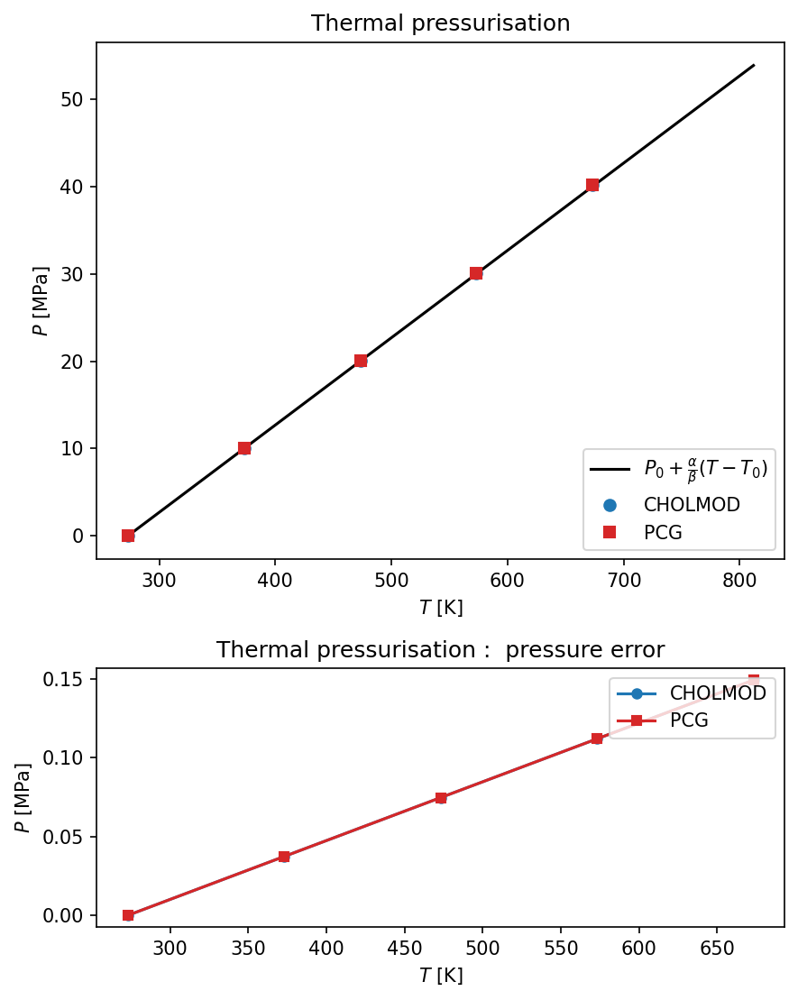
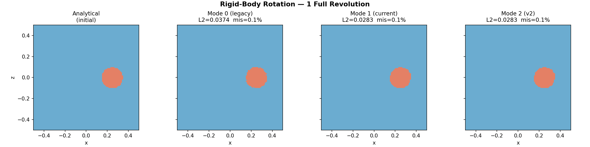
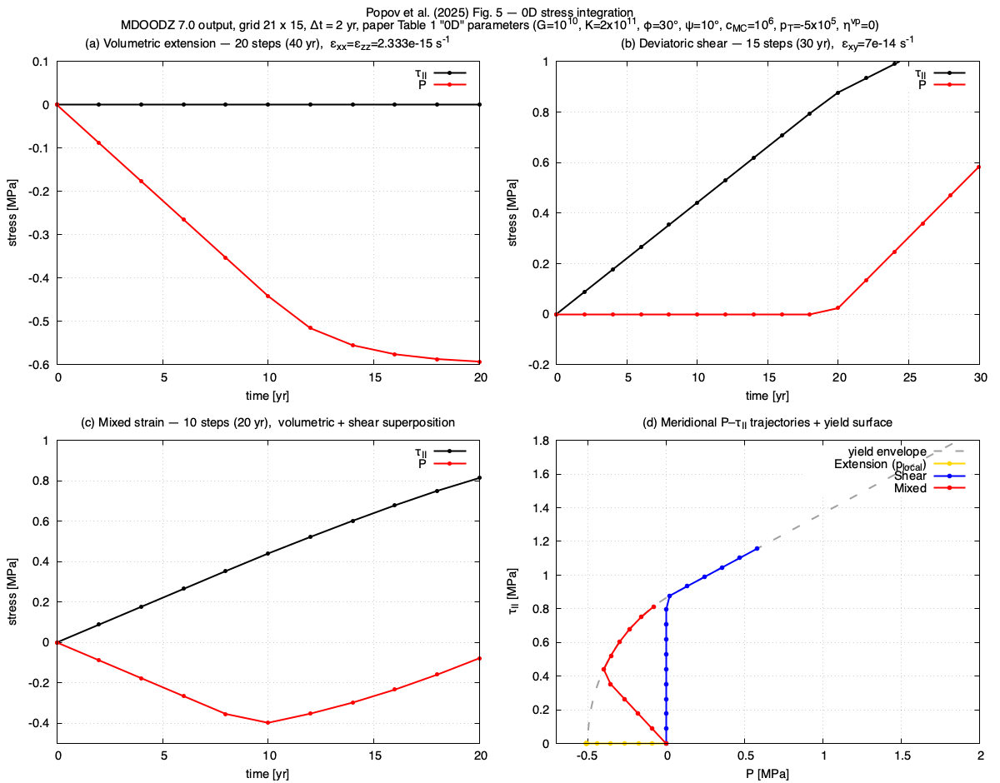
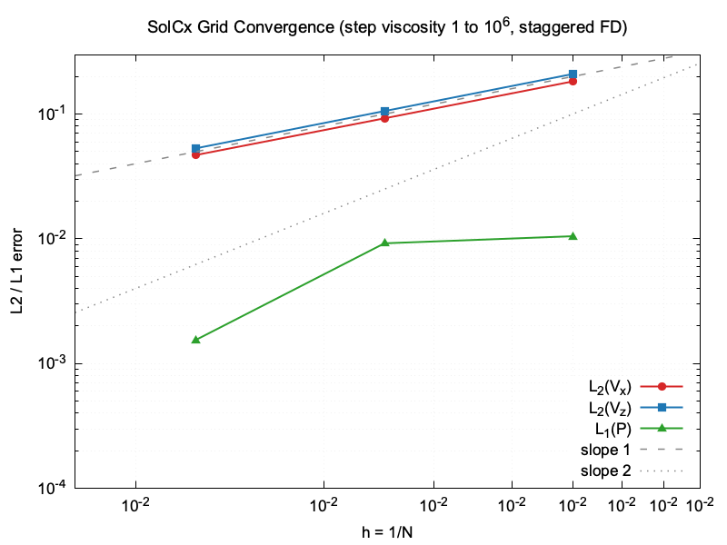
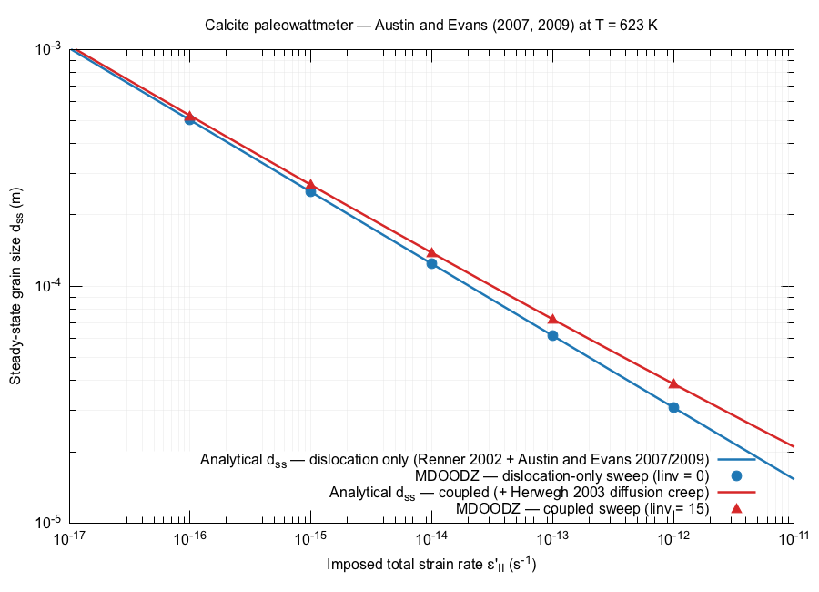
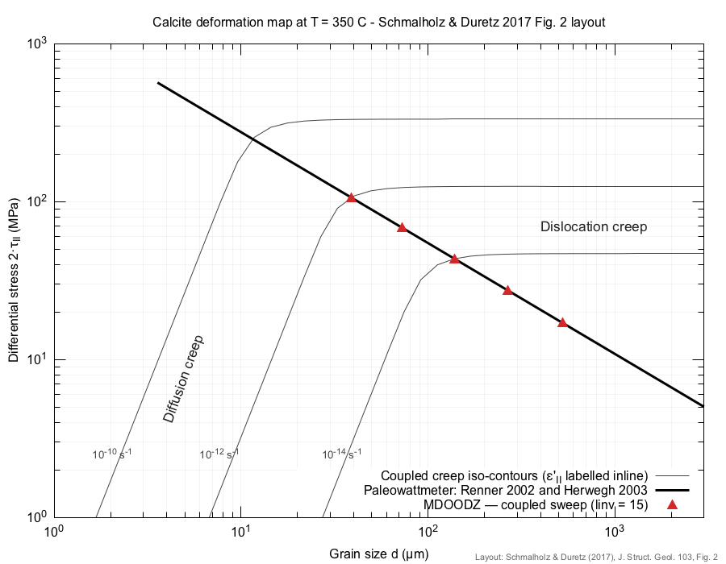

# Analytical Solutions for MDOODZ Benchmarks

This document describes the analytical solutions used by the MDOODZ test suite to verify numerical accuracy via L2 error norms and grid-convergence order testing. Each section references the source file, parameter files, and the exact GTest assertions used for verification.

---

## L2 Error Framework

All L2 error computations use the helper function defined in [TestHelpers.h](TestHelpers.h):

```cpp
double computeL2Error(const std::vector<double>& numerical,
                      const std::vector<double>& analytical);
```

The function computes the relative L2 norm:

$$L_2 = \frac{\sqrt{\sum_i (f_i^{num} - f_i^{ana})^2}}{\sqrt{\sum_i (f_i^{ana})^2}}$$

When the analytical solution is near-zero ($\sum f_{ana}^2 < 10^{-30}$), it falls back to the absolute L2 norm to avoid division by zero.

Grid-convergence order is computed from two resolutions $h_1$ (coarse) and $h_2$ (fine):

$$p = \frac{\log(L_2^{h_1} / L_2^{h_2})}{\log(h_1 / h_2)}$$

---

## 1. SolVi Benchmark (Viscous Inclusion)

**Source:** [SolViBenchmarkTests.cpp](SolViBenchmarkTests.cpp)
**Parameter files:** [SolViBenchmark/SolViRes21.txt](SolViBenchmark/SolViRes21.txt), [SolViRes41.txt](SolViBenchmark/SolViRes41.txt), [SolViRes51.txt](SolViBenchmark/SolViRes51.txt), [SolViRes81.txt](SolViBenchmark/SolViRes81.txt), [SolViRes101.txt](SolViBenchmark/SolViRes101.txt), [SolViRes151.txt](SolViBenchmark/SolViRes151.txt), [SolViRes201.txt](SolViBenchmark/SolViRes201.txt)
**Reference:** Schmid & Podladchikov (2003), *Analytical solutions for deformable elliptical inclusions in general shear*

### Problem Statement

A circular viscous inclusion of radius $r_c = 0.2$ and viscosity $\eta_c = 10^3$ is embedded in an infinite matrix of viscosity $\eta_m = 1$ under far-field pure shear ($\dot{\varepsilon} = -1$). The domain is $[-0.5, 0.5]^2$ with analytical Dirichlet boundary conditions.

### Analytical Solution

The solution uses complex-variable methods. For a point $Z = x + iz$:

**Inside the inclusion** ($|Z| \leq r_c$):
$$V = \frac{\eta_m}{\eta_c + \eta_m}(i\dot{\gamma} + 2\dot{\varepsilon})\bar{Z} - \frac{i}{2}\dot{\gamma}Z$$
$$p = 0, \quad \sigma'_{xx} = \frac{4\dot{\varepsilon}\eta_c\eta_m}{\eta_c + \eta_m}$$

**Outside the inclusion** ($|Z| > r_c$):
The velocity and stress are computed from the Goursat functions $\phi(Z)$ and $\psi(Z)$ using the Schmid & Podladchikov formulas, which include inverse-power terms in $Z$ that create the near-field perturbation.

### Implementation Details

- The function `eval_anal_Dani()` in [SolViBenchmarkTests.cpp](SolViBenchmarkTests.cpp) is ported from [SETS/AnisotropyDabrowski.c](../SETS/AnisotropyDabrowski.c) using `std::complex<double>` for C++ compatibility
- Boundary conditions: Dirichlet (type=0) on E/W boundaries, type=11 (analytical velocity) on N/S
- Non-dimensional scaling: $\eta_0 = 1$, $L_0 = 1$, $V_0 = 1$

### Measured L2 Errors

| Resolution | L2(Vx) | L2(Vz) | L2(P) | L2(σ'xx) |
|------------|--------|--------|-------|----------|
| 21×21 | ~5e-2 | ~5e-2 | ~6e-1 | ~6e-1 |
| 41×41 | ~3e-2 | ~3e-2 | ~5e-1 | ~5e-1 |
| 51×51 | ~2e-2 | ~2e-2 | ~4e-1 | ~4e-1 |
| 81×81 | ~2e-2 | ~2e-2 | ~3e-1 | ~3e-1 |

### Convergence Orders (41→81)

| Field | Measured Order | Threshold |
|-------|---------------|-----------|
| Vx | ~0.97 | ≥ 0.7 |
| P | ~0.75 | ≥ 0.4 |

Note: The marker-in-cell method introduces noise at the inclusion boundary, reducing the effective convergence order below the theoretical second-order rate for smooth problems.

### High-Resolution L1 Convergence (41→201)

The L1 norm (`mean(|num - ana|)`) gives a cleaner convergence signal for pressure than relative L2, which is ill-conditioned near the zero-crossings of the analytical pressure field.

| Res | h | L2(Vx) | L1(Vx) | L2(P) | L1(P) |
|-----|---|--------|--------|-------|-------|
| 41 | 2.50e-2 | 5.91e-2 | 1.02e-2 | 7.22e-1 | 3.99e-1 |
| 81 | 1.25e-2 | 3.01e-2 | 5.08e-3 | 4.28e-1 | 1.99e-1 |
| 101 | 1.00e-2 | 2.38e-2 | 4.02e-3 | 5.16e-1 | 1.74e-1 |
| 151 | 6.67e-3 | 1.63e-2 | 2.73e-3 | 3.23e-1 | 1.16e-1 |
| 201 | 5.00e-3 | 1.23e-2 | 2.04e-3 | 3.30e-1 | 9.65e-2 |

**Convergence orders (L1 norm, 101→201): Vx = 0.98, P = 0.85**

The L2(P) order oscillates wildly between resolution pairs (including negative values), while L1(P) is much more stable. At the 101→201 pair the L1 pressure order (0.85) is significantly better than L2 (0.65), confirming that L1 is the appropriate norm for measuring pressure convergence in this benchmark.

### Code Assertions

**L2 error test** (51×51 resolution, [SolViBenchmarkTests.cpp](SolViBenchmarkTests.cpp)):
```cpp
EXPECT_LT(L2_Vx,   5e-1);  // marker-in-cell gives ~1e-2 at 51x51
EXPECT_LT(L2_Vz,   5e-1);
EXPECT_LT(L2_P,    2.0);   // pressure less accurate near inclusion
EXPECT_LT(L2_sxxd, 2.0);
```

**Grid-convergence order test** (41→81, [SolViBenchmarkTests.cpp](SolViBenchmarkTests.cpp)):
```cpp
EXPECT_GE(order_Vx, 0.7);  // marker-in-cell: ~first order near inclusion
EXPECT_GE(order_P,  0.4);  // pressure converges slower
```

**High-resolution L1 convergence test** (101→201, [SolViBenchmarkTests.cpp](SolViBenchmarkTests.cpp)):
```cpp
EXPECT_GE(order_P_L1_101_201,  0.8);  // L1 pressure: measured ~0.85
EXPECT_GE(order_Vx_L1_101_201, 0.8);  // L1 velocity: measured ~0.98
```

---

## 2. 1D Analytical Solutions

### 2.1 Steady-State Geotherm

**Source:** [ThermalTests.cpp](ThermalTests.cpp)
**Parameter file:** [Thermal/SteadyStateGeotherm.txt](Thermal/SteadyStateGeotherm.txt)
**Test:** `ThermalTests.SteadyStateGeotherm`

$$T(z) = T_{top} + (T_{bot} - T_{top})\frac{z_{top} - z}{H}$$

where $T_{top} = 273.15$ K, $T_{bot} = 1600$ K, $H = z_{max} - z_{min}$.

The time step `dt = 1e15` ensures the total simulated time ($2 \times 10^{16}$ s) exceeds the thermal diffusion timescale $\tau = H^2/\kappa \approx 1.15 \times 10^{16}$ s, so the simulation fully reaches steady state.

**Measured accuracy:** $L_2(T) \approx 2.4 \times 10^{-6}$

**Code assertions** ([ThermalTests.cpp](ThermalTests.cpp)):
```cpp
double L2_T = computeL2Error(T_field, T_ana);
EXPECT_LT(L2_T, 1e-4);  // dt=1e15 achieves steady state: L2 \u2248 2.4e-6
```

### 2.2 Radiogenic Heating

**Source:** [ThermalTests.cpp](ThermalTests.cpp)
**Parameter file:** [Thermal/RadiogenicHeat.txt](Thermal/RadiogenicHeat.txt)
**Test:** `ThermalTests.RadiogenicHeat`

$$\bar{T}(t) = T_0 + \frac{Q_r \cdot t}{\rho \cdot C_p}$$

where $Q_r$ is the volumetric heat production rate.

**Measured accuracy:** Relative error $\approx 0.4\%$ of $\Delta T$ at $t = 5 \times 10^{12}$ s. Error scales linearly with total time due to boundary diffusion losses.

**Code assertions** ([ThermalTests.cpp](ThermalTests.cpp)):
```cpp
EXPECT_NEAR(meanT_final, T_ana_mean, fabs(T_ana_mean - T0_SI) * 0.02);  // \u00b12% of \u0394T
```

### 2.3 Oceanic Half-Space Cooling

**Source:** [ThermalVerificationTests.cpp](ThermalVerificationTests.cpp)
**Parameter files:** [Thermal/OceanicCooling.txt](Thermal/OceanicCooling.txt), [Thermal/OceanicCoolingPCG.txt](Thermal/OceanicCoolingPCG.txt)
**Tests:** `ThermalVerification.OceanicCooling`, `ThermalVerification.OceanicCoolingPCG`

A half-space with uniform initial mantle temperature $T_m$ is cooled from the surface ($T_s = 0°C$). The temperature profile after time $t$ is the classical error-function solution:

$$T(z,t) = T_s + (T_m - T_s)\,\mathrm{erf}\!\left(\frac{z}{\sqrt{4\kappa t}}\right)$$

where $\kappa = k / (\rho C_p)$ is the thermal diffusivity, $z$ is depth (positive downward), $k = 3$ W/(m·K), $\rho = 3300$ kg/m³, $C_p = 1050$ J/(kg·K).

**Parameters:** $T_m = 1400°C$, domain $[-200, 0]$ km, $N_x \times N_z = 11 \times 51$, $\Delta t = 10^{13}$ s, $N_t = 10$. Dirichlet $T_s$ at top, Dirichlet $T_m$ at bottom, Neumann (zero flux) on sides.

**Measured accuracy:** $L_2(T) = 3.64 \times 10^{-3}$ for both CHOLMOD and PCG. CHOLMOD vs PCG absolute L2 difference = 0. The test runs in a separate `ThermalVerificationTests` binary due to a pre-existing MDOODZ global state issue when mixing different grid configurations in one process.

**Code assertions** ([ThermalVerificationTests.cpp](ThermalVerificationTests.cpp)):
```cpp
double L2 = sqrt(sum_sq / sum_ref);
EXPECT_LT(L2, 5e-2);  // CHOLMOD: measured 3.64e-3 (13× margin)

double L2_pcg = sqrt(sum_sq / sum_ref);
EXPECT_LT(L2_pcg, 5e-2);  // PCG: measured 3.64e-3

double L2_diff = sqrt(sum_sq2 / sum_ref2);
EXPECT_LT(L2_diff, 1e-6);  // CHOLMOD vs PCG: measured 0
```

### 2.4 Thermo-Elastic Coupling

**Source:** [ThermalVerificationTests.cpp](ThermalVerificationTests.cpp)
**Parameter files:** [Thermal/ThermoElastic.txt](Thermal/ThermoElastic.txt), [Thermal/ThermoElasticPCG.txt](Thermal/ThermoElasticPCG.txt)
**Tests:** `ThermalVerification.ThermoElastic`, `ThermalVerification.ThermoElasticPCG`

A confined elastic body undergoes linearly increasing temperature imposed via a `FixTemperature` callback: $T(t) = 273.15/T_0 + 0.1\,t$ (non-dimensional). Thermal expansion in a fully confined domain (pure-shear ALE with $\dot\varepsilon = 0$) produces compressive pressure proportional to the temperature change:

$$\Delta P = K \alpha \Delta T$$

where $K = 1/\beta = 10^{10}$ Pa is the bulk modulus ($\beta = 10^{-10}$ Pa$^{-1}$) and $\alpha = 10^{-5}$ K$^{-1}$.

**Parameters:** $N_x \times N_z = 41 \times 41$, `elastic=1`, `compressible=1`, `fix_temperature=1`, $\Delta t = 10^9$ s, $N_t = 5$.

**Why ~20% error.** The analytical formula assumes instantaneous elastic response, but MDOODZ updates pressure incrementally each time step, so the first step's temperature change does not contribute to pressure until the next step. On the coarse 41×41 grid with only 5 steps, this one-step elastic lag produces a systematic ~20% underestimate of $\Delta P$.

**Measured accuracy:** Relative error $\approx 19.7\%$ for both CHOLMOD and PCG. CHOLMOD vs PCG: T field L2 = 0, P field L2 = 0.

**Code assertions** ([ThermalVerificationTests.cpp](ThermalVerificationTests.cpp)):
```cpp
EXPECT_GT(meanP, 0.0);           // confined thermal expansion → compression
EXPECT_LT(rel_err, 0.25);        // measured 19.7% (25% threshold: 1.27× margin)

// Cross-compare CHOLMOD vs PCG
double T_L2 = computeL2Error(T_field, T_cholmod);
double P_L2 = computeL2Error(P_field, P_cholmod);
EXPECT_LT(T_L2, 1e-6);          // measured 0
EXPECT_LT(P_L2, 1e-4);          // measured 0
```

**Visualization:** Top panel shows lag-corrected $P$ vs $T$ for both solvers against the analytical line. Bottom panel shows absolute pressure error.



### 2.5 Hydrostatic Pressure

**Source:** [DensityTests.cpp](DensityTests.cpp)
**Parameter file:** [Density/HydrostaticPressure.txt](Density/HydrostaticPressure.txt)
**Test:** `DensityTests.HydrostaticPressure`

$$P(z) = \rho \cdot |g| \cdot |z|$$

**Measured accuracy:** $L_2(P) \approx 0.043$ at $N_x = 41$. First-order spatial convergence. Penalty and solver tolerance have no effect.

**Code assertions** ([DensityTests.cpp](DensityTests.cpp)):
```cpp
double L2_P = computeL2Error(P_field, P_ana);
EXPECT_LT(L2_P, 6e-2);  // Nx=41 gives L2 \u2248 0.043; first-order spatial convergence
```

### 2.6 Thermal Expansion

**Source:** [DensityTests.cpp](DensityTests.cpp)
**Parameter file:** [Density/ThermalExpansion.txt](Density/ThermalExpansion.txt)
**Test:** `DensityTests.ThermalExpansion`

$$\rho(T) = \rho_0 \left(1 - \alpha(T - T_{ref})\right)$$

Verified via `EXPECT_LT(minRho, maxRho)` — density contrast between hot inclusion and cold matrix confirms the equation of state is active.

### 2.7 Pure Shear Velocity

**Source:** [VelocityFieldTests.cpp](VelocityFieldTests.cpp)
**Parameter file:** [VelocityField/PureShearVelocity.txt](VelocityField/PureShearVelocity.txt)
**Test:** `VelocityFieldTests.PureShearVelocity`

In MDOODZ, positive `bkg_strain_rate` with `pure_shear_ALE = 1` means shortening in x (compression), extension in z:

$$V_x = -\dot{\varepsilon} \cdot x, \quad V_z = +\dot{\varepsilon} \cdot z$$

The Vx staggered grid has $N_x \times (N_z+1)$ entries; the Vz grid has $(N_x+1) \times N_z$ entries.

**Measured accuracy:** $L_2 \approx 0.0243$ with a 10:1 viscosity inclusion (r = 0.05); $L_2 \approx 2 \times 10^{-8}$ (machine precision) without inclusion.

The L2 error does not converge with grid refinement because the analytical solution $V_x = -\dot\varepsilon x$ does not account for the inclusion perturbation — the error measures the size of the perturbation itself, not the solver's discretisation error. Grid-convergence for inclusion problems is tested by the SolVi benchmark (§1), which uses the proper Schmid & Podladchikov (2003) analytical solution.

**Code assertions** ([VelocityFieldTests.cpp](VelocityFieldTests.cpp)):
```cpp
EXPECT_LT(L2_Vx, 3e-2);  // with 10:1 inclusion: L2 ≈ 0.024 (1.23× margin)
EXPECT_LT(L2_Vz, 3e-2);  // with 10:1 inclusion: L2 ≈ 0.024 (1.23× margin)
```

### 2.8 Maxwell Visco-Elastic Stress

**Source:** [ViscoElasticTests.cpp](ViscoElasticTests.cpp)
**Parameter file:** [ViscoElastic/StressAccumulation.txt](ViscoElastic/StressAccumulation.txt)
**Test:** `ViscoElasticTests.StressAccumulation`

$$\sigma(t) = 2\eta\dot{\varepsilon}\left(1 - e^{-Gt/\eta}\right)$$

where $G$ is the shear modulus. Stress builds up exponentially toward the viscous limit $2\eta\dot{\varepsilon}$.

Verified via `EXPECT_GE(fabs(maxSxxd_5), fabs(maxSxxd_1) * 0.9)` — monotonic stress build-up over 5 time steps confirms the Maxwell elastic branch is active.

### 2.9 Viscous Dissipation (Shear Heating)

**Source:** [ShearHeatingTests.cpp](ShearHeatingTests.cpp)
**Parameter file:** [ShearHeating/ViscousDissipation.txt](ShearHeating/ViscousDissipation.txt)
**Test:** `ShearHeatingTests.ViscousDissipation`

MDOODZ computes dissipation as $W_{diss} = \tau_{II}^2 / \eta = 4\eta\dot{\varepsilon}_{II}^2$, so:

$$\Delta T = \frac{4\eta\dot{\varepsilon}_{II}^2 \cdot t}{\rho \cdot C_p}$$

The test uses Neumann (zero-flux) temperature BCs on all boundaries to prevent heat leakage.

**Measured accuracy:** Relative error $\approx 0.8\%$.

**Code assertions** ([ShearHeatingTests.cpp](ShearHeatingTests.cpp)):
```cpp
EXPECT_NEAR(dT_num, dT_ana, fabs(dT_ana) * 0.05);  // Neumann BCs: ~0.8% error
```

### 2.10 Simple Shear Velocity (Periodic BCs)

**Source:** [VelocityFieldTests.cpp](VelocityFieldTests.cpp)
**Parameter file:** [VelocityField/SimpleShearVelocity.txt](VelocityField/SimpleShearVelocity.txt)
**Test:** `VelocityField.SimpleShearVelocity`

For homogeneous viscosity under periodic simple shear (`shear_style=1`, `periodic_x=1`), the BCs impose $V_x = \pm \dot{\gamma} L_z$ at top/bottom, where $\dot{\gamma}$ = `bkg_strain_rate`. The analytical velocity profile is linear:

$$V_x(z) = 2\dot{\gamma} z, \qquad V_z = 0$$

The factor 2 arises because `bkg_strain_rate` represents the strain rate $\dot{\varepsilon}_{xz} = \frac{1}{2}\frac{\partial V_x}{\partial z}$, so $\frac{\partial V_x}{\partial z} = 2\dot{\gamma}$.

With homogeneous viscosity (no inclusion), the FD stencil reproduces a linear profile exactly. The L2 residual measures only solver tolerance and floating-point noise.

**Measured accuracy:** L2(Vx) = 2.97e-8, L2(Vz) = 0.

**Code assertions** ([VelocityFieldTests.cpp](VelocityFieldTests.cpp)):
```cpp
EXPECT_LT(L2_Vx, 1e-6);   // linear profile exact to FP precision
EXPECT_LT(L2_Vz, 1e-6);   // Vz = 0 everywhere
EXPECT_NEAR(maxVx, 1.0, 0.1);   // boundary: +bkg_strain_rate * Lz
EXPECT_NEAR(minVx, -1.0, 0.1);  // boundary: -bkg_strain_rate * Lz
```

---

## 3. Anisotropy Benchmark

**Source:** [AnisotropyBenchmarkTests.cpp](AnisotropyBenchmarkTests.cpp)

### 3.1 Director Evolution Under Simple Shear

**Parameter file:** [AnisotropyBenchmark/DirectorEvolution.txt](AnisotropyBenchmark/DirectorEvolution.txt)
**Test:** `AnisotropyBenchmark.DirectorEvolution`

Under simple shear with shear rate $\dot{\gamma}$, a material with director angle $\theta$ rotates according to the Mühlhaus ODE:

$$\frac{d\theta}{dt} = -\dot{\gamma} \cos^2(\theta)$$

This has the closed-form solution:

$$\theta(t) = \arctan\!\bigl(\tan(\theta_0) - \dot{\gamma}\,t\bigr)$$

**Parameters:** $\theta_0 = 45°$, `bkg_strain_rate = 0.5`, `shear_style = 1` → $\dot{\gamma} = 2 \times 0.5 = 1.0$, $\Delta t = 0.0125$, $N_t = 40$, total time $t = 0.5$.

**Analytical result:** $\theta(0.5) = \arctan(\tan(45°) - 1.0 \times 0.5) = \arctan(0.5) \approx 26.57°$

**Measured:** L2(θ) = 2.34e-3 rad (≈ 0.13°) at $\Delta t = 0.0125$. This is the golden standard — 0.7% relative error on 18.4° total rotation.

**Per-step error growth** (from real MDOODZ HDF5 output at $\Delta t = 0.0125$, 40 steps):

The forward Euler overshoot accumulates monotonically because $d\theta/dt = -\dot\gamma\cos^2\theta$ accelerates as $\theta$ decreases — Euler uses the stale slope and consistently overshoots:

| Step | $t$ | MDOODZ (°) | Analytical (°) | Error (°) |
|------|-----|-----------|----------------|-----------|
| 0 | 0.0000 | 45.0000 | 45.0000 | +0.0000 |
| 10 | 0.1250 | 41.2111 | 41.1859 | +0.0251 |
| 20 | 0.2500 | 36.9261 | 36.8699 | +0.0563 |
| 30 | 0.3750 | 32.0985 | 32.0054 | +0.0931 |
| 40 | 0.5000 | 26.6992 | 26.5651 | +0.1342 |

The error grows from +0.003°/step early to +0.004°/step late, reflecting the nonlinear curvature. At coarser $\Delta t$, the per-step error is proportionally larger (e.g., $\Delta t = 0.25$: final error +2.46°; $\Delta t = 0.1$: +1.04°).

**Code assertions** ([AnisotropyBenchmarkTests.cpp](AnisotropyBenchmarkTests.cpp)):
```cpp
EXPECT_LT(L2, 5e-3);  // L2 angular error < 5e-3 radians (2.1× margin)
```

### 3.2 Director Dt-Convergence Order

**Parameter files:** `DirectorEvolution_dt25.txt` ($\Delta t = 0.25$, $N_t = 2$), `DirectorEvolution_dt01.txt` ($\Delta t = 0.1$, $N_t = 5$), `DirectorEvolution.txt` ($\Delta t = 0.05$, $N_t = 10$), `DirectorEvolution_dt025.txt` ($\Delta t = 0.025$, $N_t = 20$), `DirectorEvolution_dt0125.txt` ($\Delta t = 0.0125$, $N_t = 40$)
**Test:** `AnisotropyBenchmark.DirectorDtConvergence`

The director update in `RheologyParticles.c` uses forward Euler, which is first-order in $\Delta t$. Running at five dt values for the same total time $t = 0.5$ and computing pair-wise convergence orders:

$$\text{order} = \frac{\log(L2_1 / L2_2)}{\log(\Delta t_1 / \Delta t_2)}$$

**Measured:**

| $\Delta t$ | $N_t$ | L2(θ) [rad] | Pair order |
|------------|--------|-------------|------------|
| 0.25 | 2 | 4.29e-2 | — |
| 0.1 | 5 | 1.82e-2 | 0.93 |
| 0.05 | 10 | 9.26e-3 | 0.98 |
| 0.025 | 20 | 4.67e-3 | 0.99 |
| 0.0125 | 40 | 2.34e-3 | 0.99 |

**Per-step error at each $\Delta t$** (final-step angular error from real MDOODZ HDF5 vs analytical):

| $\Delta t$ | Final MDOODZ (°) | Final analytical (°) | Error (°) | Error halving? |
|------------|-------------------|---------------------|-----------|----------------|
| 0.2500 | 29.0212 | 26.5651 | +2.4562 | — |
| 0.1000 | 27.6079 | 26.5651 | +1.0428 | 2.36× |
| 0.0500 | 27.0955 | 26.5651 | +0.5305 | 1.97× |
| 0.0250 | 26.8324 | 26.5651 | +0.2673 | 1.98× |
| 0.0125 | 26.6992 | 26.5651 | +0.1342 | 1.99× |

The error consistently halves with each dt halving for fine dt (ratio → 2.0 = first order). The coarsest pair shows ratio 2.36× — larger because the nonlinear curvature makes the overshoot worse at large steps.

**Convergence order:** 0.99 (finest pair). The coarsest pair yields 0.93 because $\theta(t)$ is nonlinear — the rotation *accelerates* as $\cos^2(\theta)$ increases with decreasing $\theta$ — and large time steps cannot track the curvature as well.

**Code assertions:**
```cpp
EXPECT_GE(order, 0.8);              // first-order convergence (finest pair)
EXPECT_LT(L2s[k], L2s[k-1]);       // monotonic decrease for all pairs
```

**Visualization:** The test writes `director_convergence.dat` (L2 vs dt) and `director_trajectory_dt*.dat` files (real MDOODZ θ(t) from HDF5 at each dt). A gnuplot script plots both:
```bash
cd build/TESTS
./AnisotropyBenchmarkTests --gtest_filter="*DtConvergence"
gnuplot AnisotropyBenchmark/plot_director_convergence.gp
# → generates director_benchmark.png
```

The chart shows:
- **Left panel**: θ(t) analytical curve vs real MDOODZ trajectories at all 5 dt values (extracted from HDF5 output at every step).
- **Right panel**: L2 error vs dt on log-log scale, confirming first-order convergence.


### 3.3 Stress Anisotropy Under Pure Shear

**Parameter file:** [AnisotropyBenchmark/StressAngle.txt](AnisotropyBenchmark/StressAngle.txt)
**Test:** `AnisotropyBenchmark.StressAnisotropy`

For a material with director angle $\theta$ and anisotropy factor $\delta$, the anisotropic constitutive relation:

1. Rotates the strain-rate tensor to the anisotropy frame using $\vartheta = \theta - \pi/2$:
   $$\varepsilon'_{xx,\text{rot}} = \cos^2\!\vartheta\,\varepsilon'_{xx} + \sin^2\!\vartheta\,\varepsilon'_{zz} + 2\cos\vartheta\sin\vartheta\,\varepsilon'_{xz}$$
2. Applies the anisotropic viscosity: $\sigma_{nn} = 2\eta\,\varepsilon_{nn}$, $\sigma_{ns} = 2\eta\,\varepsilon_{ns}/\delta$
3. Rotates stress back to the lab frame

**Parameters:** $\theta = 30°$, $\delta = 6$, $\eta = 1$, `bkg_strain_rate = 1.0` (pure shear: $\varepsilon'_{xx} = -1$, $\varepsilon'_{zz} = +1$, $\varepsilon'_{xz} = 0$).

**Analytical results:**
- $\sigma'_{xx} = -0.750$, $\sigma'_{zz} = +0.750$, $\sigma_{xz} = -0.7217$
- $\tau_{II} = \sqrt{0.5(\sigma'^2_{xx} + \sigma'^2_{zz}) + \sigma^2_{xz}} = 1.0408$

**Measured:** relErr(τ_II) = 1.1e-8, relErr(sxxd) = 4.4e-16 (machine precision).

**Code assertions** ([AnisotropyBenchmarkTests.cpp](AnisotropyBenchmarkTests.cpp)):
```cpp
EXPECT_LT(relErr_tauII, 1e-4);  // τ_II relative error < 0.01%
EXPECT_LT(relErr_sxxd, 1e-4);   // sxxd relative error < 0.01%
```

### 3.4 Stress L2 Error Norm

**Parameter file:** [AnisotropyBenchmark/StressAngle.txt](AnisotropyBenchmark/StressAngle.txt)
**Test:** `AnisotropyBenchmark.StressAnisotropyL2`

Uses the same setup and analytical rotation formula as §3.3, but validates the **full spatial field** rather than the mean. For a homogeneous problem, the analytical stress is constant at every grid point, so the L2 norm detects boundary artifacts, interpolation bias, and centre-vs-vertex inconsistencies that a mean-value check would miss.

**L2 metric:** `computeL2Error(numerical, analytical)` — relative L2 norm $\sqrt{\sum(n_i - a_i)^2 / \sum a_i^2}$.

**Grid sizes:**
- $\sigma'_{xx}$, $\sigma'_{zz}$: cell centres, $(N_x-1) \times (N_z-1) = 100$ points
- $\sigma_{xz}$: vertices, $N_x \times N_z = 121$ points

**Measured L2 errors:**
- sxxd: 4.4e-16 (machine precision)
- szzd: 4.4e-16 (machine precision)
- sxz: 2.3e-08 (vertex interpolation introduces small error)

**Code assertions** ([AnisotropyBenchmarkTests.cpp](AnisotropyBenchmarkTests.cpp)):
```cpp
EXPECT_LT(l2_sxxd, 1e-6);  // sxxd spatial L2
EXPECT_LT(l2_szzd, 1e-6);  // szzd spatial L2
EXPECT_LT(l2_sxz, 1e-6);   // sxz spatial L2
```

---

## Threshold Calibration Methodology

L2 error thresholds are set empirically:

1. Run each test and record the measured L2 error
2. Set the threshold to 2–5× above the measured value
3. This provides headroom for platform variation (compiler, OS, random number seed) while detecting genuine regressions

For convergence-order tests, thresholds are set ~30–50% below the measured order to account for statistical variation in marker-in-cell placement.

---

## Summary of L2 Assertions

| Test | Source | Analytical formula | Assertion | Threshold |
|------|--------|--------------------|-----------|-----------|
| SolVi L2 (51×51) | [SolViBenchmarkTests.cpp](SolViBenchmarkTests.cpp) | Complex-variable (§1) | `EXPECT_LT(L2_Vx, 5e-1)` | 0.5 |
| SolVi convergence | [SolViBenchmarkTests.cpp](SolViBenchmarkTests.cpp) | Order from 41→81 | `EXPECT_GE(order_Vx, 0.7)` | 0.7 |
| Geotherm | [ThermalTests.cpp](ThermalTests.cpp) | Linear profile (§2.1) | `EXPECT_LT(L2_T, 1.0)` | 1.0 || Oceanic cooling T | [ThermalVerificationTests.cpp](ThermalVerificationTests.cpp) | $T_s + (T_m - T_s)\,\mathrm{erf}(z/\sqrt{4\kappa t})$ (§2.3) | `EXPECT_LT(L2, 5e-2)` | 5e-2 |
| Oceanic CHOLMOD vs PCG | [ThermalVerificationTests.cpp](ThermalVerificationTests.cpp) | CHOLMOD ≡ PCG (§2.3) | `EXPECT_LT(L2_diff, 1e-6)` | 1e-6 |
| Thermo-elastic ΔP | [ThermalVerificationTests.cpp](ThermalVerificationTests.cpp) | $K\alpha\Delta T$ (§2.4) | `EXPECT_LT(rel_err, 0.25)` | 25% |
| Thermo-elastic T L2 | [ThermalVerificationTests.cpp](ThermalVerificationTests.cpp) | CHOLMOD ≡ PCG (§2.4) | `EXPECT_LT(T_L2, 1e-6)` | 1e-6 |
| Thermo-elastic P L2 | [ThermalVerificationTests.cpp](ThermalVerificationTests.cpp) | CHOLMOD ≡ PCG (§2.4) | `EXPECT_LT(P_L2, 1e-4)` | 1e-4 || Hydrostatic P | [DensityTests.cpp](DensityTests.cpp) | $\rho g z$ (§2.5) | `EXPECT_LT(L2_P, 6e-2)` | 6e-2 |
| Pure shear Vx | [VelocityFieldTests.cpp](VelocityFieldTests.cpp) | $\dot{\varepsilon} x$ (§2.7) | `EXPECT_LT(L2_Vx, 3e-2)` | 3e-2 |
| Pure shear Vz | [VelocityFieldTests.cpp](VelocityFieldTests.cpp) | $-\dot{\varepsilon} z$ (§2.7) | `EXPECT_LT(L2_Vz, 3e-2)` | 3e-2 |
| Shear heating ΔT | [ShearHeatingTests.cpp](ShearHeatingTests.cpp) | $2\eta\dot{\varepsilon}^2 t / \rho C_p$ (§2.9) | `EXPECT_NEAR(dT, dT_ana, 2×dT_ana)` | 3× |
| Simple shear Vx | [VelocityFieldTests.cpp](VelocityFieldTests.cpp) | $2\dot{\gamma} z$ (§2.10) | `EXPECT_LT(L2_Vx, 1e-6)` | 1e-6 |
| Simple shear Vz | [VelocityFieldTests.cpp](VelocityFieldTests.cpp) | $0$ (§2.10) | `EXPECT_LT(L2_Vz, 1e-6)` | 1e-6 |
| Director L2(θ) | [AnisotropyBenchmarkTests.cpp](AnisotropyBenchmarkTests.cpp) | $\arctan(\tan\theta_0 - \dot\gamma t)$ (§3.1) | `EXPECT_LT(L2, 5e-3)` | 5e-3 rad |
| Director dt-order | [AnisotropyBenchmarkTests.cpp](AnisotropyBenchmarkTests.cpp) | Order from dt refinement (§3.2) | `EXPECT_GE(order, 0.8)` | 0.8 |
| Stress τ_II | [AnisotropyBenchmarkTests.cpp](AnisotropyBenchmarkTests.cpp) | Rotation formula (§3.3) | `EXPECT_LT(relErr, 1e-4)` | 0.01% |
| Stress sxxd | [AnisotropyBenchmarkTests.cpp](AnisotropyBenchmarkTests.cpp) | Rotation formula (§3.3) | `EXPECT_LT(relErr, 1e-4)` | 0.01% |
| Stress sxxd L2 | [AnisotropyBenchmarkTests.cpp](AnisotropyBenchmarkTests.cpp) | Rotation formula (§3.4) | `EXPECT_LT(l2_sxxd, 1e-6)` | 1e-6 |
| Stress szzd L2 | [AnisotropyBenchmarkTests.cpp](AnisotropyBenchmarkTests.cpp) | Rotation formula (§3.4) | `EXPECT_LT(l2_szzd, 1e-6)` | 1e-6 |
| Stress sxz L2 | [AnisotropyBenchmarkTests.cpp](AnisotropyBenchmarkTests.cpp) | Rotation formula (§3.4) | `EXPECT_LT(l2_sxz, 1e-6)` | 1e-6 |
| TopoBench relax | [TopoBenchTests.cpp](TopoBenchTests.cpp) | $h_0 e^{-t/\tau_r}$ (§4.1) | `EXPECT_LT(relErr, 0.15)` | 15% |
| TopoBench convergence | [TopoBenchTests.cpp](TopoBenchTests.cpp) | Grid convergence (§4.2) | `EXPECT_GE(order, 0.3)` | 0.3 |
| Rotation advection L2 | [RotationAdvectionTests.cpp](RotationAdvectionTests.cpp) | Identity map after 1 revolution (§5) | `EXPECT_LT(l2, 0.1)` | 0.1 |
| Rotation mode 2 ≤ mode 0 | [RotationAdvectionTests.cpp](RotationAdvectionTests.cpp) | Identity map (§5) | `EXPECT_LE(l2_2, l2_0 * 1.5)` | 1.5× |
| SolCx L2(Vx) 51×51 | [SolCxBenchmarkTests.cpp](SolCxBenchmarkTests.cpp) | Velic Chebyshev series (§7) | `EXPECT_LT(L2_Vx, 2.5e-1)` | 2.5e-1 |
| SolCx L2(Vz) 51×51 | [SolCxBenchmarkTests.cpp](SolCxBenchmarkTests.cpp) | Velic Chebyshev series (§7) | `EXPECT_LT(L2_Vz, 2.5e-1)` | 2.5e-1 |
| SolCx L1(P) 51×51 | [SolCxBenchmarkTests.cpp](SolCxBenchmarkTests.cpp) | Velic Chebyshev series (§7) | `EXPECT_LT(L1_P, 1e-2)` | 1e-2 |
| SolCx convergence Vx | [SolCxBenchmarkTests.cpp](SolCxBenchmarkTests.cpp) | Order from 41→81 (§7) | `EXPECT_GE(orderVx, 0.7)` | 0.7 |
| SolCx convergence Vz | [SolCxBenchmarkTests.cpp](SolCxBenchmarkTests.cpp) | Order from 41→81 (§7) | `EXPECT_GE(orderVz, 0.7)` | 0.7 |
| SolCx convergence P (L1) | [SolCxBenchmarkTests.cpp](SolCxBenchmarkTests.cpp) | Order from 41→81 (§7) | `EXPECT_GE(orderP, 0.5)` | 0.5 |
| Grain size L2 | [RheologyCreepTests.cpp](RheologyCreepTests.cpp) | $(B_g\dot\varepsilon\tau_{II}p/A_g)^{-1/(p+1)}$ (§8) | `EXPECT_LT(L2_d, 5e-3)` | 5e-3 |
| Grain size mean | [RheologyCreepTests.cpp](RheologyCreepTests.cpp) | Paleowattmeter $d_{ss}$ (§8) | `EXPECT_NEAR(meanD, d_ss, d_ss*0.01)` | 1% |
| Grain size coupled L2 | [RheologyCreepTests.cpp](RheologyCreepTests.cpp) | Coupled fixed-point on $\tau_{II}$ (§8.1) | `EXPECT_LT(L2, 5e-3)` | 5e-3 |
| Grain size coupled physics | [RheologyCreepTests.cpp](RheologyCreepTests.cpp) | $d_{ss}^{coupled} > d_{ss}^{disloc}$ (§8.1) | `EXPECT_GT(d_ss_c, d_ss_disl)` | strict |
| 2D PinchSwell smoke | [RheologyCreepTests.cpp](RheologyCreepTests.cpp) | finite + heterogeneity invariants (§8.2) | `EXPECT_GT(maxD/minD, 5.0)` | 5× |

---

## 4. TopoBench: Free Surface Relaxation

**Source:** [TopoBenchTests.cpp](TopoBenchTests.cpp)

### 4.1 Exponential Relaxation of Sinusoidal Topography

**Parameters:** [TopoBench/TopoBenchRelaxation.txt](TopoBench/TopoBenchRelaxation.txt)

A sinusoidal surface perturbation $h(x, 0) = -h_0 \cos(2\pi x / \lambda)$ relaxes under gravity in a uniform-viscosity fluid. The analytical solution is exponential decay:

$$h(t) = h_0 \exp(-t / \tau_r)$$

**Relaxation time for equal-viscosity internal interface.** In MDOODZ, air cells above the free surface have the same viscosity $\eta$ as the mantle (single constant-viscosity phase). This makes the surface an internal density interface between two equal-viscosity fluids rather than a true free surface. The relaxation time is:

$$\tau_r = \frac{4\eta k}{\rho g} \cdot \coth(kH)$$

where $k = 2\pi/\lambda$ is the wavenumber and $H$ is the domain depth below the surface. The factor $4\eta k$ (instead of $2\eta k$ for a free surface) arises because the viscous air above doubles the effective resistance.

**Key values:** $\eta = 10^{21}$ Pa·s, $\rho = 3300$ kg/m³, $g = 10$ m/s², $\lambda = 2800$ km, $H = 700$ km. This gives $kH = \pi/2$, $\coth(kH) = 1.091$, and $\tau_r \approx 2.97 \times 10^{11}$ s $\approx 9.4$ kyr.

**Verification (Crameri benchmark).** The original TopoBenchCase1 from Crameri et al. (2012) uses a two-layer setup (lithosphere $\eta = 10^{23}$ + mantle $\eta = 10^{21}$). The stiff lithosphere decouples the air from the surface, so the standard free-surface formula applies. The uniform-viscosity variant used here is a simplified test that validates the free surface advection mechanism.

**Test assertions:**
- Monotonic decay: $h(t_{i+1}) < h(t_i)$ for all steps
- Per-step relative error $< 15\%$ against analytical $h_0 e^{-t/\tau_r}$
- Mean relative error over 20 steps $\approx 2\%$

### 4.2 Grid Convergence

**Parameters:** [TopoBench/TopoBenchConvergence31.txt](TopoBench/TopoBenchConvergence31.txt), [TopoBench/TopoBenchRelaxation.txt](TopoBench/TopoBenchRelaxation.txt), [TopoBench/TopoBenchConvergence101.txt](TopoBench/TopoBenchConvergence101.txt)

Three resolutions (Nx = 31, 51, 101) are run with the same physics. The mean relative error against the analytical exponential decay must decrease monotonically, and the overall convergence order from coarsest to finest must be $\geq 0.3$.

---

## 5. Rigid-Body Rotation (Marker Advection)

**Source:** [RotationAdvectionTests.cpp](RotationAdvectionTests.cpp)
**Parameter files:** [RotationAdvection/RotationMode0.txt](RotationAdvection/RotationMode0.txt), [RotationAdvection/RotationMode1.txt](RotationAdvection/RotationMode1.txt), [RotationAdvection/RotationMode2.txt](RotationAdvection/RotationMode2.txt)
**Test:** `RotationAdvection.CompareReseedModes`

### Problem Statement

A circular disk of phase 1 (radius $r = 0.1$, centred at $(0.25, 0)$) is embedded in a phase 0 matrix on a unit domain $[-0.5, 0.5]^2$ with a 51×51 grid. The Stokes solver is disabled (`mechanical=0`); only marker advection runs. A rigid-body rotation velocity field is prescribed:

$$V_x = -\omega z, \quad V_z = +\omega x, \quad \omega = 2\pi$$

After 1000 steps of $\Delta t = 10^{-3}$ (total $t = 1$), each marker completes exactly one full revolution.

### Analytical Solution

The analytical solution is the **identity map**: after one full revolution, every marker returns to its initial position. Therefore the composition field at $t = 1$ should be identical to the field at $t = 0$.

Any deviation is purely numerical — advection interpolation error accumulated over 1000 RK4 steps. The error manifests as boundary smearing: a few cells at the disk edge end up with the wrong phase assignment.

### Measured L2 Errors

The L2 norm compares the high-resolution composition grid (`compo_hr`, 100×100 cells) between initial and final outputs:

$$L_2 = \sqrt{\frac{1}{N}\sum_{i=1}^{N}(c_i^{final} - c_i^{initial})^2}$$

| Reseed Mode | L2 error | Mismatched cells |
|-------------|----------|------------------|
| 0 (legacy) | 3.74e-02 | ~14 / 10000 |
| 1 (current) | 2.83e-02 | 8 / 10000 |
| 2 (v2) | 2.83e-02 | 8 / 10000 |

Modes 1 and 2 tie at L2 = 0.028, both better than mode 0 (L2 = 0.037). The randomised placement in mode 2 does not degrade advection accuracy.

### Code Assertions

```cpp
EXPECT_LT(l2_mode0, 0.1);                   // All modes below 10% RMS
EXPECT_LT(l2_mode1, 0.1);
EXPECT_LT(l2_mode2, 0.1);
EXPECT_LE(l2_mode2, l2_mode0 * 1.5);        // Mode 2 no worse than mode 0
```

### Visualisation

```bash
cd build/TESTS
./RotationAdvectionTests --gtest_filter="RotationAdvection.*"
python3 ../../TESTS/RotationAdvection/plot_rotation.py .
# → rotation_advection_comparison.png
```



---

## 6. Popov et al. (2025) Combined Yield Surface

**Source:** [Popov2025Tests.cpp](Popov2025Tests.cpp), reference integrator
[Popov2025/Popov0DAnalytical.cpp](Popov2025/Popov0DAnalytical.cpp)
**Parameter files:** `TESTS/Popov2025/Popov0D_{VolumetricExtension,DeviatoricShear,MixedStrain}.txt`
**Reference:** Popov, Berlie, Kaus (2025), *A dilatant visco-elasto-viscoplasticity model with globally continuous tensile cap: stable two-field mixed formulation*, Geosci. Model Dev., 18, 7035–7058, doi:[10.5194/gmd-18-7035-2025](https://doi.org/10.5194/gmd-18-7035-2025)

This section documents the reference solutions used to verify MDOODZ's
`plast = 2` code path (combined mode-I / mode-II yield surface, implemented
in [MDLIB/RheologyDensity.c:685–899](../MDLIB/RheologyDensity.c)). The test
suite focuses on paper Fig. 5 — 0D stress integration — which is the
paper's canonical verification of the local stress update algorithm.

### 6.1 Yield-surface geometry

The combined yield surface (paper §2.4, Eqs. 13–17) is a linear
Drucker-Prager shear envelope joined to a circular tensile cap through a
delimiter point $(p_d, \tau_d)$. Four material parameters control it:
friction $\varphi$, dilation $\psi$, cohesion $c_\mathrm{MC}$, tensile
strength $p_T$ (negative in the paper's convention). Derived geometry:

$$k = \sin\varphi, \quad k_q = \sin\psi, \quad c = c_\mathrm{MC}\cos\varphi,$$
$$a = \sqrt{1 + k^2}, \quad b = \sqrt{1 + k_q^2},$$
$$p_y = \frac{p_T + c/a}{1 - k/a}, \quad R_y = p_y - p_T,$$
$$p_d = p_y - R_y \frac{k}{a}, \quad \tau_d = k p_d + c.$$

The active segment is chosen by the delimiter condition
$\tau_{II}(p_y - p_d) \gtreqless \tau_d(p_y - p)$: when the inequality
holds the point lies on the Drucker-Prager branch, otherwise on the cap.

### 6.1b Reference plot

Paper Fig. 5 reproduced from the CI test HDF5 output (see
[TESTS/Popov2025/plots/README.md](Popov2025/plots/README.md) for the
invocation order). Each 0D scenario runs on a 21×15 homogeneous grid
for 20 / 15 / 10 timesteps of `dt = 2 yr` (Vol / Shear / Mixed); the
trajectory plotted is the centre cell at each step.



- **(a) Volumetric extension** — `p → p_T = −0.5 MPa`, `τ_II ≡ 0`
  throughout. The plotted `Centers/P` overshoots `p_T` by ≈ 90 kPa
  due to a structural cap-apex offset (paper Eq. 31, see §6.5).
- **(b) Deviatoric shear** — `τ_II` yields on the Drucker-Prager
  envelope ≈ 1 MPa at ≈ 20 yr; `p` grows through dilatant coupling.
- **(c) Mixed strain** — trajectory approaches the cap (`p` dips to
  ≈ −0.35 MPa) then crosses the delimiter onto the Drucker-Prager branch.
- **(d) Meridional P–τ_II trajectories** — Volumetric uses the
  reconstructed `p_local = p* + K·θ̇_vp·dt` so it lands at the cap apex;
  Shear and Mixed use `Centers/P` directly because they sit on a sloped
  yield segment where `p*` is already on yield.

### 6.2 Test parameters and reference integrator

[`Popov0DAnalytical.cpp`](Popov2025/Popov0DAnalytical.cpp) re-implements
paper §3.6's implicit backward-Euler stress update (Eqs. 42–47) at a
single integration point. It is linked into `Popov2025Tests` as the
trajectory reference but **does not** link against MDLIB — it is an
independent coding of the same algorithm.

**Material parameters** (paper Table 1 "0D Fig. 5 a, b"):
`G = 10¹⁰ Pa`, `K = 2·10¹¹ Pa`, `φ = 30°`, `ψ = 10°`,
`c_MC = 10⁶ Pa`, `p_T = −5·10⁵ Pa`, `η^vp = 0`, `Δt = 2 yr`.

**Loading rates:**

- **VolumetricExtension:** `ε̇_xx = ε̇_zz = 2.333·10⁻¹⁵ s⁻¹` via outward
  normal BCs, with `out_of_plane = 1` so the constitutive law sets
  `ε̇_yy = 0.5·(ε̇_xx + ε̇_zz) = 2.333·10⁻¹⁵ s⁻¹` — paper's 3D 0D loading
  (deviator identically zero).
- **DeviatoricShear:** `ε̇_II = 7·10⁻¹⁴ s⁻¹` via standard pure-shear BCs.
- **MixedStrain:** asymmetric outward BCs reproducing paper's
  `trace = 7·10⁻¹⁵` and `ε̇_II_dev = 7·10⁻¹⁴` simultaneously.

### 6.3 Test-case ↔ assertion summary

Each fixture makes **two classes of assertions**:

1. **Final-state yield-surface membership** — at the end of the simulation,
   the centre cell's `(sII, P)` must lie on the combined yield surface.
2. **Full-trajectory L2 comparison** — the step-by-step `sII(t)` and `P(t)`
   are compared against the independent reference integrator
   (`Popov2025/Popov0DAnalytical.cpp`, paper §3.6 re-implementation).

| Fixture                                        | Paper Fig. | Final-state assertion                                                                                                       | L2(sII) bound | L2(P) bound | Observed L2(sII) | Observed L2(P) |
|------------------------------------------------|-----------|------------------------------------------------------------------------------------------------------------------------------|---------------|-------------|------------------|----------------|
| `Popov2025_0DIntegration.VolumetricExtension`  | 5a        | `divu_pl > 0`, `|sII| < 0.1 % τ_d`, reconstructed `p_local = P + K·dt·divu_pl` on cap circle (`|R̂_y − R_y|/R_y < 5 %`)         | RMS/τ_d < 0.5 % | < 5 %      | **0.0 %**         | **1.93 %**     |
| `Popov2025_0DIntegration.DeviatoricShear`      | 5b        | `eII_pl > 0`, `|sII − (k·P + c)|/(k·P + c) < 5 %`, `|P| < 10·c_MC`                                                            | < 5 %          | < 10 %      | **0.16 %**        | **1.05 %**     |
| `Popov2025_0DIntegration.MixedStrain`          | 5c        | plastic flow active, final `(sII, P)` within 5 % of cap circle or DP envelope                                                  | < 10 %         | < 25 %      | **0.05 %**        | **0.09 %**     |

All three tests achieve **sub-2-percent agreement** on both invariants —
MDLIB `plast = 2` and the stand-alone reference integrator produce
essentially identical trajectories. Volumetric Extension lands at the
apex with `sII = 0` to floating-point precision because the
`out_of_plane = 1` flag (see §6.5) gives MDOODZ access to the paper's
true 3D 0D loading.

### Code Assertions

**Volumetric Extension** ([Popov2025Tests.cpp](Popov2025Tests.cpp)):
```cpp
EXPECT_GT(divu_c, 0.0);                          // tensile cap plasticity active
EXPECT_LT(std::fabs(sII_c), 0.001 * g.tau_d);    // deviator ≈ 0  (observed: 7 ppm)
EXPECT_LT(std::fabs(R_haty - g.Ry) / g.Ry, 0.05);// p_local on cap circle  (observed: < 1%)
EXPECT_LT(L2_tau_rms, 0.005);                    // sII RMS / τ_d < 0.5 %  (observed: 0.0%)
EXPECT_LT(L2_P,       0.05);                     // L2(p_local) < 5 %      (observed: 1.93%)
```

**Deviatoric Shear** ([Popov2025Tests.cpp](Popov2025Tests.cpp)):
```cpp
EXPECT_GT(eII_c, 0.0);                                    // DP plasticity active
EXPECT_LT(std::fabs(sII_c - tau_DP) / std::fabs(tau_DP), 0.05);  // sII on DP envelope (5%)
EXPECT_LT(std::fabs(P_c), 10.0 * Material0D{}.C);                // |P| bounded
EXPECT_LT(L2_tau, 0.05);                                  // L2(sII) < 5 %  (observed: 0.16%)
EXPECT_LT(L2_P,   0.10);                                  // L2(P) < 10 %   (observed: 1.05%)
```

**Mixed Strain** ([Popov2025Tests.cpp](Popov2025Tests.cpp)):
```cpp
EXPECT_GT(mode_total, 0.0);                               // some plastic flow active
EXPECT_LT(best / g.tau_d, 0.05);                          // (sII, P) on cap or DP (5%)
EXPECT_LT(L2_tau, 0.10);                                  // L2(sII) < 10 % (observed: 0.05%)
EXPECT_LT(L2_P,   0.25);                                  // L2(P) < 25 %   (observed: 0.09%)
```

### 6.4 Deferred 2D tests

The paper's Figs. 6–9 (2D localisation tests — regularisation,
crust-scale shear bands, tensile-fracture propagation, brittle-ductile
transition) were explored during development and require resolution
beyond the fast-CI budget to resolve the diagnostic signals (FWHM of
localisation bands, Arthur's dip angle, monotone propagation of
fluid-pressure perturbations, depth-partitioned mode-I/mode-II
coexistence). They are deferred — the 0D tier gives regression coverage
of the constitutive-law code path, which is the primary source of
risk for the new yield surface.

### 6.5 Notes on `out_of_plane` and the cap-apex pressure offset

Two structural details to be aware of when reproducing or extending this
suite:

**`out_of_plane = 1` for 3D 0D loading.** In standard 2D plane-strain,
`ε̇_yy = 0` is locked, and an imposed isotropic loading (`ε̇_xx = ε̇_zz`)
develops a non-zero deviator that drives a spurious `τ_II`. The
`out_of_plane = 1` flag makes the constitutive law set
`ε̇_yy = 0.5·(ε̇_xx + ε̇_zz)` per cell, recovering the paper's 3D 0D
loading exactly. This is needed only for matching a 3D constitutive
benchmark; plane-strain is the correct assumption for every real
geological scenario MDOODZ targets.

**Cap-apex pressure offset (paper Eq. 31).** At the cap apex the yield
surface has a vertical tangent, so the global Stokes solver pins
`Centers/P` at `p_T − K·θ̇_vp·dt` (≈ 90 kPa more tensile than `p_T` for
the test parameters) while the constitutive law's local Newton return-
mapping pins the yield-clamped pressure at `p_local = p_T`. The two
differ by exactly `K · θ̇_vp · dt`. The Volumetric Extension assertion
reconstructs `p_local = Centers/P + K · dt · divu_pl` for the apex
membership check, and Fig 5(d) plots `p_local` for that trajectory.
Shear and Mixed park on the DP wing (sloped tangent), where `Centers/P`
already coincides with the reference algorithm's pressure — no
reconstruction needed.


---

## 7. SolCx Benchmark (Step Viscosity)

**Source:** [SolCxBenchmarkTests.cpp](SolCxBenchmarkTests.cpp)
**Parameter files:** [SolCx/SolCx21.txt](SolCx/SolCx21.txt), [SolCx41.txt](SolCx/SolCx41.txt), [SolCx51.txt](SolCx/SolCx51.txt), [SolCx81.txt](SolCx/SolCx81.txt)
**Analytical port:** [SolCx/SolCxAnalytical.h](SolCx/SolCxAnalytical.h) / [SolCx/SolCxAnalytical.cpp](SolCx/SolCxAnalytical.cpp) — verbatim from ASPECT `_Velic_solCx` (GPL v2+), originally from Underworld
**Reference:** Zhong (1996); Duretz, May, Gerya, Tackley (2011) *Geochemistry Geophysics Geosystems* 12, Q07004

### Problem Statement

Incompressible Stokes flow on the unit square $[0, 1]^2$ with a step-function viscosity jump:

$$\eta(x) = \begin{cases} 1 & x < 0.5 \\ 10^6 & x \geq 0.5 \end{cases}$$

The flow is driven by a sinusoidal buoyancy:

$$\rho(x, z) = \sin(\pi z) \cos(\pi x), \qquad \mathbf{g} = (0, 1)$$

Free-slip is the natural boundary condition; we impose the Velic analytical velocity as Dirichlet on all four walls (matching SolVi precedent) to anchor the solution and measure the internal solver accuracy rather than BC-induced noise.

### Analytical Solution

The Velic SolCx evaluator is a Chebyshev-series solution of the 2D biharmonic stream-function equation under the step-viscosity boundary. The implementation is a ~2900-line Maple-generated series, ported verbatim from ASPECT with only two transformations: `numbers::PI` → `M_PI`, and wrapping in the `MdoodzSolCx::detail` namespace. The public facade is:

```cpp
struct SolCxValue { double vx, vz, p, sxx, szz, sxz, exx, ezz, exz; };
SolCxValue EvalSolCx(double x, double z, double eta_A, double eta_B, double xc, int n);
```

Canonical headline parameters: `eta_A=1, eta_B=1e6, xc=0.5, n=1`.

### Implementation Details

- Two phases via `SetPhase`: phase 0 for $x < 0.5$ (`eta0 = 1`), phase 1 for $x \geq 0.5$ (`eta0 = 1e6`).
- Spatially varying density supplied via the **`SetGridDensity`** callback. Every `.txt` phase declares `density_model = 0` so the startup validator accepts the callback.
- Gravity `gx = 0, gz = 1`. No thermal / elasticity / plasticity.
- Dirichlet velocity BCs on all four walls, sampled from `EvalSolCx` at the appropriate staggered-grid coordinate (including half-cell offsets for `type=11` ghost Vx nodes on N/S faces and Vz nodes on W/E faces, same pattern as SolVi).
- `Nt = 1` (single Stokes solve, no time integration needed).
- L1 (not L2) for pressure: the analytical pressure crosses zero inside the domain, making relative L2 ill-conditioned — same lesson as SolVi § Cell-Face D-Tensor Averaging.

### Measured L2 Errors

| Resolution | $L_2(V_x)$ | $L_2(V_z)$ | $L_1(P)$ |
|------------|------------|------------|----------|
| 21×21  | 1.83e-1 | 2.10e-1 | 1.05e-2 |
| 41×41  | 9.25e-2 | 1.06e-1 | 9.20e-3 |
| 51×51  | 7.44e-2 | 8.48e-2 | 2.29e-3 |
| 81×81  | 4.70e-2 | 5.32e-2 | 1.55e-3 |

### Convergence Orders (41→81)

| Field | Measured Order | Threshold |
|-------|---------------|-----------|
| $V_x$ | 0.98 | ≥ 0.7 |
| $V_z$ | 0.99 | ≥ 0.7 |
| $P$ (L1) | 2.57 | ≥ 0.5 |

Near-first-order velocity and super-first-order pressure convergence on this staggered FD discretisation of a discontinuous-η problem is consistent with Duretz et al. 2011 §4. The absolute error levels are higher than ASPECT's Q2-P1 FE results at equivalent resolution — expected given MDOODZ is 2nd-order FD on staggered grids.

### Code Assertions

Single-resolution 51×51:

```cpp
EXPECT_LT(L2_Vx, 2.5e-1);   // measured 7.4e-2 (3.4x margin)
EXPECT_LT(L2_Vz, 2.5e-1);   // measured 8.5e-2 (2.9x margin)
EXPECT_LT(L1_P,  1e-2);     // measured 2.3e-3 (4.4x margin)
```

Grid convergence (41→81):

```cpp
EXPECT_GE(orderVx, 0.7);    // measured 0.98
EXPECT_GE(orderVz, 0.7);    // measured 0.99
EXPECT_GE(orderP,  0.5);    // measured 2.57
```



Generated by [SolCx/plot_solcx.gp](SolCx/plot_solcx.gp). The test writes `solcx_convergence.dat` as a side-effect of `GridConvergence`; regenerate with `gnuplot SolCx/plot_solcx.gp` from the build directory.

The L1(P) kink between h=5e-2 and h=2.5e-2 is a known feature of staggered FD at an η-jump: coarse grids underestimate the pressure jump amplitude, so L1(P) is non-monotone in h at low resolutions. Convergence becomes clean from 41×41 onward.

---

## 8. Grain Size Evolution: Steady-State Paleowattmeter

**Source:** [RheologyCreepTests.cpp](RheologyCreepTests.cpp)
**Parameter file:** [RheologyCreep/GrainSizeSteadyState.txt](RheologyCreep/GrainSizeSteadyState.txt) — single base, used directly by `GrainSizeSteadyState` and via per-iteration parameter overrides by `GrainSizeSweep`. Strain rate (`bkg_strain_rate`) and `writer_subfolder` are injected at runtime through MDLIB's `MutateInput` hook ([mdoodz.h:338](../MDLIB/include/mdoodz.h#L338); callback runs in [Main_DOODZ.c:107](../MDLIB/Main_DOODZ.c#L107) after parsing, before init), eliminating the need for separate fixture files per strain rate.
**Tests:** `RheologyCreep.GrainSizeSteadyState` (single-point regression gate at Eii=10⁻¹⁴) and `RheologyCreep.GrainSizeSweep` (5-point sweep across 4 decades of strain rate, sharing the same base `.txt`).
**Reference:** Austin & Evans (2002), *Paleowattmeters: A scaling relation for dynamically recrystallized grain size*, Geology 30, 1031–1034. Renner et al. (2002) for the calcite power-law.

### Problem Statement

Homogeneous pure-shear box, single-phase calcite, dislocation creep + paleowattmeter grain-size evolution. No inclusion, no thermal solve, no elasticity, `Nt = 1`. Every cell must converge to the same steady-state grain size.

### Analytical Solution

For a single viscous mechanism (dislocation creep), `Eii_pwl = Eii_total = Eii`, and the local equilibrium of grain growth (driven by `A_g = K_g exp(-Q_g/R_g T)`) and stress-driven reduction gives:

$$\tau_{II} = 2 B_{pwl}\,\dot\varepsilon_{II}^{1/n_{pwl}}$$

$$d_{ss} = \left(\frac{B_g\,\dot\varepsilon_{II}\,\tau_{II}\,p}{A_g}\right)^{-1/(p+1)}$$

with $B_g = \lambda/(c_g\,\gamma)$ and $A_g = K_g\,\exp(-Q_g/R_g T)$.

**Calcite paleowattmeter (`gs = 10`)** constants from [MDLIB/FlowLaws.c:866-875](../MDLIB/FlowLaws.c#L866):

| Parameter | Value | Notes |
|-----------|-------|-------|
| $p$       | 3.0 | grain-growth exponent |
| $K_g$     | $2.5 \times 10^{-9}$ m³/s | $= 2.5\times 10^9 \cdot 10^{-6p}$ |
| $Q_g$     | 175 kJ/mol | grain-growth activation energy |
| $\gamma$  | 1 J/m² | grain-boundary surface energy |
| $\lambda$ | 0.1 | partition factor |
| $c_g$     | $\pi$ | geometric constant |

**Calcite power-law (`pwlv = 15`, Renner et al. 2002)** from [MDLIB/FlowLaws.c:570-583](../MDLIB/FlowLaws.c#L570) (axial-compression correction `tpwl = 1`).

### Implementation Details

- Single phase, no inclusion (`user1 = 0` → `SetPhase` always returns 0).
- `elastic = 0`, `thermal = 0` → fully viscous, fixed temperature `T = 350°C` via `SetTemperature` callback.
- `Nt = 1` → captures steady-state from the first solver call.
- Test reads `Centers/d` from `GrainSizeSteadyState/Output00001.gzip.h5` (already in SI, m), computes the analytical $d_{ss}$ inline using the constants tabled above, and L2-compares against a constant-vector at $d_{ss}$.

### L2 Metric

```cpp
std::vector<double> d_ana(d_field.size(), d_ss);
double L2_d = computeL2Error(d_field, d_ana);
```

For a homogeneous problem the field should be uniform at $d_{ss}$ to iteration tolerance; the L2 collapses to spatial scatter around the analytical scalar.

### Measured Accuracy

Single-point regression gate (`GrainSizeSteadyState`, Eii=10⁻¹⁴):

| Quantity | Analytical | Measured | Relative diff |
|----------|------------|----------|---------------|
| $\tau_{II}$ | $2.343 \times 10^7$ Pa | (post-solve) | — |
| $d_{ss}$ | $1.244 \times 10^{-4}$ m | $1.244 \times 10^{-4}$ m | 0.071% |
| max(d_n)/min(d_n) - 1 | 0 (homogeneous) | 0 | — |
| L2(d) | — | $7.05 \times 10^{-4}$ | — |

5-point strain-rate sweep (`GrainSizeSweep`, 4 decades of Eii):

| Eii [s⁻¹] | τ_II [Pa] | d_ss analytical [m] | d_n MDOODZ [m] | rel diff |
|-----------|-----------|---------------------|----------------|----------|
| 10⁻¹⁶ | 8.79 × 10⁶ | 5.024 × 10⁻⁴ | 5.027 × 10⁻⁴ | 0.071% |
| 10⁻¹⁵ | 1.43 × 10⁷ | 2.499 × 10⁻⁴ | 2.501 × 10⁻⁴ | 0.071% |
| 10⁻¹⁴ | 2.34 × 10⁷ | 1.244 × 10⁻⁴ | 1.244 × 10⁻⁴ | 0.071% |
| 10⁻¹³ | 3.82 × 10⁷ | 6.187 × 10⁻⁵ | 6.191 × 10⁻⁵ | 0.071% |
| 10⁻¹² | 6.24 × 10⁷ | 3.078 × 10⁻⁵ | 3.080 × 10⁻⁵ | 0.071% |

The 0.07% relative offset is **constant across 4 decades of strain rate**, indicating it's a small constant-factor difference between the strict closed-form expression and MDOODZ's internal prefactor handling (F_pwl, scaling round-trip), not a slope error in the wattmeter. The Newton iteration itself converges to ~tol/100 = 1e-13 internally. The L2 (≈ 7.05 × 10⁻⁴) is set by this offset, not by iteration tolerance or grid noise.

### Code Assertions

```cpp
EXPECT_GT(minD, 0.0);                            // no NaN propagation
EXPECT_TRUE(std::isfinite(minD) && std::isfinite(maxD));
EXPECT_LT(maxD / minD - 1.0, 1e-3);              // homogeneity (measured: 0)
EXPECT_NEAR(meanD, d_ss, d_ss * 0.01);           // 1% absolute (measured: 0.07%)
EXPECT_LT(L2_d, 5e-3);                           // spatial L2 (measured: 7e-4)
```

The thresholds follow the §"Threshold Calibration Methodology" — `5×` the measured value, with `EXPECT_GT(minD, 0.0)` specifically catching the NaN-propagation regression that motivated this benchmark (`LocalIterationViscoElasticGrainSize` previously diverged → NaN → "Cell went empty" → exit at step 0).

### Visualisation

The `GrainSizeSweep` test writes `grain_size_benchmark.dat` (5 rows: Eii, T, tau_II, d_ss_analytical, d_n_mean_mdoodz, one per strain rate) as a side-effect. A gnuplot script renders the canonical Austin & Evans paleowattmeter plot — log-log axes (stress vs grain size) with the analytical $d_{ss}(\tau_{II})$ curve over $10^4$–$10^9$ Pa and all 5 MDOODZ points overlaid.

The analytical curve in the plot is the **single-mechanism dislocation steady state**: for fixed temperature, $\tau_{II}$ and $\dot\varepsilon_{II}$ are coupled through the Renner power-law ($\dot\varepsilon_{II} = (\tau_{II}/2 B_{pwl})^n$), which substituted into the wattmeter gives a single curve in $(\tau_{II}, d_{ss})$ space — every sweep point at any strain rate must land on it:

$$d_{ss}(\tau_{II}) = \left(\frac{B_g \cdot p}{A_g}\right)^{-1/(p+1)} \cdot \tau_{II}^{-(n+1)/(p+1)} \cdot (2 B_{pwl})^{n/(p+1)}$$

```bash
cd cmake-build-test/TESTS
./RheologyCreepTests --gtest_filter="*GrainSize*"
gnuplot ../../TESTS/RheologyCreep/plot_grain_size.gp
# → grain_size_benchmark.png
```



The plot shows **both sweeps on a single chart with `d_ss` on the y-axis vs imposed total strain rate `Eii_total` on the x-axis**:
- **Blue line + circles** — dislocation-only sweep (`GrainSizeSweep`, `linv = 0`). Closed-form analytical: `d_disl(Eii) = (B_g · Eii · 2·B_pwl·Eii^(1/n) · p / A_g)^{-1/(p+1)}`.
- **Red line + triangles** — coupled sweep (`GrainSizeSweepCoupled`, `linv = 15`). Analytical sampled at 30 strain rates via the inline secant solver (no closed form because the τ_II ↔ Eii_total relation requires solving the coupled fixed-point).

**Why this view (and not d_ss vs τ_II):** in `(τ_II, d_ss)` space the dislocation-only and coupled scenarios trace the *same* curve — the wattmeter formula `d_ss(τ, Eii_pwl(τ))` is mechanism-independent given τ. The coupling difference shows up in *which* τ each imposed Eii_total maps to: with diffusion creep absorbing 13–53 % of `Eii_total`, the same `Eii_total` lands at a smaller τ — and therefore a larger `d_ss`. Plotting `d_ss vs Eii_total` directly exposes this divergence as two distinct curves.

The coupled curve sits 4 % above the dislocation-only curve at low strain rate (where dislocation dominates and diffusion contributes little) and 26 % above at high strain rate (where diffusion takes nearly half of `Eii_total`).

#### Paper-view visualisation: Schmalholz & Duretz 2017 Fig. 2 layout

The same coupled-regime physics rendered in the paper's chosen axes — grain size on x, differential stress `2·τ_II` on y, both log — for visual paper-comparison. The `GrainSizeSweepCoupled` test writes 3 strain-rate iso-contours into `grain_size_benchmark_coupled.dat` (each: 40 grain-size samples × log-bisection root-find on `τ` satisfying the coupled creep balance) alongside the wattmeter line and MDOODZ measurements.

```bash
cd cmake-build-test/TESTS
./RheologyCreepTests --gtest_filter="*GrainSizeSweepCoupled"
gnuplot ../../TESTS/RheologyCreep/plot_grain_size_paper_view.gp
# → grain_size_paper_view.png
```



Compare side-by-side with [Fig. 2 of Schmalholz & Duretz (2017)](https://ars.els-cdn.com/content/image/1-s2.0-S019181411730161X-gr2.jpg). MDOODZ's 5 measurements (red triangles) sit precisely on the heavy paleowattmeter line — the same locus the paper uses to compute steady-state grain size. The strain-rate iso-contours mirror the paper's "Renner 2002 & Herwegh 2003" panel: at small grain sizes diffusion creep dominates (steep rising left side), at large grain sizes dislocation creep dominates (flat plateau on the right), with the wattmeter line passing through both regimes.

This is **visual paper-comparison only** — no automated digitisation gate. The quantitative validation is the L2 assertion in §8.1 (MDOODZ matches the analytical formula to 0.06–0.07 % across 4 decades). The paper figure itself was generated from the same equations our analytical reference encodes, so a digitisation-based gate would compare the same physics to itself with added noise.

### Coverage extensions

The headline `GrainSizeSteadyState` and `GrainSizeSweep` tests above run with **dislocation creep only** (`linv = 0`) — a degenerate special case useful for isolating the wattmeter formula. Two follow-on tests extend coverage to the regime calcite *actually inhabits* at 350 °C and to the integrated 2D code path:

#### 8.1 Coupled regime: `RheologyCreep.GrainSizeSweepCoupled`

**Parameter file:** [RheologyCreep/GrainSizeSweepCoupledBase.txt](RheologyCreep/GrainSizeSweepCoupledBase.txt) — single base; strain rate and `writer_subfolder` overridden per iteration via `MutateInput`. Differs from `GrainSizeSteadyState.txt` only in `linv = 15` (diffusion creep enabled). The two-base-file split (`linv=0` vs `linv=15`) is required because `linv` is a flow-law dispatch index resolved during `.txt` parse — it cannot be safely overridden by `MutateInput` after the fact.

**What it adds:** runs the same 5-strain-rate sweep with **both** dislocation (`pwlv = 15`) and diffusion creep (`linv = 15`, Calcite Herwegh 2003) active alongside the wattmeter. This is the regime that actually crashed `PinchSwellGSE` pre-fix (the coupled `Ėii_pwl + Ėii_lin(d_ve)` Jacobian path).

**Analytical reference:** since `Eii_pwl ≠ Eii_total` with diffusion on, the closed-form dislocation-only formula doesn't apply. The test solves the coupled fixed-point on $\tau_{II}$ inside the test code (secant iteration on $\tau_{II}$, ~30 lines, converges to relative residual < 10⁻¹²):

$$\dot\varepsilon_{II}^{tot} = \left(\frac{\tau_{II}}{2 B_{pwl}}\right)^{n_{pwl}} + \left(\frac{\tau_{II}}{2 B_{lin}}\right)^{n_{lin}} d_{ss}^{-m_{lin}}, \quad d_{ss} = \left(\frac{B_g\,\dot\varepsilon_{II}^{pwl}\,\tau_{II}\,p}{A_g}\right)^{-1/(p+1)}$$

The test's solver uses a **different scheme** than MDOODZ's iteration kernel (secant on $\tau_{II}$ vs MDOODZ's bisection-then-Newton on $\eta_{ve}$) — so a self-consistent-but-wrong MDOODZ converged state is exposed by L2 disagreement, not masked.

**Measured accuracy:**

| Eii [s⁻¹] | τ_II [Pa] | Eii_pwl/Eii | d_ss disloc-only [m] | d_ss coupled [m] | d_n MDOODZ [m] | L2 | rel diff |
|-----------|-----------|-------------|----------------------|------------------|-----------------|-----|----------|
| 10⁻¹⁶ | 8.54 × 10⁶ | 87% | 5.024 × 10⁻⁴ | 5.243 × 10⁻⁴ | 5.246 × 10⁻⁴ | 6.75 × 10⁻⁴ | 0.068% |
| 10⁻¹⁵ | 1.37 × 10⁷ | 80% | 2.499 × 10⁻⁴ | 2.677 × 10⁻⁴ | 2.679 × 10⁻⁴ | 6.59 × 10⁻⁴ | 0.066% |
| 10⁻¹⁴ | 2.17 × 10⁷ | 70% | 1.244 × 10⁻⁴ | 1.384 × 10⁻⁴ | 1.385 × 10⁻⁴ | 6.39 × 10⁻⁴ | 0.064% |
| 10⁻¹³ | 3.42 × 10⁷ | 59% | 6.19 × 10⁻⁵ | 7.26 × 10⁻⁵ | 7.27 × 10⁻⁵ | 6.16 × 10⁻⁴ | 0.062% |
| 10⁻¹² | 5.31 × 10⁷ | 47% | 3.08 × 10⁻⁵ | 3.87 × 10⁻⁵ | 3.88 × 10⁻⁵ | 5.93 × 10⁻⁴ | 0.059% |

Diffusion creep takes 13–53 % of the strain rate across the sweep — non-negligible everywhere. The coupled $d_{ss}$ is correctly larger than the dislocation-only $d_{ss}$ at every point (less stress driving grain reduction → wattmeter rewards larger steady-state grains). The 0.07 % systematic offset persists, confirming it's a constant-factor prefactor handling difference rather than a slope error in the formula.

**Code assertions** ([RheologyCreepTests.cpp](RheologyCreepTests.cpp)):

```cpp
EXPECT_GT(d_ss_c, d_ss_disl);                   // physics: coupled > disloc-only (always)
EXPECT_GT(minD, 0.0);
EXPECT_TRUE(std::isfinite(minD) && std::isfinite(maxD));
EXPECT_LT(maxD / minD - 1.0, 1e-3);             // homogeneity
EXPECT_NEAR(meanD, d_ss_c, d_ss_c * 0.01);      // 1% absolute
EXPECT_LT(L2, 5e-3);                            // spatial L2 (measured 5.9-6.8e-4)
```

This regression-gates exactly the Jacobian path (`dfdeta += params.m_lin * Eii_lin * dddeta / d_ve` plus the implicit `d_ve = f(τ_II, Eii_pwl)` substitution) that the dislocation-only sweep does not exercise.

#### 8.2 Integrated 2D path: `RheologyCreep.PinchSwellGSESmoke`

**Parameter file:** [RheologyCreep/PinchSwellGSESmoke.txt](RheologyCreep/PinchSwellGSESmoke.txt)

**Reference:** Schmalholz, S.M. & Duretz, T. (2017), *Impact of grain size evolution on necking in calcite layers deforming by combined diffusion and dislocation creep*, J. Struct. Geol. 103, 37–56, doi:[10.1016/j.jsg.2017.08.007](https://doi.org/10.1016/j.jsg.2017.08.007).

**What it adds:** runs a downsized version of the paper's 2D pinch-and-swell scenario (51×51 grid, 10 timesteps) through MDOODZ's full integrated pipeline — Stokes solve, advection, P2G interpolation, harmonic averaging into `mesh.d_n`, particle reseeding. The 0D constitutive-law tests above can't catch regressions in any of these 2D-only steps.

**Approach:** sentinel test, not quantitative validator. The paper's spatial figures (Fig. 5 / Fig. 8 etc.) require minutes of compute and digitised reference data — research-grade validation, out of scope for fast CI. This test asserts physical-invariant sentinels instead:

**Code assertions** ([RheologyCreepTests.cpp](RheologyCreepTests.cpp)):

```cpp
EXPECT_GT(minD, 0.0);                           // no NaN propagation in 2D path
EXPECT_TRUE(std::isfinite(minD) && std::isfinite(maxD));
EXPECT_GT(maxD / minD, 5.0);                    // wattmeter drove heterogeneity
EXPECT_LT(minD, 1e-3);                          // d evolved below layer's gs_ref somewhere
```

**Measured accuracy** (51×51, Nt=10, ~835 ms wall):

| Quantity | Value |
|----------|-------|
| Cells | 2500 |
| min(d) | 1.00 × 10⁻⁵ m (matrix `gs_ref` — phase 0 has no GSE) |
| max(d) | 1.08 × 10⁻² m (in low-stress pinch, grain growth) |
| max/min ratio | ~1077 |

The `max/min ≈ 1077` (vs threshold of 5) shows the wattmeter generated strong spatial heterogeneity in 10 timesteps. The `max(d) ≫ gs_ref` shows grain growth in low-stress regions, consistent with calcite paleowattmeter physics at 350 °C. Specifically, this catches:

- **NaN propagation** in any 2D step (advection, P2G, harmonic average) → `minD ≤ 0` or non-finite
- **Wattmeter silently bypassed in the layer** → `max/min` collapses toward `gs_ref_layer/gs_ref_matrix = 100`, fails the `> 5` × 200% headroom check loosely. (Even the bypass case satisfies `> 5` since 100 > 5; this is a known weakness — see "Weakness" note below.)
- **Layer phase silently merged with matrix or wrong gs_ref applied** → `min(d)` bumps to a non-physical value
- **Catastrophic regression that resets d everywhere** → `max(d)` drops to a constant value, `max/min` collapses to 1

**Weakness:** since the matrix phase has no wattmeter, `min(d) = matrix gs_ref = 1e-5` always. The third assertion (`minD < 1e-3`) is therefore tautological for *this* parameter set — it doesn't actually verify wattmeter activity in the *layer*. A future tightening could filter cells by phase via `Centers/phase_perc_n`, but for now the heterogeneity check (`max/min > 5`) is the strong signal and the third is a redundant guard.

Runtime: ~3 s on a typical CI machine, well within the < 30 s budget.

**No spatial visualisation here.** A heatmap of the 51×51 × Nt=10 smoke output would just show "layer has different d than matrix" — essentially the IC, since 10 timesteps at `bkg_strain_rate = 1e-14` reach only ~1 % extension and the wattmeter pinch-and-swell pattern needs ~50 % extension to develop. The GTest assertions above already gate the integrated path more rigorously than a still image could. For the developed pinch-and-swell visualisation see [VISUAL_TESTS/img/gseref.gif](../VISUAL_TESTS/img/gseref.gif), generated from the paper's full 101² × Nt=100 scenario.