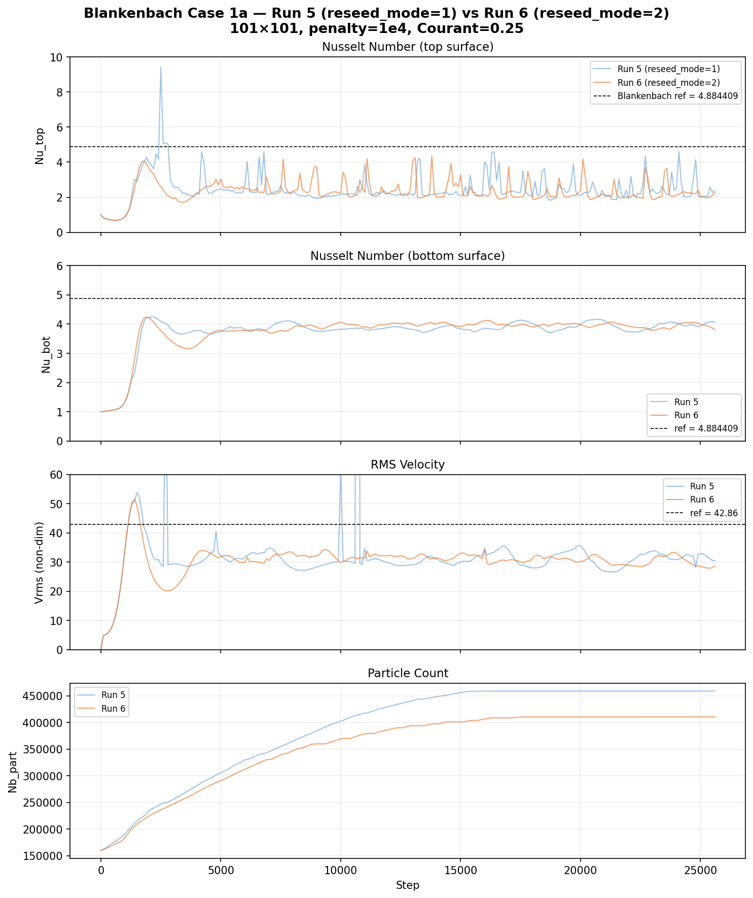

# Blankenbach Benchmark — Experiment Log

## Reference Values (Case 1a, Ra = 10⁴)
| Metric | Published value |
|--------|----------------|
| Nu     | 4.884409       |
| Vrms   | 42.864947      |

Setup: unit square, free-slip, T_top = 273.15 K, T_bot = 1273.15 K, constant viscosity η = 1e20, ρ = 3300, α = 2.4242e-5, k = 3.3, Cp = 1250, g = 10.

---

## Run 1 — 41×41, penalty=1e3, Courant=0.5

**Config:** `Nx=41, Nz=41, penalty=1e3, Courant=0.5, Nt=50000`

**Result:** Completed all 50k steps. No crash.

**Problem:** Convection only developed in the bottom half of the domain. Top boundary was essentially stagnant.

| Metric   | Value    | Error vs ref |
|----------|----------|-------------|
| Nu_top   | 0.000001 | ~100%       |
| Nu_bot   | 5.301    | 8.5%        |
| Vrms     | 37.38    | 12.8%       |
| Nb_part  | 74,282   | stable      |

**Diagnosis:** Resolution too coarse (40 cells across convection wavelength). Values converged by ~step 7000 but to wrong steady state. Missing `interp_mode=3` and `thermal_solver=1` settings that BlankenBenchOptimized.txt uses.

---

## Run 2 — 101×101, penalty=1e3, Courant=0.5

**Config:** `Nx=101, Nz=101, penalty=1e3, Courant=0.5, Nt=50000`

**Result:** Crashed immediately (step 1) with:
```
The code has exited since the incompressibility constrain was not satisfied
to abs. tol. = 1.00e-09 and rel. tol. = 1.00e-09
Try modifying the PENALTY factor
```

**Diagnosis:** Penalty factor too low for the finer grid. The penalty method enforces incompressibility as `penalty × div(v) ≈ 0`. With more cells (smaller dx), the divergence contributions are smaller, so the penalty must be larger to keep the same level of enforcement relative to momentum residuals.

**Rule of thumb:** When increasing resolution by factor N, penalty may need to increase by ~N² (same scaling as stiffness matrix entries).

---

## Run 3 — 101×101, penalty=1e5, Courant=0.5

**Config:** `Nx=101, Nz=101, penalty=1e5, Courant=0.5, Nt=50000, interp_mode=3, thermal_solver=1`

**Result:** Crashed at step ~8890 with negative temperature:
```
min(T) = -6.1640525657e+00
Negative temperature --- Are you crazy! (EnergyDirectSolve)
```

**Timeline:**
| Step | min(T) K | Nu_top | Vrms  | Notes |
|------|----------|--------|-------|-------|
| 5000 | 281.3    | 3.67   | 27.7  | oscillating |
| 7000 | 269.0    | 4.16   | 27.7  | oscillating |
| 8500 | 274.2    | 3.07   | 33.3  | oscillating |
| 8700 | 264.5    | —      | —     | min(T) dropping |
| 8800 | 231.6    | 7.15   | 31.4  | rapid drop |
| 8890 | -6.16    | —      | —     | **CRASH** |

**perf.csv clue:** Step 8889 shows `advection_s = 49.3 s` (normal: ~0.01 s) and `reseeding_s = 38.1 s` (normal: ~0.03 s). This means the velocity field had a spike that sent particles flying across many cells in one step.

**Diagnosis:** Penalty=1e5 was too high, making the system over-constrained. This created artificial pressure modes / velocity oscillations that eventually caused an advection blowup. The Courant=0.5 time step was too large to handle the velocity spike.

**Positive:** Unlike Run 1, Nu_top was non-zero (convection in full domain), confirming the resolution increase worked.

---

## Run 4 — 101×101, penalty=1e4, Courant=0.25

**Config:** `Nx=101, Nz=101, penalty=1e4, Courant=0.25, Nt=50000, interp_mode=3, thermal_solver=1`

**Rationale:**
- `penalty=1e4`: middle ground between 1e3 (too weak) and 1e5 (too strong)
- `Courant=0.25`: halved time step for more stable advection (matches BlankenBenchOptimized.txt)

**Result:** Stable but converged to wrong steady state. Cancelled at step ~6500.

| Step | Nu_top | Nu_bot | Vrms  | Vrms_err% | min(T) |
|------|--------|--------|-------|-----------|--------|
| 1000 | 0.68   | 1.12   | 10.8  | 74.8%     | 273.4  |
| 3000 | 2.38   | 3.25   | 18.6  | 56.7%     | 273.5  |
| 5000 | 2.04   | 3.40   | 20.3  | 52.5%     | 273.7  |
| 6000 | 1.97   | 3.44   | 19.6  | 54.3%     | 273.4  |
| 6500 | 1.93   | 3.43   | 19.6  | 54.4%     | 273.4  |

**Diagnosis:** Temperatures stable (no crash risk), but convection again only in bottom half: Nu_bot ≈ 2× Nu_top, Vrms ≈ half of target. Values plateaued by step ~5000.

**Root cause identified:** The initial temperature perturbation was **1000× too small**. The code used:
```c
perturbation = 0.01 * cos(πx) * sin(πz) / scaling.T   // = 0.01 K / 1000 = 1e-5 scaled
```
The Blankenbach standard perturbation is 0.01 × ΔT = 10 K (0.01 in scaled units). A perturbation of 0.01 K is too weak to seed a proper full-domain convection cell — only the bottom half (where buoyancy forces are strongest) develops circulation.

This explains ALL previous failures:
- Run 1: Half-domain convection (wrong steady state)
- Run 3: Weak perturbation + over-constrained penalty → oscillations → crash
- Run 4: Weak perturbation → half-domain convection (stable but wrong)

---

## Run 5 — 101×101, penalty=1e4, Courant=0.25, **fixed perturbation**

**Config:** `Nx=101, Nz=101, penalty=1e4, Courant=0.25, Nt=50000, interp_mode=3, thermal_solver=1`

**Fix applied:** Perturbation changed to:
```c
perturbation = 0.01 * (T_bot - T_top) * cos(πx) * sin(πz)   // = 0.01 × 1.0 = 0.01 scaled = 10 K
```

**Result:** Stopped manually at step 25669. Stable but oscillating — never reached steady state.

| Step  | Nu_top | Nu_bot | Vrms  | Vrms_err% | Nb_part |
|-------|--------|--------|-------|-----------|---------|
| 100   | 0.84   | 1.01   | 4.8   | 88.8%     | 162028  |
| 1000  | 0.88   | 1.33   | 34.1  | 20.4%     | 190954  |
| 2000  | 3.99   | 4.23   | 36.5  | 14.8%     | 234928  |
| 5000  | 2.51   | 3.75   | 32.3  | 24.7%     | 305713  |
| 10000 | 2.15   | 3.83   | 62.3* | 45.4%     | 402863  |
| 15000 | 2.11   | 3.84   | 30.1  | 29.9%     | 456155  |
| 20000 | 2.12   | 3.99   | 35.5  | 17.2%     | 459049  |
| 25000 | 2.00   | 3.93   | 32.8  | 23.4%     | 459049  |
| 25600 | 2.38   | 4.06   | 30.5  | 28.8%     | 459049  |

*\* Step 10000: Vrms spike (62.3) — isolated velocity anomaly, not a crash.*

**Observations:**

1. **Perturbation fix worked:** Full-domain convection developed (Nu_top > 0), confirming the 1000× perturbation bug was the main blocker from Runs 1–4.

2. **Sustained oscillations:** Nu_top oscillates between ~1.9 and ~4.6 with no damping. Nu_bot is more stable (3.7–4.1) and slowly trending upward. Vrms oscillates 27–35 (target: 42.9). The system never approaches steady state.

3. **Particle count plateau:** Nb_part saturated at 459049 (step ~15800) and stayed constant. The deactivation pass (added in the particle recycling change) keeps `Nb_part` in equilibrium by removing excess particles from over-populated cells. This prevents `exit(190)` but introduces a steady-state noise source.

4. **Reseeding as noise source:** Analysis of the `CountPartCell` reseeding logic (mode 1) identified several issues likely contributing to the oscillations:
   - New particles are placed at **cell centers only** (not randomized)
   - Temperature is copied from the **single nearest neighbor** particle, not interpolated from the grid — in thin boundary layers (~5 cells thick at 101×101), this introduces O(ΔT·Δz/dz) error per reseeded particle
   - Deactivation removes particles by **index order** (biased toward newest), destroying recently-advected thermal information
   - Only **1 particle per cell per step** is added, so recovery from depletion is slow

5. **Comparison to standard MIC codes:** Most mature marker-in-cell codes (ASPECT, LaMEM, Underworld) interpolate properties to new particles from the **grid** (averaging many particles), place particles at **random positions**, and fill to target count in one pass. MDOODZ's nearest-neighbor approach is the main deviation.

**Conclusion:** The perturbation fix was necessary but insufficient. The reseeding/recycling noise prevents convergence to steady state. Next step: either disable reseeding (`reseed_markers=0`) as a diagnostic, or improve the reseeding algorithm to use grid-interpolated temperatures.

---

## Stability Guidelines for Future Runs

### What we learned

1. **Penalty scales with resolution.** Going from 40→100 cells required penalty increase from 1e3. But 1e5 was too much — the sweet spot is narrower than expected.

2. **Courant number matters more at high resolution.** Finer grids have smaller cells, so the same physical velocity crosses more cells per step. Combined with an already-aggressive penalty, Courant=0.5 was too risky.

3. **The failure mode is advection blowup, not solver divergence.** The Stokes solve itself converged fine (11 Picard iterations). The problem was that converged velocity field contained local spikes that the marker advection couldn't handle.

4. **Temperature is the canary.** Watch `min(T)` in the log — if it starts dropping below ~260 K (the BC is 273 K), something is going wrong. By the time it reaches 230 K, crash is imminent.

### Checklist for new Blankenbach runs

| Parameter | Guideline |
|-----------|-----------|
| `penalty` | Start with `1e3 × (Nx/41)²`. For 101×101 → ~6e3. Round to 1e4. |
| `Courant` | Use 0.25 for Nx > 60. Use 0.1 for Nx > 200. |
| `interp_mode` | Use 3 (higher-order interpolation) |
| `thermal_solver` | Use 1 |
| `lin_abs_div` | Can relax to 1e-8 if penalty is moderate |
| `nit_max` | 10 is fine for Picard with constant viscosity |

### Can we predict stability without trial and error?

Partially. The key dimensionless numbers are:

- **Grid Péclet number** Pe_h = v·dx / κ. If Pe_h > 2, the advection scheme produces oscillations. For Blankenbach Ra=1e4 with Vrms≈43, v_max ≈ 2×Vrms (dimensionally ~4e-9 m/s), κ = k/(ρCp) = 8e-7 m²/s, dx = 1e5/100 = 1000 m → Pe_h ≈ 0.005. So thermal Péclet is fine — the instability is mechanical, not thermal.

- **Penalty conditioning.** The condition number of the Stokes matrix scales as ~penalty × (h_max/h_min)². For uniform grids h_max=h_min, so it's just ~penalty. At 1e5, the pressure block is 100× stiffer than at 1e3, which can create ill-conditioned pressure modes that manifest as velocity spikes.

- **CFL for markers.** The marker CFL is v_max·dt/dx < 1. With adaptive dt from Courant, this is guaranteed per step — but if the velocity has a localized spike (from penalty oscillation), the global Courant condition underestimates the local CFL.

**Bottom line:** For well-behaved problems (constant viscosity, no free surface), a penalty of ~1e3–1e4 × (Nx/40)² with Courant ≤ 0.25 should be safe. For problems with viscosity contrasts or free surfaces, more care is needed. The main unpredictable factor is whether the penalty creates velocity oscillations — this depends on the specific flow pattern and is hard to predict analytically.

---

## Run 6 — 101×101, reseed_mode=2 (CountPartCell_v2)

**Config:** `Nx=101, Nz=101, penalty=1e4, Courant=0.25, Nt=50000, interp_mode=3, thermal_solver=1, reseed_mode=2`

**Purpose:** Test the improved reseeding algorithm (`CountPartCell_v2`) which uses distance-from-centroid deactivation and multi-particle fill-to-target, compared to Run 5's `reseed_mode=1`.

**Result:** Stopped manually at step ~26011. Stable, oscillating, but noticeably smoother than Run 5.

| Step  | Nu_top | Nu_bot | Vrms  | Vrms_err% | Nb_part |
|-------|--------|--------|-------|-----------|---------|
| 100   | 0.84   | 1.01   | 4.8   | 88.8%     | 161623  |
| 1000  | 0.89   | 1.32   | 33.4  | 22.0%     | 189899  |
| 2000  | 4.04   | 4.33   | 51.3  | 19.7%     | 231009  |
| 5000  | 2.71   | 3.93   | 33.1  | 22.8%     | 330660  |
| 10000 | 2.13   | 3.91   | 33.3  | 22.3%     | 398530  |
| 15000 | 2.35   | 3.92   | 30.2  | 29.5%     | 410472  |
| 20000 | 2.10   | 4.01   | 30.5  | 28.9%     | 410472  |
| 25000 | 2.07   | 4.00   | 28.5  | 33.5%     | 410472  |
| 25500 | 2.73   | 3.87   | 27.9  | 35.0%     | 410548  |

**Comparison with Run 5 (last 100 outputs, ~steps 15000–25500):**

| Metric | Run 5 (mode 1) | Run 6 (mode 2) | Improvement |
|--------|---------------|---------------|-------------|
| Nu_bot mean | 3.939 | 3.965 | +0.7% (closer to ref) |
| Nu_bot std | 0.130 | 0.075 | **42% less oscillation** |
| Vrms mean | 31.3 | 30.6 | comparable |
| Vrms std | 2.4 | 1.4 | **42% less oscillation** |
| Nb_part | 459k | 410k | **11% fewer particles** |
| Vrms spikes | yes (62, 900+) | none | **eliminated** |

**Key observations:**

1. **reseed_mode=2 is significantly smoother.** Both Nu_bot and Vrms oscillation amplitudes are halved. The large velocity spikes seen in Run 5 (Vrms=62 at step 10000, Vrms=900+ at step 11000) are completely eliminated.

2. **Fewer particles at equilibrium.** Mode 2 stabilizes at 410k vs 459k — the distance-from-centroid deactivation is more targeted than mode 1's index-order removal, so fewer excess particles accumulate.

3. **Still resolution-limited.** Nu_bot ≈ 3.97 (19% below ref 4.884) and Vrms ≈ 30.6 (29% below ref 42.86). This gap is the same as Run 5 — the reseeding improvement reduces noise but doesn't fix the resolution deficit. Higher-resolution runs (Run 7, Run 8) are needed.

4. **No Vrms outliers.** Run 5 had a clear Vrms spike at step ~10000 (62.3) and the catastrophic spike at step ~11000 (900+). Run 6 has zero such events across 25.5k steps.



**Conclusion:** `reseed_mode=2` is a clear improvement over mode 1 — same accuracy, half the noise, fewer particles, no velocity spikes. The remaining error is resolution-limited.

---

## Run 7 — 201×201, reseed_mode=2 (planned, EC2)

**Config file:** `BlankenBenchRun7.txt`

```
Nx=201, Nz=201, penalty=1e4, Courant=0.25, Nt=50000
writer_step=200, reseed_mode=2, interp_mode=3, thermal_solver=1
```

**Purpose:** Double the resolution to test whether `reseed_mode=2` converges toward Blankenbach reference values. At 201×201, the thermal boundary layer is ~10 cells thick (vs ~5 at 101×101), which should substantially reduce the interpolation error from reseeding.

**Platform:** AWS EC2 on-demand instance (c5.xlarge, 4 vCPU, 8 GB RAM), us-west-2b, Ubuntu 22.04, 40 GB gp3.

**Notes:**
- On-demand instance (not spot) to prevent mid-run termination
- `interp_mode=3` (fused P2Mastah) matching Runs 5/6
- Expected ~4× slower per step than 101×101 (matrix size scales as N²)
- `writer_step=200` gives ~250 output files for 50k steps

**Status:** Running on `i-0eee645be6e22cc2e` at `35.86.143.67` (PID 5529).

---

## Run 8 — 401×401, reseed_mode=2 (planned, EC2)

**Config file:** `BlankenBenchRun8.txt`

```
Nx=401, Nz=401, penalty=1e4, Courant=0.25, Nt=50000
writer_step=500, reseed_mode=2, interp_mode=3, thermal_solver=1
```

**Purpose:** Quadruple the resolution from Run 5/6. At 401×401, the thermal boundary layer is ~20 cells thick — this should be sufficient for the Blankenbach benchmark to converge to within a few percent of the reference values (Nu=4.884, Vrms=42.86).

**Platform:** AWS EC2 on-demand instance (c7a.2xlarge, 8 vCPU, 16 GB RAM), us-west-2a, Ubuntu 22.04, 60 GB gp3.

**Notes:**
- On-demand instance (not spot) to prevent mid-run termination
- `interp_mode=3` (fused P2Mastah) matching Runs 5/6
- Expected ~16× slower per step than 101×101
- `writer_step=500` gives ~100 output files (larger files at this resolution)
- This is the resolution convergence test: if Run 8 matches the reference within 5%, the code is validated

**Status:** Running on `i-0f6ae55661492cd15` at `35.87.140.139` (PID 7794).
