# Particle Reseeding Visual Guide

MDOODZ uses three particle reseeding modes to maintain marker density during advection. This guide shows how each mode works using real simulation output.

| Mode | Function | Placement | Deactivation | Slot Recycling |
|------|----------|-----------|-------------|----------------|
| 0 | `CountPartCell_OLD` | Closest-neighbour copy | None | Per-thread `ipreuse[]` |
| 1 | `CountPartCell` | Fine-cell centroid | None | Global `part_reuse[]` |
| 2 | `CountPartCell_v2` | Random within fine cell | Distance-from-centroid, farthest first | Global `part_reuse[]` |

All modes operate on a **fine mesh** of double resolution (2×Ncx × 2×Ncz), shifted by −dx/4 and −dz/4 so that both cell centres and vertices are covered.

---

## 0. Why Reseeding?

Marker-in-cell advection moves particles (`particles.x`, `particles.z`) through the velocity field each time step. Rigid-body rotation or shear flow causes some fine-mesh cells to lose all their particles while others accumulate excess.

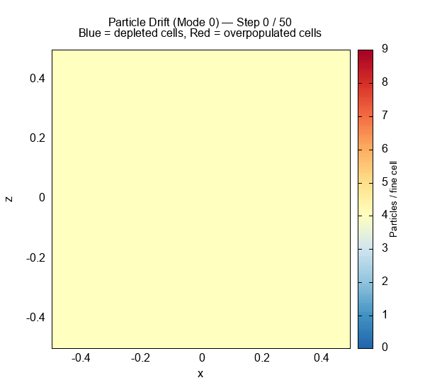

Reseeding injects new markers into depleted cells and (in mode 2) removes excess markers from overpopulated cells.

---

## 1. Reseeding Placement

Each mode fills depleted fine-mesh cells (where `nb_part_cell[kc] < threshold`) by creating new particles and copying properties from the closest neighbour.

- **Mode 0**: Per-thread arrays, closest-neighbour placement via `AddPartCell2`
- **Mode 1**: Places new particle at the fine-cell centroid (`new_x = xc`, `new_z = zc`)
- **Mode 2**: Random position within the fine cell (`xc ± dx/2 * rand()`)

New particles have `particles.generation = 1` (red in plots below).

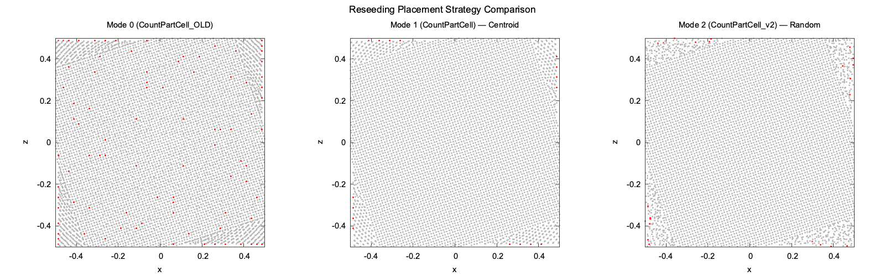

The centroid strategy (mode 1) creates visible grid-aligned patterns. Random placement (mode 2) produces a more uniform distribution. The zoomed view below highlights the difference:

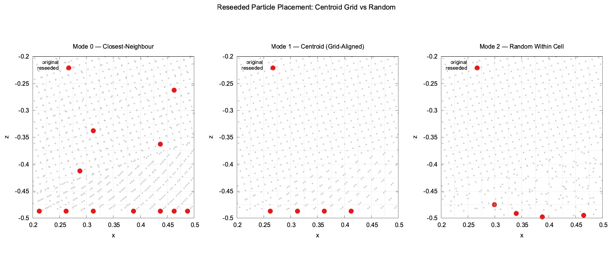

---

## 2. Deactivation Strategy

Only **mode 2** (`CountPartCell_v2`) actively deactivates excess particles. When a fine-mesh cell contains more than `min_part_cell + 4` particles:

1. Compute distance from each particle to the cell centroid → `PartDist[]`
2. Sort descending by distance (`qsort`, `cmp_partdist_desc`)
3. Mark the farthest particles as `particles.phase = -1` (deactivated)

Modes 0 and 1 never deactivate — particle count can only grow.

The difference is invisible at normal density (4×4 per cell) because only ~16–23 particles get reseeded. A **high-density stress test** (6×6 per cell) reveals the true difference:

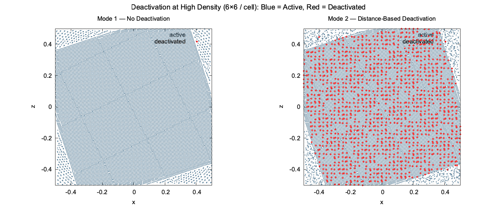

Red dots are deactivated particles (`phase == -1`). Mode 1 (left) shows deactivation only at domain edges where particles exit. Mode 2 (right) actively culls excess particles across the entire domain — 2404 deactivated (16.7%) vs only 1064 (7.4%) for mode 1.

---

## 3. The Case for Mode 2

At normal density (4×4 per cell), modes 1 and 2 look nearly identical. The left panel below shows the well-known problem: mode 0's `Nb_part` grows unbounded while modes 1 and 2 stay flat. But why prefer mode 2 over mode 1?

The right panel answers this with a high-density stress test (6×6 per cell). When particles pile up, only mode 2's distance-based deactivation keeps the active particle count controlled. Mode 1 levels off at ~13,300 active particles while mode 2 brings it down to ~12,000 — a 10% reduction in unnecessary computation.

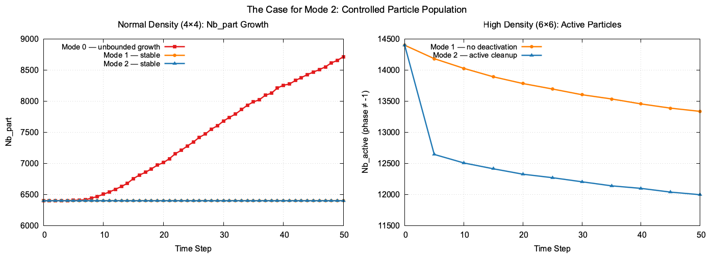

The animated comparison below shows all three modes evolving side by side. Mode 0 develops strong blue (overpopulated) and red (depleted) patches. Mode 1 stays more uniform but still drifts. Mode 2 maintains the tightest distribution — nearly all cells remain within ±1 of the target count.

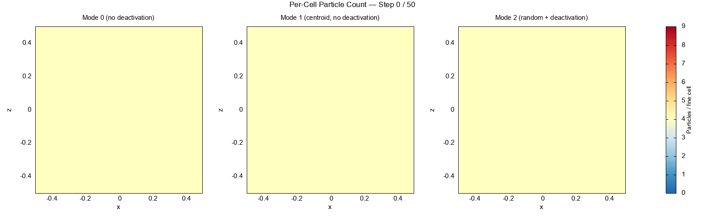

---

## 4. Particle Count Over Time

Total `Nb_part` and active particle count (`phase ≠ -1`) evolve differently per mode:

- **Mode 0**: Both `Nb_part` and active count grow monotonically (6400 → 8716)
- **Mode 1**: `Nb_part` stays flat; active count stable (slot reuse, no deactivation)
- **Mode 2**: `Nb_part` stays flat; active count stabilises at a slightly lower level thanks to deactivation

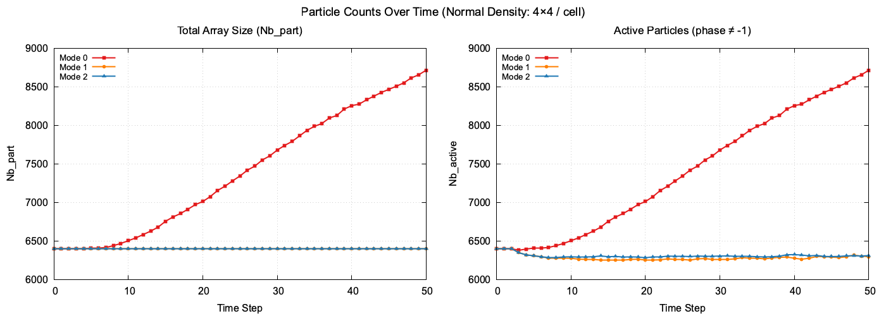

If `Nb_part` reaches `Nb_part_max`, the simulation exits with code 190.

---

## 5. Per-Cell Uniformity

The cell-count histogram shows how evenly particles are distributed across fine-mesh cells after 50 steps.

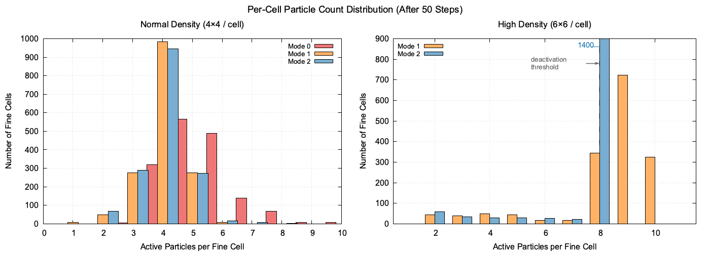

At normal density (left), mode 0 spreads across counts 3–8 while modes 1 and 2 stay tightly peaked at 4. At high density (right), mode 2 produces a narrower distribution centred at 8, while mode 1 has a broader tail extending to 10 — mode 2's deactivation trims the overpopulated cells.

---

## 6. Array Slot Usage

When a particle is deactivated (`phase == -1`), its array index becomes available for reuse. The `part_reuse[]` array collects these dead slots.

- **Mode 0**: Per-thread `ipreuse[]` — reuse within thread partitions only
- **Mode 1**: Global `part_reuse[]` — reuses dead slots first, then appends
- **Mode 2**: Same as mode 1, but deactivation continuously generates new dead slots

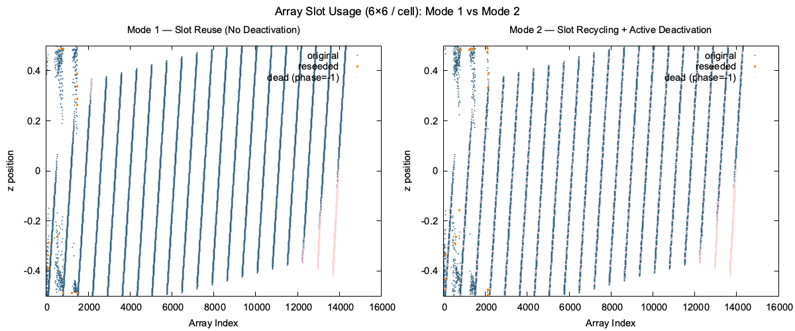

The x-axis is the array index. Orange dots are reseeded particles (`generation == 1`), pink dots are dead slots (`phase == -1`). Mode 2 (right) shows substantially more dead slots (pink) scattered across the array from active deactivation, with reseeded particles recycling into those slots.

---

## 7. Edge Cases

### Empty Cell — Bulk Reseeding

With `min_part_cell = 4` and large time steps (`dt = 5e-3`), cells deplete faster. Both modes bulk-reseed multiple particles per cell in a single pass, but mode 1 places them at fine-cell centroids (visible grid pattern) while mode 2 scatters them randomly within each fine cell.

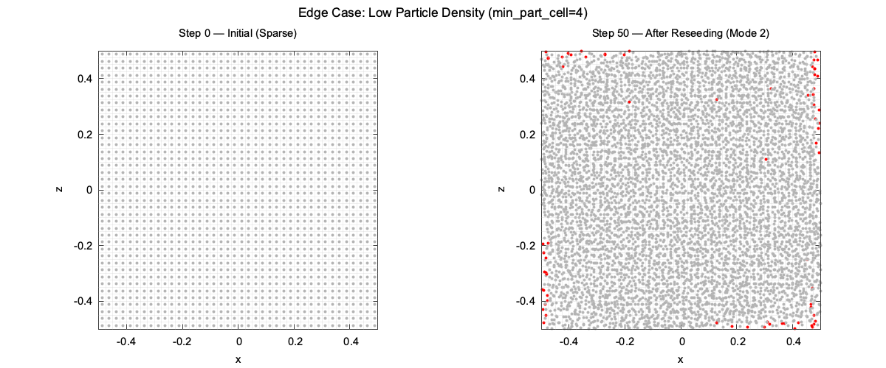

### Multiphase (3 Phases)

When interface cells contain multiple phases, reseeded particles inherit the phase of their closest neighbour via `AssignMarkerProperties`. This preserves sharp phase boundaries.

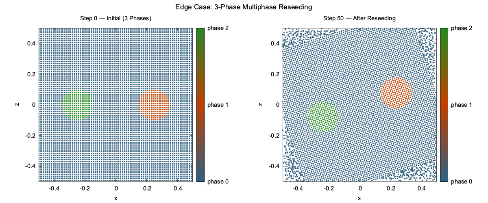

---

## 8. Annotated Log Excerpt

With `log_level = 3` (DEBUG), the reseeding functions emit per-cell and per-particle decisions:

```
[DBG] cell (15,12) fine: 0 particles (threshold=2), reseeding
[DBG]   new particle at (3.125000e-01, 1.250000e-02), reusing slot 4821
[DBG]   new particle at (3.375000e-01, 1.250000e-02), appended at index 6401
[INF] 142 markers reused, 28 markers created, out of 170 new markers
[DBG] cell (18,14): 24 particles, excess 4, deactivating 4 farthest
[DBG]   deactivated particle 3201 (dist=1.100000e-02 from centroid)
[INF] Deactivated particles: 089
[DBG] Nb_part: 6400 -> 6428 (reused=142, created=28, deactivated=89)
```

Key code variables in the log: `nb_part_cell[kc]` (fine-mesh count), `part_reuse[]` (dead slot indices), `particles.Nb_part` (total count), `PartDist[]` (centroid distances for deactivation).

---

## Code References

| Variable | Meaning |
|----------|---------|
| `particles.x`, `particles.z` | Marker positions |
| `particles.phase` | Phase ID; `-1` = deactivated (air) |
| `particles.generation` | `0` = original, `1` = reseeded |
| `particles.Nb_part` | Current total particle count |
| `particles.Nb_part_max` | Hard limit (4.1 × initial) |
| `particles.min_part_cell` | Minimum particles per coarse cell |
| `nb_part_cell[]` | Fine-mesh per-cell particle count |
| `part_reuse[]` | Indices of dead (`phase == -1`) slots |
| `reseed_mode` | `.txt` parameter: 0, 1, or 2 |
