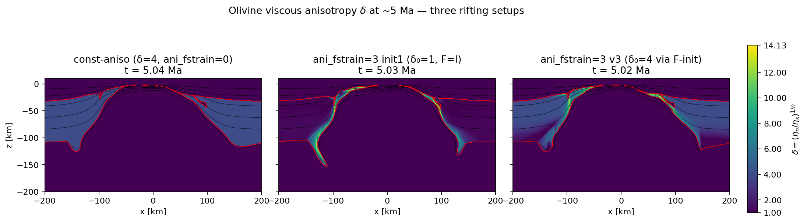

# Olivine viscous anisotropy in MDOODZ — from lab to dynamic rifting

This note documents how the MDOODZ `ani_fstrain` family of viscous-
anisotropy laws is calibrated against olivine experimental data, and how
the dynamic Boneh-DiSRX extension (`ani_fstrain=3`) plus the Phase-1
F-init helper convert that calibration into something a continental
rifting model can use without breaking the Hansen saturation envelope.
The transversely-isotropic V-E-VP rheology that consumes δ is the one
described in [Duretz et al. 2025 G3](#ref17)
(MDOODZ paper-of-record for anisotropy; Eqs 9–18, Fig 2); the present
note adds the lab-calibrated δ(γ) law and its dynamic relaxation.
Every numerical constant and functional form below is cited to a PDF in
the References section below;
purely mathematical identities are derived inline.

## 1. The lab → law chain (`ani_fstrain=2`)

### 1.1 Where the data comes from (38-point compilation)

The calibration corpus is the high-γ olivine torsion experiments compiled
in [Hansen+16 part 1](#ref4) — 38 samples spanning
single-crystal seeds, polycrystalline aggregates, and natural starting
fabrics. It folds in the original high-γ baseline of
[Bystricky+00](#ref1),
the viscous-anisotropy framework first reported in
[Hansen+12](#ref2),
the protracted-fabric data of
[Hansen+14](#ref3),
the wet Fo50 corner of
[Tasaka+16](#ref7),
and the natural-sample CPO evolution of
[Kumamoto+19](#ref8).
The micromechanical interpretation — a pseudo-Taylor + director-method
predictor benchmarked against (and outperforming) classical VPSC on the
same 38-sample corpus — is in
[Hansen+16 part 2](#ref5)
(§3 model description, §5 / Fig 9 model-vs-data comparison);
[Skemer & Hansen 16](#ref15)
collates the lot.

### 1.2 The two-step empirical relationship

> **Note on provenance of the three constants.**
> - `24.5` **is** printed verbatim — [Hansen+12 Fig 3b](#ref2) carries the in-figure annotation `δ = (24.5 ± 5.5)M + 1` (PDF text-layer, Ctrl-F `"24.5 ± 5.5"`).
> - `0.536` and `3.96` are **not** printed in any single paper — they are MDOODZ-internal LSQ-fit results obtained by re-fitting the raw $(\gamma, M)$ data points compiled across the Hansen series. Verifiability chain: **published data points** (the papers) → **LSQ fit** ([`misc/aniso_fstrain/notes/olivine_calibration.md`](../../misc/aniso_fstrain/notes/olivine_calibration.md) and [`hansen2012_comparison.md` §7.4](../../misc/aniso_fstrain/notes/hansen2012_comparison.md), where both numbers ARE Ctrl-F-able) → **committed values** ([`MDLIB/FlowLaws.c:1006–1013`](../../MDLIB/FlowLaws.c), also Ctrl-F-able).

**Step A — fabric strength (M-index) saturates with shear strain.**
The M-index of the olivine CPO grows toward a finite ceiling as a saturating exponential
([Hansen+14](#ref3) Fig 6a,c — *M*-index vs shear strain in dry single-/poly-crystal aggregates;
[Hansen+16 part 1](#ref4) Fig 6b and Fig 7b — *M*-index vs shear strain with the saturation plateau;
[Skemer & Hansen 16](#ref15) §4.3 / Fig 6):

$$
M(\gamma) \;=\; M_\infty\,\bigl(1 - e^{-\gamma/\gamma_e}\bigr).
$$

These papers show that the saturating-exponential form fits olivine but **do not print specific values** for $M_\infty$ and $\gamma_e$ — the MDOODZ-committed numbers come from a least-squares fit performed in-house. Hansen+14 and Hansen+16 part 1 contribute **38 raw $(\gamma, M)$ data points** to the combined fit; the Hansen+12 *M*-index points are subsumed into the Hansen+14 re-analysis of the same starting materials with the updated M-index methodology, so they are not double-counted. Per-paper fits scatter as follows (full breakdown in [`hansen2012_comparison.md` §7.4](../../misc/aniso_fstrain/notes/hansen2012_comparison.md)):

| Dataset | N | $M_\infty$ | $\gamma_e$ | RMS($M$) |
|---|---:|---:|---:|---:|
| Hansen+14 | 26 | 0.568 | 4.71 | 0.075 |
| Hansen+16 part 1 | 12 | 0.500 | 3.00 | 0.071 |
| **Combined (committed)** | **38** | **0.536** | **3.96** | 0.076 |

Single-paper fits scatter ±5 % around the combined-fit asymptote. The committed pair `(0.536, 3.96)` is the combined-fit result. Independent torsion-series data from [Bystricky+00](#ref1) (Fig 2 — *J*-index, not *M*-index; reported as Bystricky's strength measure) lie on the same trend after the $J\to M$ remapping documented in [`hansen2012_comparison.md` §7.2](../../misc/aniso_fstrain/notes/hansen2012_comparison.md), but are not used in the committed fit to keep the index definition uniform.

**Step B — viscous-anisotropy magnitude δ is linear in M.** The δ–M linear regression comes directly from [Hansen+12 Fig 3b](#ref2), where the in-figure annotation reads $\delta = (24.5 \pm 5.5)\,M + 1$ (PDF text-layer searchable as literal `"24.5 ± 5.5"`):

$$
\delta \;=\; (\eta_{\text{normal}}/\eta_{\text{shear}})^{1/n}\;=\;\text{slope}\cdot M + 1,\qquad
\text{slope} = 24.5.
$$

The MDOODZ comment at [`FlowLaws.c:1005`](../../MDLIB/FlowLaws.c) flags this as the Hansen+12 Fig 3b regression; the round-tripping to the analytic inverse used by `aniso_init_finite_strain` is in [`hansen2012_comparison.md` §7.4](../../misc/aniso_fstrain/notes/hansen2012_comparison.md).

**Independent cross-check on δ_∞** (also in [`hansen2012_comparison.md` §7.3](../../misc/aniso_fstrain/notes/hansen2012_comparison.md)). [Hansen+16 part 1](#ref4) Eqs 3–4 (stress-aware Hill-parameter formulation) give $\delta_\infty = (F_s/F_w)^n = (1.39/0.73)^{4.1} = 14.02$. Two independent calibrations converge on $\delta_\infty \approx 14$ — this is the strongest single-asymptote validation available for olivine.

**Composite.** Substituting (A) into (B),

$$
\delta(\gamma_{\text{eff}}) \;=\; 24.5\cdot 0.536\,\bigl(1 - e^{-\gamma_{\text{eff}}/3.96}\bigr) + 1
\;=\; 13.132\,\bigl(1 - e^{-\gamma_{\text{eff}}/3.96}\bigr) + 1.
$$

The Hansen ceiling is therefore $\delta_{\max} = 24.5\cdot 0.536 + 1 = 14.132$.
This is the closed form implemented in
`anisoDelta_HansenOlivine` ([`MDLIB/FlowLaws.c:1006`](../../MDLIB/FlowLaws.c) — searchable as literal `24.5`, `0.536`, `3.96`); the matching numerical inverse used by the F-init helper is in [`MDLIB/AnisotropyRoutines.c:60–82`](../../MDLIB/AnisotropyRoutines.c) (look for the literal `13.132`).

### 1.3 From simple-shear γ to MDOODZ's `FS_AR` (kinematic identity)

MDOODZ tracks finite strain via a per-marker deformation tensor F, not
a scalar shear γ. For an isochoric simple shear

$$
F \;=\; \begin{pmatrix} 1 & \gamma_s \\ 0 & 1 \end{pmatrix},
$$

the left Cauchy–Green tensor $B = FF^{T}$ has eigenvalues that solve
$\lambda^{2} - (2 + \gamma_s^{2})\lambda + 1 = 0$, hence
$\lambda_{\max}\lambda_{\min} = 1$ and
$\lambda_{\max} + \lambda_{\min} = 2 + \gamma_s^{2}$. The principal
stretches are $\sigma_{\max} = \sqrt{\lambda_{\max}},\;
\sigma_{\min} = 1/\sigma_{\max}$, so writing
$R \equiv \sigma_{\max}/\sigma_{\min}$ for the MDOODZ aspect-ratio field
`FS_AR`:

$$
\sigma_{\max} - 1/\sigma_{\max} \;=\; \gamma_s
\;\Longrightarrow\;
\boxed{\;\gamma_{\text{eff}} \;=\; \sqrt{R} - 1/\sqrt{R}\;}.
$$

This identity (no citation — pure kinematics) is the bridge between
the Hansen γ-domain calibration and MDOODZ's marker-F machinery. Its
analytic inverse closes the round trip:

$$
\sqrt{R} \;=\; \tfrac{1}{2}\bigl(\gamma_{\text{eff}} + \sqrt{\gamma_{\text{eff}}^{2} + 4}\bigr).
$$

### 1.4 What `ani_fstrain=2` actually computes

Each timestep, every marker on an `ani_fstrain=2` phase does:

1. F is updated by the velocity gradient (standard MDOODZ advection).
2. `FiniteStrainAspectRatio` SVDs F and returns `FS_AR`.
3. `aniso_delta_fn(FS_AR)` is the closed form of §1.2 + §1.3 → δ.
4. δ is consumed by `ViscosityConciseAniso` in the transversely-
   isotropic V-E-VP rheology of
   [Duretz+25](#ref17)
   Eqs 11 + 14 — i.e. δ controls $\tau'_{II} = \sqrt{\tau'_{xx}{}^2 + \delta^{2}\,\tau'_{xy}{}^2}$
   (Eq 14), the material-invariant stress that the power-law creep
   $\dot\varepsilon_{\text{pwl}} = C_{\text{pwl}}\,(\tau'_{II})^{n}$
   (Eq 15) is evaluated against.

No memory, no relaxation, monotonic toward the Hansen ceiling $\delta_{\max}$.
This is faithful to the *active-deformation* regime of the lab
experiments (Hansen γ̇ ≈ 10⁻⁵ s⁻¹), but it cannot reproduce the two
well-documented natural phenomena that motivate `ani_fstrain=3`.

## 2. The leap to `ani_fstrain=3`

### 2.1 What `ani_fstrain=2` misses

- **Memory.** Cratonic mantle xenoliths preserve CPO for ≳1 Ga
  ([Tommasi & Vauchez 15](#ref14)).
  A memoryless law makes the rift forget where it was inherited from.
- **DiSRX above ~1100 °C** modifies grain boundaries and partially
  resets CPO ([Boneh+21](#ref12);
  [Boneh+17](#ref11)).
  This is invisible to `ani_fstrain=2`.
- **Inherited cratonic fabric** in a phase that *also* recrystallizes
  (in shear bands) is a regime `ani_fstrain=2` cannot represent.

### 2.2 The Boneh DiSRX relaxation (kinetic engine)

[Boneh+21](#ref12)
Eqs. 1, 3, and 4 give the grain-boundary-migration velocity that
drives discontinuous static recrystallization. Eq 1: $V = M\,\Sigma F$;
Eq 3: $M = M_{0}\,e^{-Q/(RT)}$ (Arrhenius mobility); Eq 4:
$F_{s} = \mu\,b^{2}\,\Delta\rho$ (dislocation-energy driving force).
Combining these with the surface-energy term dropped
(see [`boneh2021_delta_relaxation.md` §2.2](../../misc/aniso_fstrain/notes/boneh2021_delta_relaxation.md) — at olivine
porphyroclast scale $F_s \gg F_b$, so Eq 2 is set to zero):

$$
V \;=\; M_{0}\, e^{-Q/(RT)}\,\mu\, b^{2}\,\Delta\rho.
$$

Boneh+21 §3 prints the four constants in prose (under Eq 4 and in the Fig 8 caption — all Ctrl-F-able as `"Q = 133"`, `"M₀ = 2"`, `"μ = 50"`, `"b = 0.6"`):
$Q = 133\,\mathrm{kJ/mol}$,
$M_{0} = 2\times 10^{-11}\,\mathrm{m^{4}\,J^{-1}\,s^{-1}}$,
$\mu = 50\,\mathrm{GPa}$,
$b = 0.6\,\mathrm{nm}$.

> Note on $M_0$ units. Boneh+21 prints `M₀ = 2 × 10⁻¹¹ m³/s J`, which is dimensionally inconsistent with their own Eq 1 (`V = M·ΣF` requires `[M] = (m/s)/(N/m²) = m⁴·J⁻¹·s⁻¹ ≡ m³·N⁻¹·s⁻¹`). [Boneh+17 EPSL Appendix A](#ref11) uses the dimensionally-correct form `m³ N⁻¹ s⁻¹ ≡ m⁴ J⁻¹ s⁻¹` but only reports an *evaluated* mobility $M_b = 6.6\times 10^{-16}\ \mathrm{m^{3}\,N^{-1}\,s^{-1}}$ at $T = 1250^{\circ}\mathrm{C}$ (Appendix A Eq 1, p. 373) — not the pre-exponential $M_0$. MDOODZ uses Boneh+21's $M_0 = 2\times 10^{-11}$ under the dimensionally-corrected unit; propagated through $M_b = M_0\,e^{-Q/RT}$ at $1250^{\circ}\mathrm{C}$ this gives $M_b \approx 5\times 10^{-16}\ \mathrm{m^{3}\,N^{-1}\,s^{-1}}$ — within 25 % of the Boneh+17 measured value, so the two papers are internally consistent once units are repaired. Documented at [`MDLIB/FlowLaws.c:1629–1637`](../../MDLIB/FlowLaws.c).

Implemented at [`MDLIB/FlowLaws.c:1625–1638`](../../MDLIB/FlowLaws.c) — searchable as literal `133.0e3`, `2.0e-11`, `50.0e9`, `0.6e-9`.

The dislocation-density driving force $\Delta\rho$ is proxied from each marker's accumulated dislocation-creep strain $\varepsilon_{\text{pwl}}$ (MDOODZ does not track $\rho$ directly):

$$
\Delta\rho(\varepsilon_{\text{pwl}})
\;=\; \Delta\rho_{\min} + (\Delta\rho_{\max} - \Delta\rho_{\min})\,
        \bigl(1 - e^{-\varepsilon_{\text{pwl}}/\varepsilon_{\text{ref}}}\bigr),
$$

with $\Delta\rho_{\min/\max} \sim 10^{11}$–$10^{13}\,\mathrm{m^{-2}}$. This range originates with the olivine single-crystal piezometry of Karato & Jung (2003) compiled into the textbook [Karato 08, §5.3 ("Dislocations") pp. 88–89, Eqs 5.65–5.66 and Fig 5.7](#ref16) (linking $\rho$ to differential stress via $\rho = (\sigma/\alpha\mu b)^{2}$); Boneh+21 §3 quotes that same range verbatim when bracketing $\Delta\rho$ for olivine porphyroclasts ("For dislocation densities of ∼10¹¹–10¹³ m⁻² … strain energy will be significantly higher than surface energy" — Ctrl-F `"10¹¹"`). The saturating-exponential form $\Delta\rho(\varepsilon_{\text{pwl}})$ is **not** Boneh's — Boneh+21 treats Δρ as an externally-prescribed parameter, not as a function of past strain. This proxy is an MDOODZ-internal modelling choice documented in [`misc/aniso_fstrain/notes/boneh2021_delta_relaxation.md` §5.1](../../misc/aniso_fstrain/notes/boneh2021_delta_relaxation.md) (acknowledged caveat — see the openspec change `aniso-init-from-finite-strain` design.md D3 for the matching discussion of "Δρ-proxy validity").

The relaxation timescale is then $\tau_{\text{relax}} = L_{\text{relax}}/V$
with $L_{\text{relax}}$ set from `gs_ref` (the per-phase annealed grain-
size proxy, default 2 mm). The δ update is the analytic exponential

$$
\delta_{\text{new}} \;=\; 1 + (\delta_{\text{old}} - 1)\,e^{-\Delta t/\tau_{\text{eff}}},
$$

implemented in `DeltaRelaxationTau`
([`MDLIB/AnisotropyRoutines.c:234`](../../MDLIB/AnisotropyRoutines.c)).

### 2.3 The strain-rate gate (this work)

Boneh's $M_{0},Q$ are calibrated against **static** anneal experiments;
the Hansen lab γ̇ ≈ 10⁻⁵ s⁻¹ builds CPO without DiSRX wiping it. So
DiSRX must be suppressed wherever the rock is actively deforming. We
use a smooth quadratic gate

$$
f_{\text{gate}}(\dot\varepsilon_{II})
\;=\; \frac{1}{1 + (\dot\varepsilon_{II}/\dot\varepsilon_{\max})^{2}},
\qquad
\tau_{\text{eff}} \;=\; \tau_{\text{relax}}/f_{\text{gate}},
$$

with default $\dot\varepsilon_{\max} = 10^{-13}\,\mathrm{s^{-1}}$
(per-phase, `ani_relax_eps_max`). In actively-creeping cells
$f_{\text{gate}} \to 0$, $\tau_{\text{eff}} \to \infty$, and inherited
CPO is preserved. This is consistent with the empirical observation in
[Hansen+12](#ref2)
that no DiSRX is observed at γ̇ = 10⁻⁵, and with the reverse-path
experiments in [Hansen+16 part 1](#ref4)
showing fabric-history convergence when strain rate is held high.

### 2.4 F-init from inherited fabric (Phase 1 of `aniso-init-from-finite-strain`)

A cratonic substrate carries past finite strain, *not* a magnitude offset.
Encoding the prescribed `aniso_factor` as an F-tensor (rather than
splatting it onto δ at $t=0$) keeps the operator split bounded by
Hansen and means subsequent strain can only **add** to the inherited
γ-equivalent (capped at $\delta_{\max}$). The closed-form pipeline reads,
with $\delta_{0}$ standing for the prescribed `aniso_factor` and
$R$ for the resulting `FS_AR`
([`MDLIB/RheologyParticles.c:80`](../../MDLIB/RheologyParticles.c)):

$$
\delta_{0}
\xrightarrow{\text{Hansen}^{-1}} \gamma_{\text{eff}}
\xrightarrow{\text{kinematic}} R
\xrightarrow{\gamma_{\text{eq}} = \ln R} F_{\text{init}},
$$

with the rotation onto the prescribed foliation angle
$\theta_{F} = \theta_{\mathrm{aniso}} - \pi/2$, where
$\theta_{\mathrm{aniso}}$ is the `aniso_angle` `.txt` parameter:

$$
F_{\text{init}} \;=\; Q(\theta_{F})\,\text{diag}\bigl(e^{\gamma_{\text{eq}}/2},\,e^{-\gamma_{\text{eq}}/2}\bigr)\,Q(\theta_{F})^{T}.
$$

The $-\pi/2$ rotates from MDOODZ's director-frame convention (`aniso_angle`
is the slow-axis / [010] director, per [Karato 08 §1.2 and Ch 14 on LPO
geometry](#ref16))
to the foliation frame in which F-major lies along the fabric
([Hansen+14](#ref3) Fig 6;
[Hansen+16 part 1](#ref4) Fig 5 — pole figures aligned with the shear plane).
This is the same convention as [Duretz+25 Eq 9](#ref17) (the $Q$-rotation in which the deviatoric strain-rate tensor is rotated into material coordinates: $\dot\varepsilon' = Q\,\dot\varepsilon\,Q^{T}$ at angle $\theta$); the F-init step puts that angle and its δ-equivalent finite strain on every marker before the first solver iteration.
Design rationale: [`openspec/changes/archive/2026-05-15-aniso-init-from-finite-strain/design.md`](../../openspec/changes/archive/2026-05-15-aniso-init-from-finite-strain/design.md) D1–D3.

## 3. Comparison at ~5 Ma — three rifting flavours

*Three-panel side-by-side of the δ (`Centers/ani_fac`) field at ~5 Ma
across the three rifting runs. Shared color scale 1 → 14.132 (Hansen
ceiling). Black contours: isotherms at 200, 400, 600, 800, 1000, 1200,
1400 °C. Red contour: phase-2 boundary (lithospheric mantle).
Snapshot provenance, HDF5 paths, and the "% > 4" calculation are
documented in [`notes/07_rifting_comparison_provenance.md`](notes/07_rifting_comparison_provenance.md); the figure itself
is regenerated by [`plot_07_rifting_comparison.py`](plot_07_rifting_comparison.py).*

### 3.1 The three setups

| Panel  | `ani_fstrain` | $\delta_0$ | $F_0$  | Physics                                                            |
| ------ | ------------- | ---------- | ------ | ------------------------------------------------------------------ |
| Left   | 0 (const)     | 4          | I      | δ frozen at 4 in lith. mantle; no kinematic evolution, no memory   |
| Middle | 3             | 1          | I      | No inherited fabric; new strain builds δ via Hansen, gate locks it |
| Right  | 3             | 4          | F-init | Inherited cratonic δ=4 preserved cold/static + Hansen in shear     |

### 3.2 What you see

All three panels are taken at model time t ≈ 5.03 Ma (Δt across panels
≤ 26 kyr; see the provenance file for exact step indices and times):

- **Left (const).** Effectively uniform δ = 4 over the lithospheric mantle.
  No spatial signal, no localization, no fabric–strain feedback —
  the "anisotropy is on but it isn't doing physics" baseline. Exact
  reproducible figures (from `plot_07 --print-stats`): t = 5.041 Ma,
  $\delta \in [1.05, 4.00]$, median = 4.00, 0 % > 4 (δ is hard-capped at
  the prescribed `aniso_factor = 4`).
- **Middle (init1).** The bulk is dark (δ ≈ 1, isotropic where no
  strain has accumulated) and bright shear-band CPO appears along
  the necking flanks where γ has reached the Hansen sigmoid's knee.
  t = 5.027 Ma, $\delta \in [1.00, 13.91]$, median = 1.17, 13 % of
  lith.-mantle cells > 4. This is the *purely-rift* fabric signal.
- **Right (Phase-1 F-init).** Green-tinted bulk (δ ≈ 4 inherited fabric
  preserved by the strain-rate gate) PLUS bright shear bands at the
  necking flanks, both bounded by the Hansen ceiling 14.132.
  t = 5.015 Ma, $\delta \in [1.00, 13.27]$, median = 4.00, 48 % of
  lith.-mantle cells > 4 (the inherited δ = 4 floor pulls the median
  up to 4 in the cold, gated bulk while the warm asthenospheric edges
  drop to ≈ 1).

### 3.3 Why the shear-band δ is similar between middle and right

The Hansen sigmoid saturates near $\gamma_{\text{eff}} \gtrsim 10$, and
at that γ the inherited fabric is *kinematically* overwritten because the
new F dominates the rotation. The relevant experimental anchors are the
"reset strain" range reported by
[Warren+08 Fig 9](#ref13)
(natural Josephine peridotites equilibrate to a new simple-shear LPO
between $\gamma \approx 1.68$ and $\gamma \approx 2.58$, depending on
the initial fabric orientation) and the D-Rex modelling of
[Boneh+15 Figs 4–6](#ref10)
(initial-fabric transient observed for $\gamma \lesssim 4$; quasi-
steady simple-shear CPO for $\gamma > 4$, regardless of starting
geometry).
Whatever was there at $t = 0$ does not matter once the local γ exceeds
$\gamma \sim 4$ — well inside the Hansen knee. The middle and right
panels therefore *converge* in the shear bands and *diverge* in the
cold/static bulk.

## 4. Why dynamic `ani_fstrain=3` matters for geodynamic models

**Strain localization feedback.** Heterogeneous δ → directional weakening
along the foliation → strain partitions into shear zones → those shear
zones intensify δ further → bootstrap. Const-δ models
(`ani_fstrain=0`) have anisotropy but no heterogeneity and so cannot
do this. The closed-form directional weakening that drives this loop
is [Duretz+25 Eq 18](#ref17)
($\tau_{II} = \tau_{II}^{\text{iso}}\sqrt{((\delta^{2}-1)\cos^{2}(2\theta)+1)/\delta^{2}}$;
the τ–θ envelope is plotted in their Fig 2 for $\delta = 4$), and the
driving-force / strength-profile consequences of letting δ be
spatially variable are quantified in their Figs 11–13. Earlier 2- vs
3-mode comparisons of these same rifting runs show
$\dot\varepsilon_{II}$ in the shear bands is several times higher under
`ani_fstrain=3` than under the const-δ baseline (precise multiplier
depends on the snapshot — see [`notes/07_rifting_comparison_provenance.md`](notes/07_rifting_comparison_provenance.md)).

**Cratonic substrate is real.** Cratonic mantle xenoliths preserve CPO
for Ga timescales
([Tommasi & Vauchez 15 §3.4 — xenolith review; §4.4 — seismic
implications](#ref14);
[Hansen+16 PNAS](#ref6)
Fig 2), and many continental rifts initiate on previously-deformed
lithosphere (no global statistic is committed here; see Tommasi-Vauchez
2015 §4 for a regional census). Modelling them with `δ_init=1` (the
middle panel) misses where the rift actually nucleates; F-init from
inherited finite strain (the right panel) is the cleanest minimally-
invasive way to encode this. The experimental "rotation-and-rebuild"
basis for treating inherited fabric as an F-tensor rather than a δ
offset comes from
[Boneh & Skemer 14 Fig 4](#ref9)
(pre-existing dunite CPO, $M_{\text{index}} \approx 0.13$ in the
starting material, transients down to $\approx 0.08$ before rebuilding
along the new shear direction) and
[Boneh+17 Fig 4](#ref11)
(oriented grain growth modifies grain-size distribution without
wiping fabric).

**The mid-T uncertainty band.** Where strain rates are comparable to
$1/\tau_{\text{relax}}$ — roughly $\dot\varepsilon \sim 10^{-13}\,\mathrm{s^{-1}}$
at $T \approx 1100$ K — the model's prediction is most sensitive to the
under-calibrated Boneh constants ($Q,M_{0}$) and to $L_{\text{relax}}$.
This is the diagonal "caught partway" band in
[`VISUAL_TESTS/img/aniso_fstrain/06_regime_map.png`](../img/aniso_fstrain/06_regime_map.png).
Refining $\Delta\rho$ proxy and isolating olivine-specific Boneh
kinetics is the open path forward.

**Seismic coupling.** A dynamic, spatially-varying δ field can be
post-processed to time-evolving seismic anisotropy (azimuthal split
times, radial $\xi$), giving a falsifiable prediction against new
SKS / Rayleigh-wave data — see
[Skemer & Hansen 16 §4.3 / Fig 6](#ref15)
for the CPO→seismic mapping, and
[Hansen+16 part 2](#ref5)
for the micromechanical model: that paper builds a pseudo-Taylor +
director-method viscous-anisotropy predictor that **outperforms** the
classical VPSC scheme on the Hansen+16 part 1 corpus (their Fig 9 / §5
comparison). A const-δ model returns a static prediction; a dynamic
one can be tested against time-evolving data.

## 5. Where to read more

- Visual-tests overview: [`VISUAL_TESTS/aniso_fstrain/INDEX.md`](INDEX.md).
- OpenSpec change (archived 2026-05-15):
  [`openspec/changes/archive/2026-05-15-aniso-init-from-finite-strain/`](../../openspec/changes/archive/2026-05-15-aniso-init-from-finite-strain/).
- Phase-1 regression SET: `SETS/AniFstrainOlivineBoneh_InitFS.{c,txt}`.
- Calibration corpus: see the [References](#references) section below — every constant in the engine traces back to one of those 17 entries (each with a DOI / publisher link).

## References

Each entry below has a publisher / DOI link. In-text citations like
`[Hansen+14](#ref3)` jump to the corresponding entry below; clicking the
DOI/publisher link then opens the original paper.

1. Bystricky M., Kunze K., Burlini L., Burg J.-P. (2000). High shear
   strain of olivine aggregates: rheological and seismic consequences.
   *Science* 290, 1564–1567.
   [DOI](https://doi.org/10.1126/science.290.5497.1564)

2. Hansen L.N., Zimmerman M.E., Kohlstedt D.L. (2012). The influence of
   microstructure on deformation of olivine in the grain-boundary-
   sliding regime / viscous anisotropy.
   *Nature* 492, 415–418.
   [DOI](https://doi.org/10.1038/nature11671)

3. Hansen L.N., Warren J.M., Zimmerman M.E., Kohlstedt D.L. (2014).
   Protracted fabric evolution in olivine: implications for the
   relationship among strain, crystallographic fabric, and seismic
   anisotropy. *EPSL* 387, 157–168.
   [DOI](https://doi.org/10.1016/j.epsl.2013.11.040)

4. Hansen L.N., Conrad C.P., Boneh Y., Skemer P., Warren J.M.,
   Kohlstedt D.L. (2016a). Viscous anisotropy of textured olivine
   aggregates, Part 1: Measurement of the magnitude and evaluation of
   flow laws. *EPSL* 445, 92–103.
   [DOI](https://doi.org/10.1016/j.epsl.2016.04.008)

5. Hansen L.N., Conrad C.P., Boneh Y., Skemer P., Warren J.M.,
   Kohlstedt D.L. (2016b). Viscous anisotropy of textured olivine
   aggregates, Part 2: Micromechanical model. *JGR* 121, 7137–7160.
   [DOI](https://doi.org/10.1002/2016JB013240)

6. Hansen L.N., Qi C., Warren J.M. (2016c). Olivine anisotropy
   suggests Gutenberg discontinuity is not the base of the
   lithosphere. *PNAS* 113, 10503–10506.
   [DOI](https://doi.org/10.1073/pnas.1608269113)

7. Tasaka M., Zimmerman M.E., Kohlstedt D.L. (2016). Evolution of
   the rheological and microstructural properties of olivine
   aggregates during dislocation creep under hydrous conditions.
   *JGR Solid Earth* 121, 92–113.
   [DOI](https://doi.org/10.1002/2015JB012134)

8. Kumamoto K.M., Warren J.M., Hansen L.N. (2019). Evolution of the
   Josephine Peridotite shear zones, part 2: Influences on olivine
   CPO evolution. *JGR* 124, 12763–12781.
   [DOI](https://doi.org/10.1029/2019JB017903)

9. Boneh Y., Skemer P. (2014). The effect of pre-existing CPO on the
   evolution of olivine LPO under simple shear. *EPSL* 406, 213–222.
   [DOI](https://doi.org/10.1016/j.epsl.2014.08.018)

10. Boneh Y., Morales L.F.G., Kaminski E., Skemer P. (2015). Modeling
    olivine CPO evolution with complex deformation histories. *G3*
    16, 3436–3455.
    [DOI](https://doi.org/10.1002/2015GC005964)

11. Boneh Y., Wallis D., Hansen L.N., Krawczynski M.J., Skemer P.
    (2017). Oriented grain growth and modification of "frozen
    anisotropy" in the lithospheric mantle. *EPSL* 474, 368–374.
    [DOI](https://doi.org/10.1016/j.epsl.2017.06.027)

12. Boneh Y., Wallis D., Hansen L.N. (2021). The effect of
    discontinuous static recrystallization on olivine
    crystallographic preferred orientation. *G3* 22, e2021GC009810.
    [DOI](https://doi.org/10.1029/2021GC009810)

13. Warren J.M., Hirth G., Kelemen P.B. (2008). Evolution of olivine
    lattice preferred orientation during simple shear in the mantle.
    *EPSL* 272, 501–512.
    [DOI](https://doi.org/10.1016/j.epsl.2008.05.007)

14. Tommasi A., Vauchez A. (2015). Heterogeneity and anisotropy in
    the lithospheric mantle. *Tectonophysics* 661, 11–37.
    [DOI](https://doi.org/10.1016/j.tecto.2015.07.026)

15. Skemer P., Hansen L.N. (2016). Inferring upper-mantle flow from
    seismic anisotropy: an experimental perspective.
    *Tectonophysics* 668–669, 1–14.
    [DOI](https://doi.org/10.1016/j.tecto.2015.12.003)

16. Karato S. (2008). *Deformation of Earth Materials: An Introduction
    to the Rheology of Solid Earth*. Cambridge University Press.
    [Cambridge](https://www.cambridge.org/9780521844048)

17. Duretz T., Schmalholz S.M., Kulakov R., Mohn G., Tugend J.,
    Halter W., Bardroff A. (2025). Lithospheric Deformation With
    Mechanical Anisotropy: A Numerical Model and Application to
    Continental Rifting. *Geochemistry, Geophysics, Geosystems* 26,
    e2025GC012409. doi:10.1029/2025GC012409.
    [DOI](https://doi.org/10.1029/2025GC012409)
