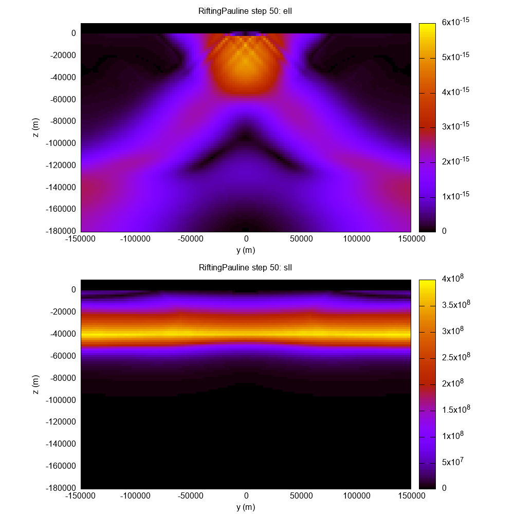

# Visual Tests

Last run date: 2022-05-18.17:25:44

## Usage 

Visual tests module is developed with the C++17 and requires Eigen3 package:

For Ubuntu it can be installed with 
```
sudo apt install libeigen3-dev
```

To run the visualisation you will need to build the CMAKE project with the 
VIS=ON and run the executable `./visualtests-out/visualtests` or simply use the makefile command:

```bash 
make build-dev VIS=ON run-vis 
```

<hr>

### RiftingPauline

<div style="display: flex;">
    <div style="margin: 20px; width: 450px;">
        <h3>Result</h3>
        
    </div>
    <div style="margin: 20px; width: 450px">
        <h3>Reference</h3>
        
    </div>
</div>

### ShearTemplate

<div style="display: flex;">
    <div style="margin: 20px; width: 450px;">
        <h3>Result</h3>
        
    </div>
    <div style="margin: 20px; width: 450px;">
        <h3>Reference</h3>
        
    </div>
</div>

### ShearTemplate with shear_style = 1

<div style="display: flex;">
    <div style="margin: 20px; width: 450px">
        <h3>Result</h3>
        
    </div>
    <div style="margin: 20px; width: 450px">
        <h3>Reference</h3>
        
    </div>
</div>

### TopoBenchCase1 Result with Analytical solution


