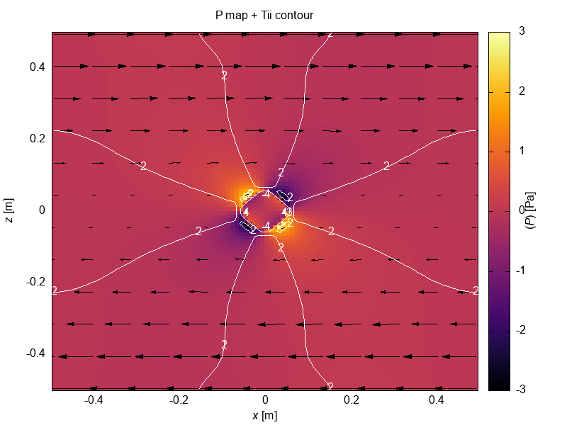

# Visual Tests

Last update date: 2022-05-18.16:26:46

## RiftingPauline

    

        <h2>Result</h2>
        
    

    

        <h2>Reference</h2>
        
    

## ShearTemplate

    

        <h2>Result</h2>
        
    

    

        <h2>Reference</h2>
        
    

## ShearTemplate with shear_style = 1

    

        <h2>Result</h2>
        
    

    

        <h2>Reference</h2>
        
    

## TopoBenchCase1 Result with Analytical solution

