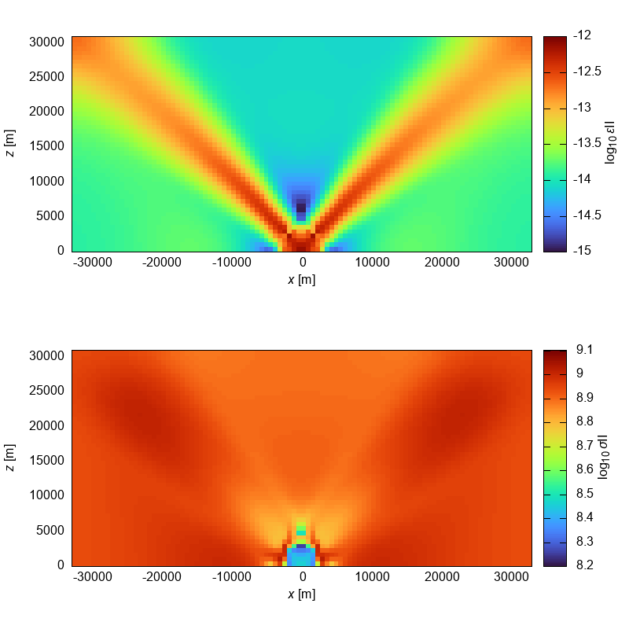
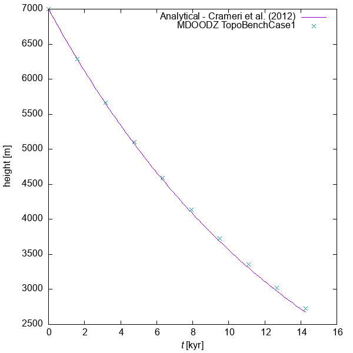

# Visual Tests

Last run date: 2022-06-30.14:23:31

## Usage 

Visual tests module is developed with the C++17 and requires Eigen3 package:

For Ubuntu it can be installed with 
```
sudo apt install libeigen3-dev
```

To run the visualisation you will need to build the CMake project with the 
VIS=ON and run the executable `./visualtests-out/visualtests` or simply use the makefile command:

```bash 
make build-dev VIS=ON run-vis 
```

<hr>

### RiftingPauline

| Result  | Reference                   |
| ------------- |-----------------------------|
|   |  |


### ShearTemplate

| Result  | Reference                   |
| ------------- |-----------------------------|
|   |  |


### ShearTemplate with shear_style = 1

| Result  | Reference                   |
| ------------- |-----------------------------|
|   |  |

### ShearHeatingDuretz14

| Result  | Reference                   |
| ------------- |-----------------------------|
|   |  |


### TopoBenchCase1 Result with Analytical solution


