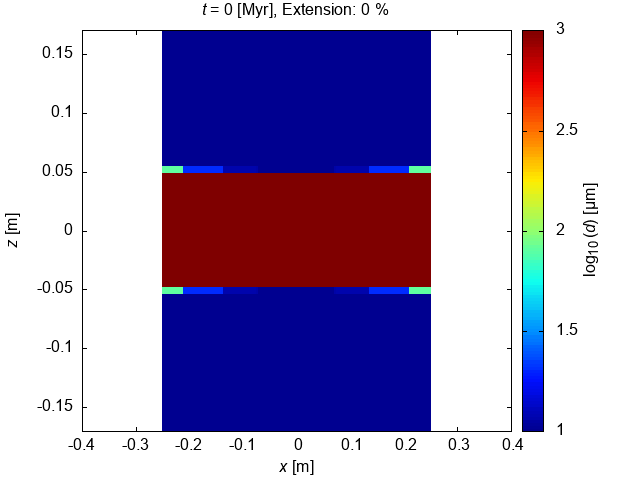
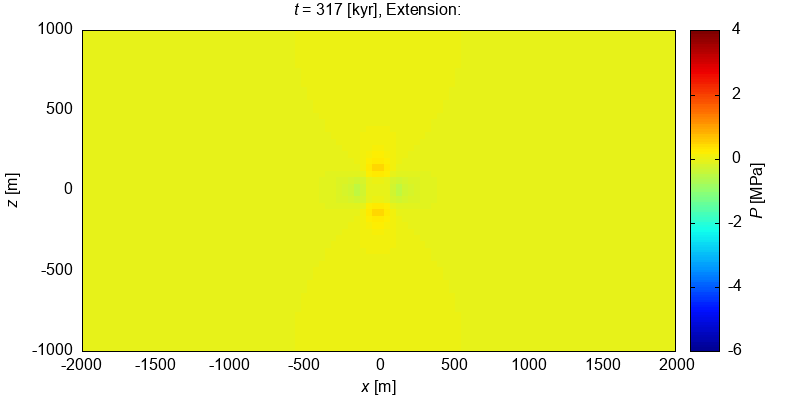
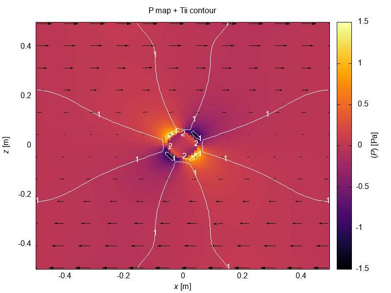

# Visual Tests

Last run date: 2022-09-22.11:27:31

## Usage 

Visual tests module is developed with the C++17 and requires Eigen3 package:

For Ubuntu it can be installed with 
```
sudo apt install libeigen3-dev
```

To run the visualisation you will need to build the CMake project with the 
VIS=ON and run the executable `./visualtests-out/visualtests` or simply use the makefile command:

```bash 
make build-dev VIS=ON run-vis 
```

<hr>

### PinchSwellGSE

Based on a [Schmalholz and Duretz, 2017](https://www.sciencedirect.com/science/article/pii/S019181411730161X).
Shows evolution of the grain size during the necking in pure shear boundary conditions mode.

| Result           | Reference           |
|------------------|---------------------|
|  |  |

### VEP_Duretz18

Based on a [Duretz, 2018](https://agupubs.onlinelibrary.wiley.com/doi/pdfdirect/10.1029/2018GC007877) Matlab code.
The average stress is characterized by a period of elastic loading followed by a period of  
elastoplastic loading during which shear banding takes place.
The transition between the two regimes occurs for a strain of approximately 1.3×10
and an average stress of approximately 2.5 MPa.

| Result           | Reference           |
|------------------|---------------------|
|  |  |

### RiftingChenin

Isotopic based on a [Chenin et al., 2019](https://agupubs.onlinelibrary.wiley.com/doi/pdf/10.1029/2018TC005318) model. 
Shows symmetry and development of the rift zone

| Result                     | Reference                           |
|----------------------------|-------------------------------------|
|  |  |


### ShearTemplate (Simple Shear)

The test verifies the accuracy of the velocity and the pressure 
fields for a model defining a circular inclusion of high viscosity,  
subject to a pure shear boundary condition ([Schmid and  Podladchikov, 2003](https://academic.oup.com/gji/article-pdf/155/1/269/5957478/155-1-269.pdf)). 
In order to impose the strain rate boundary  conditions similar to those used in [Schmid and Podladchikov  (2003)](https://academic.oup.com/gji/article-pdf/155/1/269/5957478/155-1-269.pdf), 
we evaluated the analytic velocity field at the boundary of  
the model domain, and used these values as Dirichlet boundary conditions.

| Result  | Reference                   |
| ------------- |-----------------------------|
|   |  |


### ShearTemplate (Pure Shear)

| Result  | Reference                   |
| ------------- |-----------------------------|
|   |  |

### ShearHeatingDuretz14

Based on [Duretz et. al., 2014](https://agupubs.onlinelibrary.wiley.com/doi/pdfdirect/10.1002/2014GL060438) model and shows deformation of power law viscous 
incompressible fluid with thermomechanical coupling. Model is containing a 
half‐circular  inclusion with a radius of 3 km, whose center is located at 
the bottom middle of the domain. All  thermal boundary conditions are zero flux 
which yields to upper estimates of the temperature  increase due to shear heating.

| Result  | Reference                   |
| ------------- |-----------------------------|
|   |  |


### TopoBenchCase1 Result with Analytical solution

Numerical model of the free surface based on analytical model of [Crameri et, al, 2012](https://academic.oup.com/gji/article-abstract/189/1/38/575556)

| Result       | 
|--------------|
|  |
